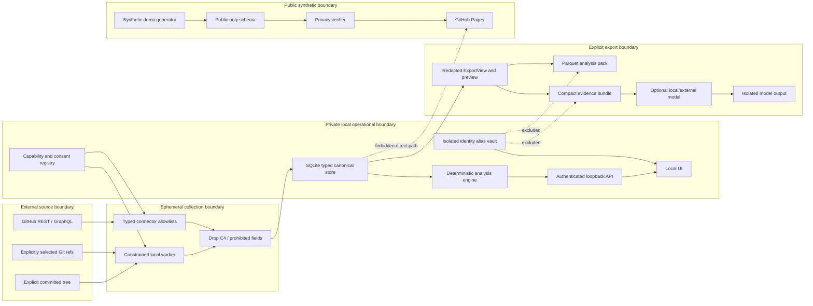

# Developer Lens demo-first signal architecture

Evidence date: **2026-08-03**.
Labels: **V** verified repository fact · **D** documented platform constraint · **R** recommendation · **U** documentation uncertainty · **G** owner gate.

> **Persistence note:** This file is the full durable capture of the read-only architecture response produced from `docs/SOL_ULTRA_DEEP_DISCOVERY_PROMPT.md`. The Changed/Verified closeout in section 15 describes that research pass, not the later documentation-only commit that saved it.

> **Authority and state note:** `HUMAN_TODO.md` is the live owner-decision record and
> `IMPLEMENTATION_LEDGER.md` is the live phase/evidence record. This file owns stable design and
> dependency order; historical task cards and closeout snapshots do not override those sources.

No repository files, generated datasets, private activity, credentials, `.developer-lens/`, `public/data`, `dist`, or caches were read or changed.

## 0. Owner development policy: demo first

Owner decision: **2026-08-03**. This section controls implementation sequencing wherever the
remainder of this architecture suggests a slower hardening-first order.

The development priority is:

1. a visibly useful, working local demo;
2. speed, effectiveness, and low-friction developer productivity;
3. short owner-feedback loops;
4. focused behavior tests and a green milestone check;
5. maintainability and performance only where they unblock the demo;
6. security, privacy hardening, operational resilience, and distribution readiness after the demo.

During the demo lane, a security or risk observation is recorded in
[`POST_DEMO_HARDENING.md`](./POST_DEMO_HARDENING.md) and does not interrupt delivery. No speculative
security scaffold, migration framework, production control, or comprehensive threat test is built
before the demo is usable.

The only immediate floor is the irreversible boundary inherited from the repository authority:
do not expose secrets or private/generated data, destroy user work, mutate an external/production
system, or publish anything outside the chosen q-4 code-only/synthetic route. G2 is approved, and
all seven named G3 sources have standing authorization for bounded implementation. G4 is approved
only for the OpenAI `gpt-5.6-luna` boundary in the data charter; P12 remains default-off until a
bounded activation task passes. These decisions do **not** automatically activate a source or
external request, and they do not block invented C0 fixtures or a local synthetic demo.

### D1-D3 working-demo lane

This lane runs immediately after P1 and before the P2-P11 post-demo queue. P12 may now advance only
through separately bounded, default-off OpenAI/Luna slices after their dependency and privacy gates.

| Demo slice | Outcome | Acceptance |
|---|---|---|
| D1 - visible vertical slice | One invented system story crosses a typed fixture, local presentation boundary, and a useful UI view. Reuse the existing app instead of replacing infrastructure. | One focused behavior test proves the journey; no collection, migration, private input, or network dependency. |
| D2 - feedback loop | Put the local demo in front of the owner when available; otherwise run a local browser/visual usability pass, record assumptions and next-day questions, and keep moving. Fix only what improves comprehension or flow. | A reviewer can identify what the view says, navigate it, and name the next most useful change; unavailable overnight owner feedback is queued rather than treated as a blocker. |
| D3 - demo milestone | Make the chosen journey easy to launch and stable enough for repeated local feedback. | One documented launch path, focused smoke coverage, and `npm run check` green. |

The demo is complete when D3 is met. That is a development milestone, not a claim that the product
is secure, production-ready, distributable, or ready for real/private data.

For unattended work, D2 does not wait for synchronous owner input. Sol uses the local browser and
focused tests as the provisional feedback loop, records any subjective assumption for next-day
review, and proceeds to D3 when the acceptance above is met.

#### Exact D1 task card

- **Journey:** run `npm run dev:web`, open `http://127.0.0.1:5173/?demo=v2`, filter Observed,
  Derived, and Hypothesis signals, inspect evidence/caveat and confidence text, and end on the
  hypothesis card's question about what evidence could change the interpretation. No API server is
  required.
- **Owned paths:** add `shared/v2Demo.ts` and `src/components/V2Demo.tsx`; modify `src/App.tsx`
  and `src/App.test.tsx` only.
- **Boundary:** `App` selects the V2 demo before `useDashboard` mounts. The fixture module registers
  a strict `public_showcase.v1` payload whose fields are all C0. The view says explicitly that its
  content is invented and uses no account, repository, or local-history input.
- **Reuse:** keep the existing visual system and `InsightStack`; do not introduce a new framework,
  route, server, or storage abstraction.
- **Non-goals:** no edits to `server/demo.ts`, `server/dataStore.ts`, `server/index.ts`,
  `scripts/exportDemo.ts`, collection, storage, network, migration, or public-showcase generation.
- **Proof:** `npm test -- src/App.test.tsx`, then `npm run check`. The focused test proves all three
  evidence levels render and filter, the question remains in the strict C0 fixture/presentation
  seam, registered fixture classes are C0, and `fetch` is never called.
- **Known limitation:** D1 proves a visible C0 presentation seam, not canonical-envelope,
  provenance, coverage, persistence, or real-data integration. Those do not block the demo.

## 1. Executive recommendation

### Product thesis

Developer Lens should become a **local evidence warehouse and system-retrospective tool**: it explains observable repository, integration, CI, release, dependency, and architecture evolution while preserving provenance and uncertainty.

Its unit of analysis is the **change system**—repositories, workflows, queues, releases, dependencies, and opaque modules—not individual developers.

The core product must remain useful with:

- deterministic local processing;
- no external model;
- no raw source, diffs, prose, logs, artifacts, paths, or collaborator identities;
- explicit coverage, censoring, and source limitations;
- a hard separation between private analysis and the synthetic public showcase.

### Major non-goals

Developer Lens must not become:

- an employee ranking, effort-estimation, performance, attendance, or hours-worked product;
- a sentiment, personality, archetype, diligence, impact, quality, or human-value scorer;
- a collaborator surveillance or people-graph product;
- a secret, vulnerability-location, source, diff, Actions-log, or artifact archive;
- a data lake collecting fields without an identified reflective question;
- dependent on an LLM for collection, calculation, navigation, or explanation.

### Highest-value safe capabilities

| Priority | Capability | Posture | Reflective value |
|---|---|---|---|
| 1 | Capability, consent, and coverage ledger | Default | Shows exactly what evidence is present, missing, stale, restricted, or censored. |
| 2 | Canonical provenance and incremental synchronization | Default | Makes every result explainable, correctable, resumable, and reproducible. |
| 3 | Repository lifecycle and portfolio state | Default/minimal | Shows emergence, concentration, transition, archive, fork, and public/private boundary effects. |
| 4 | Explicit-ref Git topology | Opt-in local Git | Adds parent topology, reachability, release ancestry, and non-fast-forward observations without source retention. |
| 5 | PR integration and review-state shape | Default/minimal | Describes integration distributions, review coverage, rework episodes, and censored tails. |
| 6 | Checks and CI feedback shape | Opt-in aggregate | Describes queue, execution, outcome, retry, and recovery distributions without logs or names. |
| 7 | Issue → PR → release linkage | Opt-in aggregate | Shows observable planning-to-delivery linkage without claiming causality. |
| 8 | Release and deployment coupling | Release minimal; deployments opt-in | Describes change batches and deployment outcomes with explicit retention horizons. |
| 9 | Portfolio transitions and cross-repository waves | Derived | Shows how systems move together without weighted “engagement” scores. |
| 10 | Commit-intent mix | Opt-in ephemeral | Produces aggregate maintenance/feature/test/docs/refactor mix without retaining subjects. |
| 11 | Dependency update waves | High-sensitivity opt-in | Finds cross-repository upgrade coordination using pack-scoped dependency aliases. |
| 12 | Ownership coverage | High-sensitivity opt-in, aggregate-only | Measures whether surfaces are covered by ownership rules, never who is valuable. |
| 13 | Committed-tree composition and opaque module graph | High-sensitivity opt-in | Enables architecture evolution, cycles, coupling, and API-surface movement without retaining names or paths. |
| 14 | Queryable local analysis pack | Explicit export | Makes evidence usable in DuckDB, notebooks, SQL, statistics tools, and later sessions. |
| 15 | Redacted evidence-bundle narratives | Optional, off by default | Adds cited hypotheses and counter-hypotheses without transmitting private records. |

### Explicit decisions against unsafe or premature capabilities

- Retire person-shaped “DNA,” archetypes, streaks, weekend share, activity lulls, PRs-per-active-day, and similar behavioural framing.
- Do not persist PR titles by default. They are presentation metadata, not analytical inputs.
- Move repository names into an isolated local identity vault; analytical tables and packs use aliases.
- Reject broad event feeds, audit logs, collaborator graphs, bus-factor-by-person, review latency by person, and individual forecasting.
- Reject secret-scanning ingestion and draft/private security advisories. Their reflective payoff does not justify the exposure path.
- Do not collect Actions logs, artifact contents, cache contents or keys, source, diffs, patch text, paths, bodies, comments, snippets, symbols, or parser diagnostics.
- Do not use GitHub search or contribution profiles as complete history.
- Do not build new Projects Classic ingestion.
- Defer Projects, security, CODEOWNERS, source structure, and ML work until the data charter, provenance, coverage, retention, deletion, and privacy sink tests exist. External LLM work stays default-off and must follow the approved OpenAI/Luna contract plus a bounded activation gate.

### Completed foundation slice

After authority gate G1, implement a **contract-only privacy foundation**:

- `docs/data-charter.md`
- `docs/source-capability-matrix.md`
- `shared/privacy.ts`
- `shared/capabilities.ts`
- `shared/coverage.ts`
- `shared/provenance.ts`
- `docs/analysis-pack/manifest.schema.json`
- `server/privacyContract.test.ts`

It must add no source, collector, retention, UI, API, or export behavior. Acceptance is an executable fail-closed field classification, consent registry, coverage union, provenance envelope, pack-manifest skeleton, and invented privacy canaries.

P0 and P1 completed this foundation locally. The next implementation work is D1, not P2.

---

## 2. Evidence-backed current-state map

### Current flow

1. The project describes itself as local-first and keeps a synthetic public showcase separate from private construction ([README.md:3](../README.md#L3), [README.md:25](../README.md#L25)).
2. `collect` parses explicit roots/ranges, obtains authenticated GitHub and optional local-Git data, analyzes it, then rewrites complete raw and dashboard JSON files ([package.json:10](../package.json#L10), [scripts/collect.ts:77](../scripts/collect.ts#L77), [scripts/collect.ts:98](../scripts/collect.ts#L98)).
3. GitHub collection uses contribution connections, repository discovery, search enrichment, per-repository commit queries, contributor statistics, and separate line-stat calls ([server/github.ts:147](../server/github.ts#L147), [server/github.ts:277](../server/github.ts#L277), [server/github.ts:561](../server/github.ts#L561), [server/github.ts:619](../server/github.ts#L619), [server/github.ts:954](../server/github.ts#L954)).
4. Local Git discovers repositories only beneath explicit roots, matches only verified email, invokes `git log --all`, processes paths and subjects ephemerally, and retains repository/SHA/date/size/derived-subject features ([server/localGit.ts:22](../server/localGit.ts#L22), [server/localGit.ts:112](../server/localGit.ts#L112), [server/localGit.ts:203](../server/localGit.ts#L203)).
5. The raw schema retains subject, repository identity, commit metadata and PR titles/URLs ([shared/types.ts:208](../shared/types.ts#L208), [shared/types.ts:223](../shared/types.ts#L223), [shared/types.ts:247](../shared/types.ts#L247), [shared/types.ts:271](../shared/types.ts#L271)).
6. Analytics deduplicates repository/SHA observations, reconciles line totals, computes a scalar confidence formula, and emits deterministic features, insights, archetypes and DNA axes ([server/analytics.ts:113](../server/analytics.ts#L113), [server/analytics.ts:146](../server/analytics.ts#L146), [server/analytics.ts:177](../server/analytics.ts#L177), [server/analytics.ts:563](../server/analytics.ts#L563), [server/analytics.ts:1195](../server/analytics.ts#L1195)).
7. Storage is versionless whole-file JSON with unchecked casts; analysis also performs complete rewrites ([server/dataStore.ts:7](../server/dataStore.ts#L7), [server/dataStore.ts:17](../server/dataStore.ts#L17), [scripts/analyze.ts:9](../scripts/analyze.ts#L9)).
8. The API binds to `127.0.0.1`, adds security/no-store headers, serves `dist`, and currently logs raw error messages; it has no per-launch authentication, strict Host validation, or Origin validation ([server/index.ts:10](../server/index.ts#L10), [server/index.ts:13](../server/index.ts#L13), [server/index.ts:25](../server/index.ts#L25), [server/index.ts:54](../server/index.ts#L54), [server/index.ts:74](../server/index.ts#L74)).
9. The compact and portable exporters have separate allowlists and acknowledgement-driven UI, but are built from the full `DashboardData` object, making privacy a late sanitization step ([src/lib/sharePayload.ts:19](../src/lib/sharePayload.ts#L19), [src/lib/portableExportPayload.ts:87](../src/lib/portableExportPayload.ts#L87), [src/lib/portableExportPayload.ts:500](../src/lib/portableExportPayload.ts#L500), [src/components/ShareStudio.tsx:351](../src/components/ShareStudio.tsx#L351)).
10. Pages builds deterministic demo data, enforces an exact synthetic repository allowlist, and runs a post-build verifier ([.github/workflows/pages.yml:1](../.github/workflows/pages.yml#L1), [scripts/exportDemo.ts:7](../scripts/exportDemo.ts#L7), [scripts/showcasePrivacyPolicy.ts:1](../scripts/showcasePrivacyPolicy.ts#L1), [scripts/verifyShowcase.ts:40](../scripts/verifyShowcase.ts#L40)).

### Already protected / gap / do not regress

| Surface | Already protected | Gap | Do not regress |
|---|---|---|---|
| Collection scope | Local roots are explicit; email matching does not use ambiguous author names ([server/localGit.ts:22](../server/localGit.ts#L22)). | `--all` silently includes every ref; local warning text can expose a basename ([server/localGit.ts:203](../server/localGit.ts#L203), [server/localGit.ts:248](../server/localGit.ts#L248)). | Explicit roots, verified-email-only self attribution, no implicit fetch. |
| Content minimization | No raw subjects, paths, bodies, diffs, credentials, or source are intentionally retained ([scripts/collect.ts:121](../scripts/collect.ts#L121)). | Identity, names, titles, URLs, and avatar remain mixed into analytical records. | Content prohibition and local-only defaults. |
| Coverage | Individual source coverage and warnings exist ([shared/types.ts:7](../shared/types.ts#L7)). | Only `complete`, `partial`, `unavailable`; current scalar confidence obscures reason and censoring. | Never convert absence to zero. |
| Determinism | Normalization, dedupe, features, insights, and synthetic output are deterministic. | DNA, archetypes, streaks, weekend share, and person-shaped narratives conflict with the anti-surveillance boundary. | Evidence/caveat fields and deterministic fallback. |
| Storage | Private files are outside tracked application source. | Whole-file writes lack transactions, locking, migration, field validation, integrity, recovery, selective deletion, and atomic pack publication. | Private directory separation and ignore rules. |
| Loopback API | Loopback bind and `no-store` are correct. | Any local process/site able to reach the port may request data; raw exception text can escape. | Loopback bind, no generic file endpoint, no-store. |
| Sharing | Separate compact/portable schemas, alias option, preview and acknowledgement exist ([src/components/ShareStudio.tsx:449](../src/components/ShareStudio.tsx#L449), [src/components/ShareStudio.test.tsx:16](../src/components/ShareStudio.test.tsx#L16)). | Sanitization begins after the full dashboard object reaches the exporter; public repository names can remain visible. | Acknowledgement reset after redaction changes and separate export schemas. |
| Pages | Synthetic identity, exact repository names, no repo URLs, and common secret/path patterns are checked ([scripts/verifyShowcase.ts:40](../scripts/verifyShowcase.ts#L40), [scripts/verifyShowcase.ts:136](../scripts/verifyShowcase.ts#L136)). | Scanner is pattern-based and does not prove private schemas, names, titles, labels, dependency strings, or security fields cannot enter all sinks. | Pages must accept only its compiled synthetic schema. |

### Current caps and semantics

| Current seam | Verified behavior and cap |
|---|---|
| Contribution query | Up to 100 repositories and 100 nodes per contribution connection; private restriction count is recorded ([server/github.ts:147](../server/github.ts#L147), [server/github.ts:699](../server/github.ts#L699)). |
| Search enrichment | Pages at 100 and stops at 1,000, emitting a truncation warning ([server/github.ts:529](../server/github.ts#L529)). |
| Nested reviews | First 100 are used; saturation emits a warning ([server/github.ts:834](../server/github.ts#L834)). |
| Accessible repositories | `user/repos`, 100/page, filtered by range-relevant `pushed_at` ([server/github.ts:561](../server/github.ts#L561)). |
| Commits | Repository commit API with author/range, implicitly default-branch-oriented; deleted/force-pushed history is acknowledged as incomplete ([server/github.ts:619](../server/github.ts#L619), [server/github.ts:916](../server/github.ts#L916)). |
| Concurrency | Commit and line-stat fanout are fixed at four ([server/github.ts:900](../server/github.ts#L900), [server/github.ts:954](../server/github.ts#L954)). |
| Local discovery | Maximum directory depth six, with common dependency/build exclusions ([server/localGit.ts:112](../server/localGit.ts#L112)). |
| Coverage aggregate | Equal-weight average; `partial` is hard-coded as `0.65`, and unrequested local Git is omitted ([server/analytics.ts:133](../server/analytics.ts#L133)). |

Identity-bearing retained fields include dashboard subject login/name/avatar, repository IDs/names/URLs/descriptions, PR titles/URLs, raw subject identity, and exact date ranges ([shared/types.ts:47](../shared/types.ts#L47), [shared/types.ts:73](../shared/types.ts#L73), [shared/types.ts:175](../shared/types.ts#L175), [shared/types.ts:271](../shared/types.ts#L271)).

The present tests cover core dedupe, line reconciliation, local-email matching, health, share redaction and synthetic-showcase allowlists. They do not comprehensively prove privacy across the private store, WAL-like recovery artifacts, logs/errors, every API response, malformed records, alias collisions, local-port attacks, model payloads, notebooks, screenshots, or migration/revocation.

---

## 3. Exhaustive source capability matrix

### Matrix notation

- Posture: **D** default minimal · **O** opt-in · **A** aggregate-only · **E** ephemeral compute · **X** reject.
- Classification: **C0** synthetic public · **C1** low-identifiability aggregate · **C2** local identifier/provenance · **C3** high-sensitivity isolated · **C4** ephemeral bytes/prose · **X** prohibited.
- Common limits: REST and GraphQL connections ordinarily support up to 100/page; GitHub search returns at most 1,000; rate handling must use returned headers and GraphQL `rateLimit` values. Official constraints were verified on 2026-08-03 against [REST versioning](https://docs.github.com/en/rest/about-the-rest-api/api-versions?apiVersion=2026-03-10), [REST pagination](https://docs.github.com/en/rest/using-the-rest-api/using-pagination-in-the-rest-api), [REST rate limits](https://docs.github.com/en/rest/using-the-rest-api/rate-limits-for-the-rest-api?apiVersion=2026-03-10), [GraphQL pagination](https://docs.github.com/en/graphql/guides/using-pagination-in-the-graphql-api), and [GraphQL limits](https://docs.github.com/en/graphql/overview/rate-limits-and-query-limits-for-the-graphql-api).

### A. Git graph and change history

| ID / reflective question | Authoritative extraction | Posture, retained minimum, prohibited | Permissions / limits / freshness | Analytical payoff; model value; validity | Synthetic contract |
|---|---|---|---|---|---|
| `GH-CONTRIB-01` — What activity does GitHub attribute to the selected owner? | GraphQL `User.contributionsCollection`: repository contribution connections, totals, calendar, `restrictedContributionsCount`. | D compatibility source; retain C1 repository/month counts and restriction count. Prohibit profile identity and event prose. | Auth; `read:user` for private profile contribution visibility; connections 100/page; attribution can lag and follows profile rules. | Coverage cross-check only. ML none. Not authoritative for repository history or local-only/default-branch-excluded work. | Delayed, restricted and unattributed synthetic contributions. |
| `GH-COMMIT-01` — What commits and aggregate change surfaces are observable remotely? | REST commits and single-commit detail: `sha`, parent SHAs, author/committer dates, verification enum, additions/deletions/file count. | D; C2 OIDs/HMAC IDs, times, parent edges, numeric surface. Prohibit author identity, message, files, patches, paths, URLs. | `Contents: read`; 100/page; compare max 250 unpaged commits/300 files; single commit max 3,000 files. | Topology, batch and surface features. ML limited to aggregates. Hosted graph omits vanished/unreachable history. | Merge, 251-commit comparison, >3,000 files, ambiguous 404. |
| `GIT-GRAPH-01` — What topology exists in explicitly selected local refs? | Hardened `git rev-list`/`git log` with explicit refs, `--no-replace-objects`, `--no-lazy-fetch`, author/committer ISO dates and parents. | O; C2 HMAC commit/parent/tree keys and timestamps. Prohibit names, emails, subjects, paths, raw stderr. | Explicit root/ref consent; no network; O(C+edges); shallow/partial/replace state must be recorded. | Reachability, ancestry, first-parent and release linkage. ML sequence research only. Current reachability is not historical publication evidence. | Shallow, partial, replace refs, merges, missing objects, malicious Git config. |
| `GIT-REF-01` — How did selected branch/tag tips move? | `for-each-ref` explicit namespaces plus successive tip snapshots and `merge-base --is-ancestor`. | O+A; retain opaque ref class/ID, tip HMAC, annotated flag, observed time and movement enum. Prohibit ref/tag names and remotes. | Local Git; enumerate same scope for deletion; remote-tracking refs may be stale. | Fast-forward/non-fast-forward/deletion observations and release ancestry. No ML needed. Must not label “force push” without authoritative evidence. | Fast-forward, non-fast-forward, deleted and stale upstream refs. |
| `GIT-SIGN-01` — What proportion of selected objects pass the local verification policy? | `git verify-commit`, `verify-tag`; retain outcome type, signature family, verifier and policy version. | O+A; C3 aggregate grade counts. Prohibit signer, key/fingerprint, output, tag names. | Requires installed verifier/trust configuration; per-object cost. | Verification-policy coverage, not identity or code-quality proof. ML none. | Valid, invalid, unknown, expired, revoked and unsupported signatures. |
| `GIT-SEM-01` — What broad change-intent mix is visible? | Ephemeral commit-subject parser over selected self-attributed commits; conventional type, revert/fixup, classifier confidence, language/unknown. | O+E→A; retain C1 category counts/confidence only. Subject is C4 and destroyed. | Explicit consent; local process only; multilingual/parser-version coverage. | Maintenance/feature/test/docs/refactor mix. ML research after labelled evaluation. Text ambiguity prevents intent certainty. | Multilingual, ambiguous, injection-like, revert/fixup, empty and very long subjects. |
| `GIT-REFLOG-X` — Can historical rewrites be reconstructed? | Local reflog availability/count diagnostic only. | X for analytics; optional E diagnostic. Messages, selectors and identities prohibited. | Reflogs are local, mutable and commonly expire; [Git reflog](https://git-scm.com/docs/git-reflog.html). | No stable analytical claim. Absence cannot prove no rewrite. | Expired, disabled and missing reflogs. |
| `GIT-CONTENT-X` — Can raw source/diffs improve reflection? | None. | X: source, blobs, diffs, patches, paths, LFS objects and binaries never retained or exported. | N/A. | The privacy cost dominates; aggregate structure has a safer separate capability. | Poison fixtures must fail every sink. |

### B. Repository and portfolio metadata

| ID / question | Authoritative extraction | Posture / fields | Permissions / limits / correction | Payoff / limitations | Fixture |
|---|---|---|---|---|---|
| `GH-REPO-01` — Which systems exist and what lifecycle state is observable? | REST repository object or GraphQL `Repository`: stable ID, visibility, archive/disabled/fork/mirror/template flags, timestamps, default branch, parent/source IDs. | D; C2 stable IDs and isolated aliases; C1 flags/times. Prohibit names/URLs/descriptions from analytical tables. | `Metadata: read`; stable ID survives rename/transfer; 404 is access-ambiguous. | Portfolio state and lifecycle. LLM may narrate only aliased aggregates. | Rename, transfer, fork, archive, private→restricted. |
| `GH-LANG-01` — What language composition is exposed? | Repository languages/GraphQL language edges: language identifier and byte count. | O+A; C1 language family and proportion. Names may be retained only from a controlled public language vocabulary. | Metadata/contents visibility; vendored/generated classification is provider-dependent. | Composition and transition, not skill or quality. | Mixed language, generated-heavy, empty and inaccessible repo. |
| `GH-TAXONOMY-01` — What declared repository themes exist? | Topics, license SPDX, feature flags and custom properties. | O+A; retain controlled topic aliases, SPDX, booleans. Prohibit descriptions and custom-property values by default. | Metadata; plan/visibility differences; snapshot-only. | Portfolio segmentation. Topic clustering is research only. Self-declared metadata can be stale. | Renamed topic, absent license, private custom property. |
| `GH-RULE-01` — What integration policies are configured? | Rulesets/effective rules/branch protection: enforcement, rule types, required-count flags. | O+A; C3 policy aggregates. Prohibit patterns, status names, bypass actors, integrations. | Administration read may be required; plan/visibility dependent; history permissions can be unusually strong. | Policy-presence and policy/change associations, not policy quality. | Layered rulesets, disabled/evaluate rules, permission denial. |
| `REPO-DOC-01` — Are expected docs/build/config surfaces present? | Ephemeral committed-tree enumeration of controlled standard roles, not file contents. | O+E→A; retain role-presence booleans/counts. Paths and names prohibited. | Explicit local-root consent; no repository tools. | Composition and change-system context. No content quality inference. | Monorepo, renamed docs, generated/vendor exclusions. |

### C. Pull requests, reviews, checks, and integration

| ID / question | Authoritative extraction | Posture / fields | Permissions / limits / correction | Payoff / limitations | Fixture |
|---|---|---|---|---|---|
| `GH-PR-01` — What is the observable integration lifecycle? | REST/GraphQL PR: ID/number, state/draft, creation/update/close/merge times, head/base OIDs, merge OID, additions/deletions/file count. | D; C2 ID/OIDs; C1 enums/times/counts. Title/body/branches/URL/identities prohibited analytically. | `Pull requests: read`; PR commits max 250, files max 3,000; edits are not full audit history. | Integration/censoring/change-surface distributions. Never productivity. | Draft, ready, closed-unmerged, reopened, >caps, force-pushed. |
| `GH-PR-TL-01` — What ready/review/rework transitions are visible? | GraphQL timeline, reviews and review threads: ready/draft events, review state/time, thread resolved/outdated counts, head changes. | D minimal; C2 event IDs; C1 state/times/counts. Bodies/comments/reviewer identity prohibited. | PR read; 100/page connections; timeline is incomplete edit history. | First signal, review coverage, rework episodes. Survival research possible. Delayed/batched review confounds. | Ready↔draft, dismissed review, thread edit, missing page. |
| `GH-CHECK-01` — What feedback did checks provide? | Check runs/suites and commit statuses: IDs, head OID, status/conclusion, timestamps, annotation count. | O+A; C3 source records, C1 aggregates. Names, URLs, annotation content/paths prohibited. | Checks/commit-status read; latest-only defaults; >1,000 suites may truncate. | Outcome and feedback distributions. Failure-family ML is not ready without safe labels. | >1,000 suites, fork PR, rerun, missing suite. |
| `GH-STACK-01` — What PR dependency/queue topology is explicitly visible? | Base/head relationships, linked PRs, merge-queue events when present, auto-merge state. | O+A; opaque PR edges and transition enums. Branch names and people prohibited. | PR read; merge-queue availability varies; **U:** no universal complete historical stack graph. | Stack depth, blocked integration and supersession observations. Do not infer intent from same branch alone. | Base retarget, deleted head, queue cancellation, ambiguous overlap. |

### D. Issues, labels, milestones, Discussions, and Projects

| ID / question | Authoritative extraction | Posture / fields | Permissions / limits / correction | Payoff / limitations | Fixture |
|---|---|---|---|---|---|
| `GH-ISSUE-01` — What issue state and explicit dependency flow exists? | REST/GraphQL Issue: ID, state/reason/type, timestamps, parent/subissue, blocking, closing-PR edges. | O+A; IDs/edges/times/enums. Prohibit title/body/comments/creator/assignees. | `Issues: read`; pagination; transfers/deletion/access can produce ambiguous responses. | Issue→PR flow and ageing distributions. Age is queue state, not diligence. | Transfer, reopen, blocked, deletion, partial permission. |
| `GH-LABEL-01` — What work-type taxonomy and transitions are observable? | Label/milestone/type IDs, state, dates, colors/default flags and timeline events. | O+A; C3 local aliases and transition aggregates. Names/descriptions prohibited from ordinary packs. | Issues read; rename via stable ID; history incomplete where no event exists. | Work-stream mix and scope-transition counts. No semantic claim without owner mapping. | Rename, deletion, duplicate colors, missing transition. |
| `GH-DISCUSS-01` — What discussion-state metadata exists? | GraphQL Discussion/category: ID, answer/state enums, timestamps and counts. | O+A; category alias/counts only. All prose, voters and identities prohibited. | GraphQL availability/permission varies; no complete edit history. | System knowledge-channel volume/state only. Low priority. | Answered/unanswered, edited body absent, category rename. |
| `GH-PROJV2-01` — What project-item flow is observable? | GraphQL `ProjectV2`, item, field values, status-change events, archive state and timestamps. | O+A/E; C3 current status aliases/transition aggregates. Text, users, reviewers, teams and raw custom values prohibited. | `read:project`/Projects permission; `GITHUB_TOKEN` insufficient; 50,000-item and field limits documented. | Status transition and planning-delivery coupling. Arbitrary custom-field history is not generally available. | Status history, deleted field, archive, unsupported host schema. |
| `GH-PROJCLASSIC-X` — Should Classic projects be ingested? | None. | X. | Projects Classic is sunset. | No new collector. | Capability must report unsupported, not zero. |

### E. Actions, CI, releases, and deployments

| ID / question | Authoritative extraction | Posture / fields | Permissions / limits / correction | Payoff / limitations | Fixture |
|---|---|---|---|---|---|
| `GH-ACT-RUN-01` — What is the workflow-run feedback shape? | Workflow run: ID, workflow alias, run number/attempt, event, status/conclusion, head OID, created/started/updated times. | O+A; C3 observation, C1 distributions. Names, display titles, branches, actors prohibited. | `Actions: read`; 100/page; filtered lists cap 1,000. Partition windows and mark saturation. | Queue, execution, rerun, recovery and outcome mix. No code-quality inference. | 1,001 runs, cancelled concurrency, delayed start, missing run. |
| `GH-ACT-JOB-01` — Where is run time distributed? | Attempt-specific job endpoints: IDs, timestamps, status/conclusion, step count, coarse runner class. | O+A; prohibit workflow/job/step/runner names and labels. | Actions read; default listing is latest execution unless `filter=all` or attempt endpoint. | Job-shape distributions and matrix fanout. Runner classification may be incomplete. | Rerun attempts, skipped steps, self-hosted coarse class. |
| `GH-ACT-DEF-01` — What declared triggers/concurrency/filter patterns exist? | Ephemeral parse of selected committed workflow YAML using a data-only parser. | O+E→A; retain trigger classes, concurrency/path-filter presence and matrix-size category. Raw YAML, names, paths, expressions prohibited. | Explicit consent; never execute Actions expressions, repository tooling or plugins. | Context for cancellation and fanout. Configuration is not proof of runtime behavior. | YAML aliases, expressions, malicious strings, reusable workflows. |
| `GH-ACT-ART-X` — Are artifact/cache contents useful? | Metadata-only count/size/expiry may be a later O+A capability. Downloads and cache contents are X. | Not now. Names, keys, digests tied to private identity, contents and URLs prohibited. | Actions read; artifacts/retention are bounded and host-configured; cache eviction is independent. | Little reflective value before disk/cost questions are demonstrated. | Expired/deleted artifacts; cache metadata must not persist. |
| `GH-REL-01` — How large are observable release batches? | Release ID, tag/target OID alias, draft/prerelease/immutable flags, dates, asset count/bytes. | D minimal for authorized repos; C2 OIDs/ID, C1 aggregates. Names, body, asset names/uploader/URL prohibited. | Contents read; releases are not all tags. | Release batches and release/change coupling. “Latest” semantics are provider-specific. | Prerelease, retag, deleted release, non-ancestor target. |
| `GH-DEPLOY-01` — What deployment outcomes are observable? | Deployment/status/environment IDs, commit OID, state, timestamps, production/transient flags, policy traits. | O+A; C3 observations. Environment/ref names, URLs, payloads, reviewers prohibited. | `Deployments: read`/Actions read; plan-dependent; statuses older than 90 days are unavailable. | Deployment outcome and release-deploy linkage. Older windows are censored. | >90-day history, environment rename, permission loss. |

### F. Dependencies, supply chain, and security

| ID / question | Authoritative extraction | Posture / fields | Permissions / limits / correction | Payoff / limitations | Fixture |
|---|---|---|---|---|---|
| `GH-SBOM-01` — What ecosystem/dependency composition exists? | SPDX SBOM or local manifest parser, processed in memory. | O+E→A; retain ecosystem/license/count/direct-transitive buckets and pack-scoped aliases. Names, versions, PURLs, paths, raw SBOM/manifests prohibited. | Usually `Contents: read`; feature/plan availability; reports/download URLs expire. | Dependency concentration and update-wave inputs. SBOM completeness varies by ecosystem. | Private package canaries and malformed SPDX. |
| `GH-DEPALERT-01` — What aggregate dependency-alert lifecycle is observable? | Dependabot alert state/times, coarse severity/CWE/CVSS/EPSS, ecosystem/scope and patched-version-available. | O+A, physically isolated C3. Exact package/version/range, advisory prose and identities prohibited. | `Dependabot alerts: read`; feature must be enabled; initial processing can lag. | Exposure-window distributions and update coupling. Not a security score. | Disabled feature, 403/404, renamed package alias, reopened alert. |
| `GH-CODESEC-01` — What aggregate code-scanning lifecycle exists? | Alert ID/state/times, coarse severity/CWE/tool class and commit alias. | O+A, isolated C3. Never request/store instances, paths, messages, rules, locations, dismissal comments or identities. | `Code scanning alerts: read`; default-branch semantics; deleted analyses can erase evidence. | Alert-state timing only. No exploitability or code-quality claim. | Deleted analysis, non-default instance, poison location. |
| `GH-SECRET-X` — Should secret scanning be ingested? | None in the recommended roadmap. | X, including aggregate counts. | High privilege and plan-dependent; alert APIs expose exceptionally sensitive surfaces. | Insufficient reflective value for the risk. | A literal-secret response must cause schema failure. |
| `GH-ADVISORY-X` — Should repository advisories be ingested? | Public advisory reference enrichment only if later justified; draft/private advisories X. | X now. | Embargo and exploit-detail risk; permission requirements can be broad. | No current legitimate reflective question. | Draft advisory must be rejected before persistence. |
| `GH-ATTEST-01` — Are release artifacts accompanied by verifiable attestations? | Attestation subject-digest alias, predicate type, builder class, observation and independent verification result. | O+A; raw bundle/certificate/signer prohibited. | Repository/plan dependent; 100/page cursor. | Provenance coverage, not trust by mere existence. | Existing but invalid attestation, unsupported plan. |

### G. Ownership and organisational metadata

| ID / question | Authoritative extraction | Posture / fields | Permissions / limits / correction | Payoff / limitations | Fixture |
|---|---|---|---|---|---|
| `GH-CODEOWNERS-01` — What proportion of selected surfaces matches an ownership rule? | Ephemeral CODEOWNERS discovery/parser plus provider error endpoint. | O+E→A; retain repository-level match/unmatched/error counts and opaque group class. Patterns, paths, handles, email and messages prohibited. | Contents read; base-ref-specific; >3 MB file is not loaded and invalid lines are skipped. | Ownership coverage only, never owner value or bus factor. | Multiple locations, invalid lines, >3 MB, base-ref change. |
| `GH-TEAM-01` — How broad is system ownership coverage? | Team IDs/hierarchy/size bands and repository associations. | O+A; C3 aliases/aggregate hierarchy. Names/slugs/member lists prohibited. | `Members: read`; only visible teams; org and GHES variation. | Group-level coverage/context. Re-identification risk suppresses sparse output. | Hidden team, inherited membership, size-one suppression. |
| `GH-PEOPLE-X` — Who is central, responsive or indispensable? | None. | X: contributor graphs, person centrality, bus factor, review-routing performance and rankings. | N/A. | Invalid and surveillance-oriented even when pseudonymized. | Schema must reject person-node analytical output. |

### H. Opt-in local source-tree intelligence

| ID / question | Authoritative extraction | Posture / fields | Limits / correction | Payoff / limitations | Fixture |
|---|---|---|---|---|---|
| `SRC-COMP-01` — What is the committed-tree composition? | `git ls-tree -r -z --long HEAD^{tree}`; bundled syntax parsers; generated/vendor/binary/symlink exclusion. | O+E→A; retain language/role/count/parser coverage. Source, paths, identifiers and diagnostics prohibited. | No lazy fetch or working-tree scan; parser/input/time/memory caps; versioned cache. | Composition and change context. Parser coverage is language-dependent. | Dirty working tree unchanged result; malformed/binary/huge files. |
| `SRC-MODULE-01` — How is the opaque module graph structured? | Stream committed blobs into isolated bundled parsers; emit HMAC module nodes and typed edge counts. | O; C3 pseudonymous graph. No reverse map in packs; no names/import strings. | Current immutable tree first; parser version invalidates dependent features. | Cycles, SCCs, layering and centrality. Pseudonymous is not anonymous. | Cycle, unsupported grammar, parser crash, alias rescoping. |
| `SRC-API-01` — How did public API surface size change? | Syntax-only public-declaration counts between consented snapshots. | O+E→A; retain added/removed/count totals by language. Names, signatures and source prohibited. | Only languages with documented extractor quality; renames and type-aware semantics limited. | API-surface movement, not breaking-change proof. | Rename-only, unsupported construct, parser-version change. |
| `SRC-COUPLING-01` — Which opaque modules repeatedly change together? | Ephemeral path→HMAC mapping from selected commit diffs; retain pair counts/lift. | O; C3 sparse graph. Paths/diffs/commit messages prohibited. | Cap modules/commit; exclude oversize commits; version rename heuristic. | Temporal coupling and migration waves. Co-change does not prove dependency. | Huge commit, rename, generated-only change, monorepo boundary. |
| `SRC-WORKTREE-X` — Should dirty/untracked work be analysed? | None. | X initially. | Working-tree state is materially more sensitive and unstable than committed trees. | No current necessity. | Untracked secret/source canaries must be invisible. |

### I. Higher-order cross-source capabilities

| ID / question | Sources and minimum records | Posture | Payoff and validity | Test |
|---|---|---|---|---|
| `X-FLOW-01` — How often is an explicit issue→PR→release chain observable? | Issue closing edges, PR merge OID, release target ancestry, complete coverage. | Derived C1. | Deterministic linkage only; not causal delivery attribution. ML none. | Linked/unlinked/censored/reverted chains. |
| `X-CI-01` — How does aggregate change surface relate to CI feedback? | PR surface plus attempt-aware run/job records, joined by OID/PR ID. | O-derived C1. | Stratified distributions; never “large changes cause failures” without a modelled claim. | Confounded workflow, rerun, missing association. |
| `X-RELEASE-01` — Do releases and dependency updates move together? | Release intervals, dependency aliases and update events. | High-sensitivity opt-in. | Cross-repo waves and release coupling. Names remain isolated. | Same update outside/inside wave; sparse suppression. |
| `X-PORT-01` — How is attention distributed and changing across systems? | One homogeneous event family, repository aliases and complete windows. | Derived C1. | Effective-repository and transition measures; not engagement or worth. | Concentrated/even/no-data portfolios. |
| `X-ARCH-01` — How is architecture evolving? | Comparable opaque graphs, parser versions, API counts and coupling edges. | High-sensitivity opt-in. | Cycles, coupling and surface movement. ML community work remains research. | Parser drift, partial graph, module split/merge. |
| `X-OWN-01` — Are important surfaces covered by declared ownership? | Ephemeral CODEOWNERS/source roles plus repository-level counts. | High-sensitivity aggregate. | System coverage only. Sparse teams/person output is prohibited. | Invalid pattern, hidden team, sparse suppression. |

---

## 4. Signal and metric dictionary

### Shared rules

- Windows are half-open UTC ranges `[start, end)`.
- Exact native IDs are used only in the restricted operational store; packs receive pack-scoped aliases.
- Corrections upsert by stable source key and revision, preserve non-sensitive provenance, tombstone only on positive deletion evidence, and recompute dependent feature IDs.
- `null` means ineligible, unavailable, censored, or insufficient sample; it never means zero.
- The sample gates below are **recommended product display gates**, not platform facts. They require validation with synthetic and later consented aggregate data.
- C1 retention recommendation: 36 rolling months. C2: 13 months. C3: 90 days. C4: process lifetime only.

| Feature ID | Definition, inputs and exact computation | Grain, eligibility, correction, validity, privacy and golden test |
|---|---|---|
| `DL.COV.COMPLETE_RATIO.v1` | Question: how much expected evidence is complete? `complete_units / expected_units`, where expected includes refused/restricted/etc. | Capability×window; `n≥1`; range `[0,1]`; source coverage only. Limitation: units differ in weight and importance. C1/36m. Golden: 8 complete of 10 expected → `0.8`. |
| `DL.COV.FRESHNESS_AGE_H.v1` | `(as_of - latest_successful_observed_at)/1h`. | Capability×scope; null if never successful; invariant `≥0`. Correction uses newest accepted snapshot. Limitation: freshness is not completeness. C1/36m. Golden: 12:00 vs 09:30 → `2.5h`. |
| `DL.DQ.CONFLICT_RATIO.v1` | `conflicting_keys / keys_compared` across independent observations of the same canonical fact. | Source pair×window; `n≥1`; null if no comparable keys. Conflicts remain findings, not arbitrary precedence. C1/36m. Golden: 2 conflicts/40 → `0.05`. |
| `DL.PR.INTEGRATION_DURATION_H.v1` | Per PR: `(merged_at - ready_start)/1h`; `ready_start=ReadyForReviewEvent`, else first complete observation where non-draft, else creation for never-draft PRs. Store `event|censored`. | PR and repository distribution; display with `≥5` events and censored count. Invalid negative intervals rejected. Confounders: batching, queues, timezone irrelevant but source lag matters. C1/36m; supporting C2/13m. Golden: ready Monday 10:00, merged Tuesday 16:00 → `30h`. |
| `DL.PR.FIRST_SIGNAL_DURATION_H.v1` | `min(first check created_at, first submitted review_at)-ready_start`; exclude comments and identity. | PR; `≥5` eligible. Right-censor if no signal before window end. Limitation: first observable signal is not first human attention. C1. Golden: ready 10:00, check 10:08, review 14:00 → `0.133h`. |
| `DL.PR.REWORK_EPISODES.v1` | Count episodes where `CHANGES_REQUESTED` is followed by a new head OID before approval/merge; repeated reviews without head movement stay one episode. | PR; display distribution for `≥5` review-complete PRs. Missing timeline → null. Limitation: head movement need not respond to the review. C1. Golden: request→two pushes→approval = one episode. |
| `DL.PR.CHANGE_SURFACE.v1` | Tuple `{additions,deletions,changed_files,total=additions+deletions}`; binary/unavailable components remain null. | PR; `≥5`; invariant nonnegative and `total=a+d`. Corrections follow provider revision. Limitation: generated code and language density confound magnitude. C1; C2 source 13m. Golden `12+8=20`. |
| `DL.REVIEW.COVERAGE_RATIO.v1` | Eligible merged PRs with ≥1 submitted non-pending review before merge / eligible merged PRs. | Repository×window; `≥5` complete PR timelines. Limitation: review may occur elsewhere or be unnecessary. C1. Golden 7/10 → `0.7`. |
| `DL.CI.QUEUE_DURATION_S.v1` | Per run/job `max(0, started_at-created_at)`. Negative records become DQ failures. | Workflow alias×window; `≥10`; censored starts excluded and counted. Limitation: provider scheduling plus concurrency/configuration, not team responsiveness. C1; C3 source 90d. Golden 12:00:00→12:01:30 = `90s`. |
| `DL.CI.EXEC_DURATION_S.v1` | `completed_at-started_at` for completed attempt-specific runs/jobs. | Workflow alias×attempt; `≥10`. Cancelled/skipped retained as separate outcome, not duration zero. Limitation: runner and matrix differences confound. C1. Golden 300s. |
| `DL.CI.RERUN_RATIO.v1` | Distinct primary run IDs with `max(run_attempt)>1` / distinct primary run IDs. | Workflow×window; `≥20`; range `[0,1]`. Deleted attempts can censor. Limitation: reruns include infrastructure and intentional retries. C1. Golden 3 rerun of 30 → `0.1`. |
| `DL.CI.RECOVERY_TRANSITION_RATIO.v1` | Runs whose earlier attempt conclusion ∈ `{failure,timed_out,cancelled}` and later attempt is `success` / runs with an eligible earlier non-success. | Workflow×window; `≥10` eligible transitions. Attempt order is authoritative. Limitation: recovery does not establish flakiness. C1. Golden 6 recoveries/8 → `0.75`. |
| `DL.CI.OUTCOME_MIX.v1` | Vector `count(conclusion=c)/eligible_attempts` for each controlled conclusion enum. | Workflow×window; `≥10`; components sum to 1 within rounding. Missing conclusions excluded and disclosed. C1. Golden `{success:8,failure:1,cancelled:1}` → `{.8,.1,.1}`. |
| `DL.FLOW.ISSUE_PR_RELEASE_RATIO.v1` | Closed issues with an explicit closing-PR edge whose merge OID is reachable from a release target inside horizon / eligible closed issues. | Repository×cohort; `≥10`; only complete issue/PR/release coverage. Limitation: linkage is not causality or requirement completion. C1. Golden 12 linked of 20 → `0.6`. |
| `DL.REL.CHANGE_BATCH.v1` | Number of distinct merged PR IDs on the default-branch first-parent interval `(previous_release_target,current_release_target]`. | Release interval; `≥3` valid intervals for distributions. Null if targets are non-ancestor or history censored. Limitation: backports/squashes affect linkage. C1. Golden three linked merges → `3`. |
| `DL.DEP.UPDATE_WAVE.v1` | For pack-scoped dependency alias `d`, connect repos with update events in the same ISO week; wave size = distinct repos; wave lift uses the co-occurrence formula below. | Dependency alias×week; `≥5` updates and ≥2 repos. Exact names never leave C3. Limitation: same version intent is not guaranteed. C3 facts 90d; C1 wave summaries 36m. Golden updates in 4 repos → size `4`. |
| `DL.PORT.EFFECTIVE_REPOSITORIES.v1` | For one event family only, `p_r=count_r/Σcount`; `N_eff=1/Σp_r²`. Never combine commits, PRs and reviews with arbitrary weights. | Portfolio×event family×window; `≥10` events and ≥2 repos. Range `[1,R]`. Limitation: distribution is not importance or engagement. C1. Golden equal shares over 4 repos → `4`; all in one → `1`. |
| `DL.PORT.TRANSITION_JS.v1` | Jensen–Shannon distance between repository-share vectors in adjacent equal windows, base-2 logarithms. | Portfolio×event family×window pair; ≥20 events in each. Range `[0,1]`; missing repos receive zero probability. Limitation: changed observability can mimic transition. C1. Golden identical vectors → `0`. |
| `DL.CROSS.REPO_COOCCURRENCE_LIFT.v1` | Weekly binary presence: `lift(A,B)=P(A∧B)/(P(A)P(B))`. | Repo pair×window; ≥12 eligible weeks and each present ≥3; null when denominator zero. Confounder: release calendars and shared automation. C1; sparse pairs suppressed. Golden independent presence → near `1`. |
| `DL.CHANGE.INTENT_MIX.v1` | Proportion of ephemeral subject classifications in controlled categories; include `unknown` and classifier-version coverage. | Repository×window; ≥20 subjects and ≥80% parser completion. Components sum to 1. Limitation: text convention is not actual intent. C1; raw C4 destroyed. Golden `{feature:10,maintenance:5,unknown:5}` → `{.5,.25,.25}`. |
| `DL.ARCH.CYCLE.v1` | Tarjan SCC over the opaque directed module graph; report SCC count, largest SCC and proportion of nodes in SCCs of size>1 or self-loop. | Repository snapshot; ≥2 nodes and declared parser coverage. Graph correction is snapshot replacement. Limitation: static import cycles may be valid and parser coverage partial. C3 graph 90d; C1 summary 36m. Golden `A→B→A` → one 2-node cycle. |
| `DL.ARCH.TEMPORAL_COUPLING.v1` | For opaque module pair, `cochange_commits / commits_touching_either`; retain support count. | Pair×window; ≥20 eligible commits and pair support ≥3; oversize commits excluded and disclosed. Limitation: co-change is not dependency or ownership. C3 sparse graph. Golden 4 together/10 union → `0.4`. |
| `DL.ARCH.API_SURFACE_DELTA.v1` | `{added_public_declarations,removed_public_declarations,current_total}` between comparable parser/tree snapshots. | Repository×language×snapshot pair; two comparable snapshots and supported parser. Limitation: syntax counts do not prove compatibility. C1 summary; ephemeral C4 input. Golden 5 added, 2 removed → net `+3`. |
| `DL.OWN.COVERAGE_RATIO.v1` | Eligible committed files matched by at least one valid CODEOWNERS rule / eligible files; file paths are ephemeral. | Repository×ref snapshot; `n≥1`, complete enumeration required. Limitation: declared coverage is not active stewardship. C1; raw rules C4. Golden 80/100 → `0.8`. |
| `DL.SYS.CHANGE_CI_ASSOC.v1` | Within each workflow alias, assign PR surface quartiles; emit per-quartile count, median and p90 CI execution duration. No combined causal scalar. | Workflow×window; ≥20 observations per displayed bin and ≥3 bins. Limitation: workflow, runner, branch and change type confound. C1; C3 join facts 90d. Golden equal distributions across bins → “no observed separation.” |

### Rejected metric ledger

| Rejected metric | Reason |
|---|---|
| Commits/day, PRs/day, reviews/day as performance | Volume is workflow- and batching-dependent and invites ranking. |
| Active streak, longest streak, weekend share, hour-of-day, lulls | Encodes behavioural surveillance and invites work/sleep/diligence inference. |
| DNA, personality, archetype, “builder/steward” labels | Behavioural profiling with weak validity and high reification risk. |
| PRs per active day or velocity score | Conflates units and turns system data into productivity scoring. |
| Reviewer response ranking or per-person latency | Collaborator surveillance; missing context dominates. |
| Bus factor by named/pseudonymous people | Re-identification and human-value inference. Use system ownership coverage only. |
| LOC/change size as quality, risk, impact or effort | Language, generated code, refactoring, format and tooling confound. |
| CI duration as quality or developer efficiency | Runner, matrix, cache, queue and provider effects dominate. |
| Rerun = flaky test | Reruns have many alternative causes; require stronger independent evidence. |
| Vulnerability/alert count as security quality | Tool enablement and coverage dominate; could expose sensitive posture. |
| Sentiment or tone from reviews/issues | Invalid, identity-targeting and requires prohibited prose. |
| Individual output/performance forecasting | Categorically outside the product boundary. |

---

## 5. Privacy, safety, consent, and threat model

### Field classification

| Class | Meaning | Examples | Default retention/export |
|---|---|---|---|
| C0 | Synthetic or explicitly public-showcase data | Invented identity, allowlisted synthetic repositories | Tracked/public; synthetic schema only |
| C1 | Low-identifiability aggregates | Counts, distributions, coverage ratios, coarse controlled enums | 36-month rolling recommendation; pack eligible after sparse suppression |
| C2 | Local identifiers and provenance | Provider IDs, OIDs, repository alias links, exact source timestamps | 13-month rolling; excluded or pack-remapped |
| C3 | High-sensitivity isolated metadata | Workflow aliases, dependency/security records, project/team/module graphs | 90-day rolling; excluded from ordinary exports |
| C4 | Ephemeral source-derived bytes | Subjects, paths, manifests, CODEOWNERS, workflow YAML, source AST | Process/worker lifetime only; never persisted |
| X | Prohibited | Tokens, secrets, code, diffs, bodies, comments, logs, artifact/cache content, binaries | Never accepted by a persistence or export schema |

These retention periods are active owner policy under G2 as of 2026-08-03. Pseudonymized
identifiers are not anonymous.

### Boundary enforcement

| Boundary | Fail-closed control |
|---|---|
| Collection | Connector-specific response schema selects allowed fields; unknown fields are discarded, never serialized wholesale. |
| Ephemeral compute | Isolated worker, no network, no shell, no repository executables/plugins/config, bounded input/time/memory/output, disabled stdout/stderr. |
| Persistence | Typed `STRICT` tables, field classification registry, CHECK/FK constraints, no generic JSON payload column for provider responses. |
| API | Resource-specific response types generated from C0/C1/C2 allowlists; C3 denied unless endpoint and consent explicitly permit it. |
| UI | Receives `PresentationView`, never canonical/source records; sparse values and identity-bearing dimensions suppressed. |
| Logs/errors | Stable error codes and bounded numeric metadata only; no source strings, command arguments, paths, API bodies or exception causes. |
| Export | Builder accepts a pre-redacted `ExportView`, not `DashboardData`; pack-scoped IDs and explicit manifest allowlist. |
| Models | Accept only schema-constrained evidence bundles containing controlled codes, values and evidence IDs. |
| Build | Compile-time denylist prevents importing private storage/connectors into public entry points; scan bundles and source maps. |
| Pages | Separate synthetic package/schema and generator; private schemas are structurally incompatible and rejected. |

### Capability consent registry

| Capability | Purpose and retained minimum | Retention / delete / revoke | Refusal behavior and trust boundary |
|---|---|---|---|
| `cap.local.git` | Selected-ref topology and self-attributed aggregate changes | C2 13m; delete observations and descendants | Refused → `refused`; never inspect roots or fetch. |
| `cap.git.signatures` | Aggregate local verification-policy coverage | C3 90d; delete grades/summary | No verifier or consent → unavailable/refused. |
| `cap.commit.intent` | Aggregate maintenance/feature/test/docs mix | C1 36m; raw C4 destroyed immediately | No subject read when refused. |
| `cap.github.actions` | Aggregate run/job feedback shape | C3 90d→C1 summaries | No workflow discovery when refused. |
| `cap.github.issue_taxonomy` | Issue/linkage and local taxonomy aliases | C3 90d→C1 summaries | No labels/milestones/project linkage queries. |
| `cap.github.projects` | Project-status snapshot/transitions | C3 90d; descendant deletion | No Projects token/scope request when refused. |
| `cap.github.deployments` | Deployment outcome/linkage | C3 90d | Older provider history remains censored after deletion. |
| `cap.github.dependencies` | Aggregate ecosystem/update waves | C3 90d; delete alias graph and summaries | No SBOM/alert request or local manifest read. |
| `cap.github.security` | Code/Dependabot alert lifecycle aggregate | Separate restricted database if implemented; C3 90d | Never silently infer zero from disabled/403/404. |
| `cap.github.ownership` | Repository-level ownership coverage | C3 graph 90d; C1 summary | No CODEOWNERS/team reads when refused. |
| `cap.source.structure` | Committed-tree composition/opaque graph | C3 90d; C4 immediate; parser cache deletion | No working-tree scan or repository tooling. |
| `cap.external.model` | Optional structured hypotheses over a user-reviewed compact C1 bundle | Initial prompt/output process-only; delete local descendants; disclose provider abuse logs up to 30d and prompt-cache state up to 24h | No credential read or request when inactive/refused; no hosted retrieval or tools. |

Revocation deletes source observations, dependent facts/features, graph projections, caches, model outputs, and application-controlled packs/backups. It leaves only a content-free tombstone. The product cannot promise recall from user-copied exports, filesystem snapshots, SSD remapping, or provider retention.

### Explicit source treatment

- **Private repositories:** same minimization as public; never assume “public means safe to export.”
- **Collaborators:** identities discarded before persistence except ephemeral self-attribution.
- **Repository names:** isolated local identity vault; aliases everywhere else; default pack uses new pack-scoped aliases.
- **PR titles and URLs:** remove from canonical analytics. Optional presentation cache would require separate consent and short TTL; recommended default is absent.
- **Labels/topics/dependencies/workflows/environments:** local aliases only, opt-in, never ordinary exports.
- **Commit subjects:** separate ephemeral capability; aggregate category output only.
- **Source/diffs/paths:** C4 only inside the constrained worker; ordinary collection never reads them.
- **CI logs/artifacts/caches:** rejected.
- **Projects custom values:** C4 ephemeral; retain only approved local taxonomies and aggregate transitions.
- **CODEOWNERS:** patterns/owners ephemeral; repository-level coverage only.
- **Security:** isolated opt-in; secret scanning and draft advisories rejected.
- **External model providers:** no default transmission, training, telemetry or retention promise; user must review provider terms and exact payload.

### Threat model

| Threat | Required control |
|---|---|
| Accidental Git add | Private roots ignored and absent from package/build inputs; tracked-file and artifact canary scan. |
| Frontend/Pages leak | Separate schemas/entry points; private-type import denylist; scan bundles/source maps; Pages rejects private schema versions. |
| Unsafe logs/errors | Code-only errors; scrub source strings before every sink; test raw/escaped/encoded canaries. |
| Local-port exposure/DNS rebinding | Loopback bind, per-launch bearer secret in a header, exact Host and Origin validation, deny CORS, CSRF protection, `no-store`. |
| Compromised dependency/parser | Pinned bundled parsers, no repository dependencies/plugins, OS-process isolation, no network, resource limits. |
| Malicious source string | Parameterized SQL, contextual escaping, control/length limits, CSV formula neutralization, no raw string survival. |
| Schema downgrade | Application ID, supported-version bounds, signed/checksummed migration ledger, refuse unknown classes/versions. |
| Partial migration/disk full | Preflight size, consistent backup, transaction, failure injection, no checkpoint advance. |
| Prompt injection | Repository prose never enters model bundles; no tools; schema validation; evidence-ID verification; injection canaries. |
| Aggregate re-identification | Minimum-group suppression, pack-scoped IDs, no rare identity dimensions, explicit preview. |
| Partial clone network fetch | `--no-lazy-fetch`; missing object becomes coverage. |
| Git config execution | Disable aliases, hooks, filters, textconv, external diff and configured signature display. |

### Claims requiring legal/owner review

The product must not claim:

- GDPR/CCPA compliance, anonymization, lawful basis or guaranteed erasure;
- employment fairness or suitability for performance management;
- security certification, vulnerability absence or secure-development quality;
- ownership, authorship, causality or intent beyond the documented source semantics;
- provider non-retention unless contractually verified;
- complete historical coverage where GitHub/Git cannot supply it.

---

## 6. Canonical data and provenance architecture

### Evidence layers

1. **Observed:** a typed allowed source field was seen at a source snapshot.
2. **Deterministic derived:** a versioned pure calculation over observed facts.
3. **Statistical/modelled:** an estimate with dataset, seed, evaluation and uncertainty.
4. **Hypothesis/narrative:** a non-authoritative interpretation with supporting and contradicting evidence.

Types and tables must prevent implicit promotion between layers.

### TypeScript-oriented contract

```ts
type DataClass = "C0" | "C1" | "C2" | "C3" | "C4";
type EvidenceLayer =
  | "observed"
  | "deterministic"
  | "modelled"
  | "hypothesis";

type CoverageStatus =
  | "never_authorized"
  | "refused"
  | "unavailable"
  | "restricted"
  | "truncated"
  | "stale"
  | "failed"
  | "deleted"
  | "censored"
  | "complete";

interface EvidenceTimes {
  occurredAt?: string;
  authorAt?: string;
  committerAt?: string;
  observedAt: string;
  collectedAt: string;
}

interface SourceProvenance {
  sourceKind: "github_rest" | "github_graphql" | "local_git" | "local_source";
  sourceHostId: string;
  sourceSnapshotId: string;
  queryTemplateId: string;
  queryFingerprint: string;
  connectorVersion: string;
  sourceApiVersion?: string;
  gitVersion?: string;
}

interface CanonicalEnvelope<K extends string, P> {
  evidenceId: string;
  schemaVersion: "2.0.0";
  payloadFamily: K;
  layer: EvidenceLayer;
  restrictedSourceKey: string;       // never exported
  analyticalKey: string;             // installation-HMAC
  repositoryId?: string;
  payload: P;                        // typed family, not provider JSON
  fieldClasses: Record<keyof P, DataClass>;
  times: EvidenceTimes;
  provenance: SourceProvenance;
  capabilityId: string;
  consentRevision: string;
  coverageId: string;
  redactionRevision: string;
  sourceRevision?: string;
  supersedesEvidenceId?: string;
  tombstone?: { reasonCode: string; observedAt: string };
}

interface CoverageRecord {
  coverageId: string;
  capabilityId: string;
  scopeAlias: string;
  rangeStart: string;
  rangeEnd: string;
  status: CoverageStatus;
  expectedUnits: number | null;
  observedUnits: number;
  omittedUnits: number | null;
  saturationReason?: string;
  retryable: boolean;
  observedAt: string;
  limitationCode: string;
}
```

Payload families are separate types such as `RepositoryObservedV1`, `PullRequestFactV1`, `CheckAttemptFactV1`, `ReleaseFactV1`, `OpaqueModuleEdgeV1`; no `Record<string, unknown>` source store is permitted.

### Canonical tables

- `capability_consent`
- `collection_job`
- `collection_checkpoint`
- `source_snapshot`
- `coverage_ledger`
- `source_observation_repository`
- `source_observation_pr`
- `source_observation_check_attempt`
- `source_observation_release`
- source-specific high-sensitivity tables only when approved
- `fact_pr_lifecycle`
- `fact_issue_pr_edge`
- `fact_ref_movement`
- `fact_release_interval`
- `feature_value`
- `graph_projection`, `graph_node`, `graph_edge`
- `deterministic_insight`
- `statistical_output`
- `model_output`
- `hypothesis_output`
- `data_quality_finding`
- `identity_alias` in an isolated namespace
- `tombstone`
- `export_build`

### Stable identity and dedupe

- GitHub repository: provider node ID plus host ID.
- GitHub object: object kind + repository ID + stable native ID.
- Git commit: repository ID + object-format-qualified OID, restricted locally.
- Local repository: installation UUID derived after canonical common-Git-directory resolution; link to GitHub only after resolving a consented remote to a stable provider repository ID.
- Local worktrees share the same object-store repository; each non-primary head needs explicit inclusion.
- Self attribution compares raw email ephemerally against an owner-verified allowlist and emits only `is_self`.
- Repository names, remotes and aliases are not identity keys.
- Analytical IDs use installation HMAC-SHA-256. Export IDs use a new pack-scoped key, preventing straightforward cross-pack linkage.
- Integrity SHA-256 is not encryption or anonymity.

### Migration from the current schema

1. Introduce v2 contracts and synthetic importer fixtures without reading real private data.
2. Build an idempotent v1 JSON importer that validates the current shape and rejects unknown fields.
3. Route repository names and optional presentation metadata into `identity_alias`; drop avatar, descriptions and URLs unless explicitly needed.
4. Drop PR titles from analytical facts; retain ID, state, dates and numeric surface only.
5. Map current three-state coverage into the richer ledger without inventing completeness.
6. Recompute deterministic features from imported facts; do not import current DNA/archetype/personality output as canonical features.
7. Compare v1/v2 safe aggregate parity on invented fixtures and, later, owner-authorized private data.
8. Create a consistent pre-migration backup, import into a new SQLite file and leave old JSON untouched.
9. Switch readers only after integrity, FK, deterministic replay and rollback checks.
10. Delete old files only after G2’s grace period and explicit verified migration report.

---

## 7. Incremental collection and data-quality design

### Connector boundaries

Each connector exposes:

```ts
interface Connector {
  discover(context: ConsentContext): Promise<CapabilityManifest>;
  plan(checkpoint: Checkpoint | null, budget: RateBudget): CollectionPlan;
  collect(plan: CollectionPlan): AsyncIterable<TypedAllowedPage>;
  reconcile(jobId: string): Promise<CoverageRecord[]>;
}
```

A per-host capability manifest records REST versions, GraphQL schema hash, accepted permissions, feature probes, plan/GHES constraints and source-specific caps. Unsupported is never zero.

### Checkpoint protocol

```ts
interface Checkpoint {
  capabilityId: string;
  scopeId: string;
  queryVersion: string;
  sourceApiVersion: string;
  highWatermark?: string;
  cursorHint?: string;           // optimization, not durable CDC truth
  boundedOverlapStart: string;
  lastCompleteSnapshotHash?: string;
  consentRevision: string;
  committedJobId: string;
}
```

1. Discover capability and verify consent revision.
2. Create immutable `collection_job`.
3. Read from the last committed watermark with a source-specific overlap.
4. Store each validated page in typed staging tables under `job_id`.
5. Follow pagination and rate headers; stop before exhaustion.
6. Validate IDs, duplicates, caps, classifications and page completeness.
7. In one short transaction, merge observations/facts, write coverage, and advance checkpoint.
8. On failure, leave checkpoint unchanged; replay is idempotent.
9. Expire abandoned staging rows under a declared policy.

Cursors are hints, not durable change-data-capture tokens. `updated_at` is not assumed to reflect every child change.

### Retry, budget and backpressure

- Maximum three genuinely different attempts.
- Honor `Retry-After` and rate reset headers; exponential backoff with jitter otherwise.
- Adapt concurrency from remaining primary budget, secondary-limit signals, observed latency and configured local memory/CPU.
- No retry for permission refusal, unsupported capability or schema-classification failure.
- Partial capability success commits independently; failed capability coverage does not poison unrelated sources.
- Saturated partitions stop, checkpoint, and report `truncated`; they are never silently sampled.

### Corrections

| Condition | Handling |
|---|---|
| Rename/transfer | Stable provider ID remains canonical; alias history is isolated and expires. |
| `403`/`404` | Distinguish restricted, disabled, SAML/plan unknown and deleted-or-missing; never assert deletion without positive evidence. |
| Deletion | Tombstone after a complete enumeration or explicit deletion signal; cascade derived outputs. |
| Late edit/event | Bounded overlap and revisioned upsert; recompute affected evidence only. |
| Review edit/dismissal | Preserve state revision and supersede current projection; no body retained. |
| Actions rerun | Key by run ID + attempt; use attempt-specific jobs. |
| Force-pushed/ref movement | Record non-fast-forward observation; vanished history becomes censored. |
| Shallow/partial Git | Mark ancestry/reachability censored; never fetch implicitly. |
| Parser/schema/API change | Version the extractor/query/schema; invalidate only dependent features. |
| Consent revocation | Stop collection, delete descendants/caches/packs under app control, write content-free revocation tombstone. |

### Confidence components

Replace the current scalar with a vector:

```ts
interface EvidenceConfidence {
  freshness: number | null;        // 1 - age/SLO, clamped
  sample: number | null;           // min(1, eligibleN/displayTargetN)
  eligibility: number | null;      // eligible / expected
  sourceDiversity: number | null;  // observed independent sources / required
  consistency: number | null;      // 1 - conflicts/comparisons
  completeness: number | null;     // observed expected units / expected units
}
```

Display the components and limiting coverage reason. Do not average them into a persuasive single score.

### User-facing coverage limitation mapping

Every coverage record carries a stable limitation code, for example:

- `GH_SEARCH_1000_CAP`
- `GH_ACTIONS_FILTERED_1000_CAP`
- `GH_CHECK_SUITES_1000_CAP`
- `GH_DEPLOY_STATUS_90D_CENSOR`
- `GH_PR_COMMITS_250_CAP`
- `GH_PR_FILES_3000_CAP`
- `GIT_SHALLOW_BOUNDARY`
- `GIT_PARTIAL_OBJECT_MISSING`
- `PROJECT_FIELD_HISTORY_UNAVAILABLE`
- `PERMISSION_AMBIGUOUS_404`

UI, API and packs resolve these codes through one versioned limitation dictionary.

---

## 8. Deterministic analysis catalog

| Analysis | Layer / feature IDs / rule | Evidence and confidence | Confounders, negative cases, limitation and tests |
|---|---|---|---|
| Evidence trust summary | Observed + deterministic; coverage/DQ features | Status counts, freshness, conflicts and source caps shown before analytics | “Missing evidence is not zero.” Test refusal, stale, cap and conflict. |
| Integration shape | Deterministic; PR integration/first-signal/change-surface | ECDF/quantiles, eligible/censored counts, linked evidence IDs | Draft/queue/batching; not developer speed. Test open, reopened and negative intervals. |
| Review surface | Deterministic; review coverage/rework episodes | Counts, distribution and timeline coverage | Reviews elsewhere or unnecessary; head change does not prove response. |
| CI feedback shape | Deterministic; queue/execution/outcome/rerun/recovery | Attempt-aware distributions and limitation codes | Runner/cache/matrix/concurrency; rerun does not prove flake. |
| Issue→PR→release flow | Deterministic explicit graph | Linked and unlinked cohort counts with complete coverage | Links do not prove causality, completion or value. |
| Release/change coupling | Deterministic first-parent intervals | Release targets, ancestry proof and PR batch counts | Backports, squashes, retags and censored history. |
| Dependency update waves | Deterministic opt-in graph | Pack-scoped aliases, wave dates, support and sparse suppression | Same package timing may be automated or coincidental. |
| Portfolio concentration | Deterministic inverse HHI by one event family | Distribution table, event-family label and coverage | Not repository importance, effort or engagement. |
| Portfolio transition | Deterministic Jensen–Shannon distance | Before/after distributions and coverage changes | Permission changes can mimic transitions. |
| Cross-repository coordination | Deterministic weekly lift | Pair support, observed/expected co-occurrence and alternatives | Shared calendars/automation; no people inference. |
| Change-intent mix | Deterministic classifier output over ephemeral subjects | Category proportions, unknown share and classifier version | Text is ambiguous/multilingual; no true-intent claim. |
| Architecture evolution | Deterministic opt-in graph/SCC/API deltas | Comparable snapshot IDs, parser coverage and omitted classes | Static structure is partial; cycles are not automatically defects. |
| Change-surface/CI association | Deterministic stratified distributions | Within-workflow bins, counts and non-causal wording | Workflow/runner/change type confound; no quality or risk score. |
| Ownership coverage | Deterministic opt-in aggregate | Match/unmatched/error counts only | Declared rule coverage is not human stewardship quality. |

Commit counts, CI duration, review timing and PR volume are valid only as **system observations with explicit workflow and coverage context**. They cannot establish effort, productivity, performance, quality, availability or human value.

---

## 9. Statistical, ML, and graph-analysis catalog

All thresholds are provisional evaluation-entry gates. Production thresholds must be justified by learning curves, calibration and false-positive cost.

| Status / candidate | Baseline, data and minimum sample | Evaluation, leakage/bias and explainability | Drift, privacy, cost and fallback |
|---|---|---|---|
| Ship candidate after evaluation: robust weekly change points | Rolling median/MAD baseline; PELT or Bayesian offline candidate; ≥52 weekly C1 observations and ≥80% complete coverage | Injected synthetic changes plus preregistered natural system events; time split; report location/strength and alternatives | Monitor false-alert rate and coverage shift; O(T)–O(T²) method-dependent; fall back to median/MAD or abstain |
| Research: sequence/motif discovery | Deterministic n-gram/event-transition counts; ≥200 ordered events over ≥20 eligible sequences | Time-held-out motif stability; avoid future release labels and identity features; show supporting sequences as controlled event codes | Drift by source/schema; C1 only; bounded suffix/tree mining; fallback to transition counts |
| Research: dynamic graph/community | SCC/components baseline; ≥4 comparable snapshots and ≥20 opaque nodes | Snapshot stability, seeded repeatability, synthetic planted communities; community labels have no ground truth | Graph/parser drift; C3; potentially high memory; fallback to SCC/components |
| Research: time-to-event queues | Kaplan–Meier baseline; Cox/AFT only with ≥100 events and ≥10 events per parameter, including censoring | Time/repository holdout; proportional-hazard checks; no people/identity covariates; survival curves and intervals | Workflow drift; C1; fallback to empirical completed/censored distributions |
| Research: probabilistic missingness | Explicit coverage ledger baseline; ≥500 collection outcomes across repeated probes | Predict observability, never activity; evaluate calibration/Brier score against later probes | Permission/plan drift; C1/C2; fallback to direct coverage state |
| Research: aggregate similarity/retrieval | SQL filtering and standardized-distance baseline; ≥200 aggregate evidence rows | Synthetic/user-authored query relevance; repository/time holdouts; exclude names and future outcomes | Feature-version drift; local vector index only; fallback to SQL |
| Research: ephemeral change clustering | Rule taxonomy baseline; ≥200 ephemeral records and stability across seeds | Cluster stability, owner-reviewed synthetic labels, no raw-text retention; explain controlled feature contributions | Language/convention drift; C4→C1 only; fallback to rule/unknown |
| Research: change-intent classifier | Conventional-commit/rule baseline; ≥500 explicitly owner-labelled synthetic/consented items and ≥50/class | Time and repository holdout; macro-F1, calibration, abstention; no commit author features | Model/language drift; local model only initially; fallback to rules |
| Research: CI failure-family classifier | Outcome/attempt transition baseline; ≥500 failed runs and ≥50/class with owner-approved labels | Logs remain prohibited; assess whether metadata-only features outperform baseline; likely weak labels | Workflow drift; C3; if metadata is insufficient, reject rather than request logs |
| Research: architecture-change classifier | Threshold rules over API/graph deltas; ≥500 labelled changes across ≥10 systems | Repository-held-out evaluation, calibration and feature attribution; parser coverage as input | Parser/language drift; C3; fallback to deterministic deltas |
| Research only with legitimate capacity decision: CI-load forecast | Seasonal-naive baseline; ≥104 complete weekly system observations | Rolling-origin forecast, prediction intervals, decision-cost test; no individual output target | High drift and limited value; C1; abstain on coverage shift |
| Reject | Individual output/performance/behaviour forecast, sentiment, personality, people centrality, named bus factor | No valid product decision justifies them | No implementation |

No model may ship unless it:

1. beats a deterministic baseline on a preregistered offline gate;
2. has time- and repository-held-out evaluation;
3. reports calibration and uncertainty;
4. detects coverage/schema drift;
5. explains inputs without source prose;
6. abstains below coverage/sample gates;
7. falls back to the deterministic product;
8. avoids collaborator/person identity and human-value targets.

---

## 10. Approved optional LLM architecture — default-off OpenAI/Luna boundary

G4 was approved on 2026-08-04 only for OpenAI `gpt-5.6-luna` within the exact data-charter boundary.
This design may now produce bounded implementation tasks, but it does not activate a credential,
payload, request, cache, telemetry path, hosted tool, or persisted model output by itself.

### Evidence bundle

```json
{
  "schema_version": "1.0.0",
  "bundle_id": "request-scoped-id",
  "range": {"start": "2026-01-01T00:00:00Z", "end": "2026-04-01T00:00:00Z"},
  "consent_revision": "consent-v3",
  "redaction_revision": "redaction-v2",
  "budget": {"max_input_tokens": 12000, "max_output_tokens": 1500},
  "evidence": [
    {
      "evidence_id": "ev_01",
      "layer": "deterministic",
      "feature_id": "DL.CI.RERUN_RATIO.v1",
      "value": 0.08,
      "unit": "ratio",
      "coverage": {"status": "complete", "sample": 75},
      "limitation_code": "RERUN_NOT_FLAKE"
    }
  ]
}
```

The schema forbids arbitrary source text, names, titles, labels, paths, bodies, comments, dependency
names, security details, repository IDs/aliases, grain identifiers and raw identifiers. Its future
executable implementation must use a strict schema and invented canaries that reject those fields
before any credential read or transport call.

### Structured model output

```ts
interface ModelClaim {
  claimId: string;
  kind: "hypothesis" | "counter_hypothesis" | "abstention";
  statementCode: string;
  evidenceIds: string[];
  contradictingEvidenceIds: string[];
  alternativeCodes: string[];
  confidenceBand: "low" | "medium" | "high";
  limitationCodes: string[];
}
```

All evidence IDs must exist in the bundle; statement, alternative and limitation codes come from
closed enums, and every array/string is bounded by the future executable schema. Unknown IDs or
codes, free-form source citations, schema violations or unsupported recommendations reject the
response.

### Controls

- Off by default; deterministic mode is the complete product.
- Prefer a local model option.
- The only approved external route is one synchronous standard-tier OpenAI Responses request to
  `gpt-5.6-luna` with `store: false` and credential `Llm__OpenAi__ApiKey` read at call time.
- External provider transmission requires `cap.external.model`, an exact payload preview/hash, and
  a reviewed activation card even though G4 is approved.
- Retrieval/RAG is local-only over selected C1 analysis-pack facts; no hosted files, vector stores,
  embeddings, web search, browsing, repository access, tools, or agentic actions.
- Typed evidence is treated as untrusted data.
- The initial path has no local request/response cache or telemetry and uses no conversation state,
  previous response, background mode, streaming, Batch, or Realtime.
- Keep only in-process model/prompt/schema revisions and numeric token/cost usage for the initial
  request; provider identifiers and response bodies never enter logs or errors.
- Limit each activation card to one request, no retry, at most 16,000 UTF-8 input bytes, at most
  2,000 output tokens, and an estimated USD 0.01 using freshly verified official pricing.
- Compare model versions against a frozen invented evaluation suite.
- Validate the complete structured response before any presentation; initial model output remains
  process-only. A later reviewed task may store validated C1 output separately and delete it without
  touching deterministic evidence.
- OpenAI documents no API training unless opted in, but ordinary non-ZDR abuse-monitoring content
  may remain by default for up to 30 days (subject to documented legal/service-protection
  exceptions) and encrypted prompt-cache state up to 24 hours. `store: false` is not a Zero Data
  Retention claim; revalidate provider terms and pricing before every runtime task.

### Historical separate-chat export — not authorized

The earlier manual attach-to-chat workflow is retired. Do not export or attach an evidence bundle
to ChatGPT or another model surface. G4 authorizes only the exact OpenAI Responses route and
controls above; any other external surface, provider, model, hosted tool, or manual upload requires
a new explicit owner decision. A local model option must keep every byte and derived index local.

---

## 11. Local storage, API, and analysis-pack contract

### Storage decision

| Format | Decision |
|---|---|
| SQLite | Canonical operational store: typed `STRICT` tables, foreign keys, transactions, indexes, selective deletion, migrations, checkpoints and one writer queue. |
| DuckDB database | Not the mutable source of truth; current concurrency is best suited to a single read-write process. Use DuckDB as the analysis engine over Parquet. |
| Parquet | Generated typed analysis-pack tables with projection/filter efficiency. Not responsible for mutation, deletion, locking or migration. |
| JSON | Manifest, schemas and compact evidence bundles only. |
| JSONL | Compact evidence/model interchange only, not mutable canonical history. |
| CSV | Explicit lossy derived export only, with formula neutralization and schema. |
| GraphML | Separate opt-in graph artifact using opaque pack-scoped nodes and allowlisted attributes. |

SQLite transactions/atomic commit, WAL behavior and backup requirements are documented by [SQLite transactions](https://www.sqlite.org/lang_transaction.html), [atomic commit](https://www.sqlite.org/atomiccommit.html), [WAL](https://www.sqlite.org/wal.html), and the [online backup API](https://www.sqlite.org/backup.html). DuckDB’s native multi-process write constraint is documented in [DuckDB concurrency](https://duckdb.org/docs/current/connect/concurrency); Parquet querying is documented in [DuckDB Parquet](https://duckdb.org/docs/stable/data/parquet/overview).

Operational requirements:

- One application writer queue and bounded `busy_timeout`.
- `PRAGMA foreign_keys=ON`; `STRICT` tables where bundled SQLite supports them.
- WAL only on a verified local filesystem; not a network share.
- `synchronous=FULL` until measured evidence supports a change.
- Application ID, schema bounds and transactional migrations.
- Backup API or `VACUUM INTO`, never a live-file copy.
- Integrity/FK check after migration and before backup acceptance.
- Treat database, `-wal`, `-shm`, backups, packs, caches and temporary exports as private siblings.
- Build packs from a consistent read snapshot into a sibling temporary directory.
- Validate every file/checksum, then write `COMPLETE` last and atomically rename.
- Deletion includes descendant rows, caches, packs/backups under application control, WAL checkpoint and optional rebuild. Do not promise physical erasure beyond application control.

### Local API

Resources:

- `GET /api/v2/capabilities`
- `GET /api/v2/coverage`
- `GET /api/v2/features`
- `GET /api/v2/evidence/:id`
- `GET /api/v2/graphs/:projection`
- `GET /api/v2/data-quality`
- `POST /api/v2/export/preview`
- `POST /api/v2/export/build`
- `POST /api/v2/capabilities/:id/revoke`
- `POST /api/v2/forget`

Contract:

- Cursor pagination, bounded page size and allowlisted filters.
- Per-launch random bearer secret delivered out-of-band to the UI, never in a URL.
- Exact Host and Origin allowlist; no wildcard CORS.
- `Cache-Control: private, no-store`.
- Resource-specific response schemas; no generic SQL, JSON-table or file endpoint.
- Stable redacted error codes.
- Static serving uses a fixed compiled directory with no path relation to private storage.
- Export preview returns schema, fields, row counts, byte estimate, classifications, suppression decisions and checksums before acknowledgement.

### Analysis-pack manifest

```json
{
  "pack_schema_version": "1.0.0",
  "build_id": "pack_...",
  "created_at": "2026-08-03T00:00:00Z",
  "range": {"start": "...", "end": "..."},
  "source_snapshots": ["snapshot_alias"],
  "capabilities": [{"id": "github.core", "consent_revision": "v3"}],
  "coverage_summary": [{"capability": "github.core", "status": "complete"}],
  "redaction_revision": "v2",
  "feature_versions": ["DL.PR.INTEGRATION_DURATION_H.v1"],
  "query_fingerprints": ["sha256:..."],
  "software": {"developer_lens": "...", "parquet_writer": "..."},
  "tables": [
    {
      "path": "tables/facts/pr_lifecycle.parquet",
      "schema_id": "fact.pr_lifecycle.v1",
      "classification_ceiling": "C1",
      "rows": 0,
      "bytes": 0,
      "sha256": "..."
    }
  ],
  "omissions": [],
  "complete_marker": "COMPLETE"
}
```

Operational cursors, consent secrets, identity aliases, raw platform IDs, raw OIDs and private storage paths are prohibited from packs.

### Public/portable separation

- `PublicShowcaseData` is produced only from synthetic constructors.
- `PrivateExportView` is created by an audited projection before exporter code runs.
- No union or shared permissive base type between those products.
- Public build fails if any private schema version, capability ID, table name or canary appears.
- Portable export defaults to aliases for every repository, not only private repositories.
- Sparse/re-identifiable dimensions are suppressed before preview.
- Changing redaction options invalidates acknowledgement and prior checksums.

---

## 12. Scalability, rate, and cost model

Define:

- `R`: selected repositories.
- `C_r`: commits in repository `r`.
- `P_r`: PRs.
- `V_p`: review/timeline nodes for PR `p`.
- `I_r`: issues.
- `A_r`: workflow runs.
- `J_a`: jobs for run attempt `a`.
- `T`: Project items.
- `D`: dependency/security records.
- `F`: selected committed-tree files.
- `B`: admitted parser bytes.
- `N_s`, `P_s`, `O_s`: new/changed rows, page size and overlap for source `s`.

```text
repository discovery requests ≈ ceil(R / 100)
commit pages                 = Σr ceil((C_r + overlap_r) / 100)
PR pages                     = Σr ceil((P_r + overlap_r) / 100)
PR expansion                 = Σp review_pages_p + timeline_pages_p + needed_detail_p
issue pages                  = Σr ceil((I_r + overlap_r) / 100)
workflow-run pages           = Σr ceil((A_r + overlap_r) / 100)
job pages                    = Σa ceil(J_a / 100)
project pages                = ceil(T / 100) + nested field-value pages
dependency/security pages    = ceil(D / 100), endpoint-specific
initial Git graph work       = O(C + parent_edges)
incremental Git work         = O(new_commits + new_parent_edges)
current source parse         = O(B + emitted_AST_nodes)
temporal coupling naive      = O(Σcommit changed_modules²)
SCC/components               = O(vertices + edges)
SQLite live bytes            = page_count × page_size + WAL/SHM
pack bytes                   = exact sum of generated files
```

GraphQL cost must use the server-reported query cost and remaining/reset fields, not REST request counts.

Documented platform boundaries include:

- REST 60/hour unauthenticated and commonly 5,000/hour authenticated; secondary limits include 100 concurrent requests and rolling point/CPU constraints ([GitHub REST rate limits](https://docs.github.com/en/rest/using-the-rest-api/rate-limits-for-the-rest-api?apiVersion=2026-03-10)).
- GraphQL connections require 1–100 items and use cost-based limits ([GitHub GraphQL limits](https://docs.github.com/en/graphql/overview/rate-limits-and-query-limits-for-the-graphql-api)).
- Search returns at most 1,000 results and can be incomplete ([GitHub Search](https://docs.github.com/en/rest/search/search)).
- Filtered Actions run lists cap at 1,000 ([workflow runs](https://docs.github.com/en/rest/actions/workflow-runs?apiVersion=2026-03-10)).
- PR commits cap at 250 and PR files at 3,000; commit comparisons and single-commit file surfaces have their own caps ([commits](https://docs.github.com/en/rest/commits/commits?apiVersion=2026-03-10), [pull requests](https://docs.github.com/en/rest/pulls/pulls?apiVersion=2026-03-10)).
- Check suites can expose only the newest 1,000 in some listing paths ([check runs](https://docs.github.com/en/rest/checks/runs?apiVersion=2026-03-10)).
- Deployment statuses older than 90 days are not retained by the API ([deployment statuses](https://docs.github.com/en/rest/deployments/statuses)).

Backpressure:

- Partition capped endpoints by repository and bounded date ranges.
- Preserve cap saturation and `incomplete_results` in coverage.
- Stop before rate/disk budgets, persist progress and resume.
- Use ETags/conditional requests where supported.
- Stream connector/Git/parser output; do not materialize whole histories.
- One SQLite writer; fixed-size staging batches.
- Cap modules per commit before pair generation.
- Spill graph edges to SQLite/Parquet instead of requiring an in-memory portfolio graph.
- Parser concurrency is chosen from configured CPU/memory limits, not repository count.
- Estimate disk from staged actual rows/files; do not assume a compression ratio.
- GHES and plan-specific absence downshifts capabilities without changing zero-valued metrics.

---

## 13. Verification and test strategy

### Test layers

| Layer | Required proof |
|---|---|
| Unit | Field classifiers, HMAC/alias scope, formulas, coverage mapping, limitation lookup, time/censor rules. |
| Contract | Recorded invented REST/GraphQL/Git shapes validate allowlists, permission outcomes, caps and schema evolution. |
| Property/fuzz | Page/order/concurrency shuffles; duplicate replay; malformed times/enums; parser/path/control-character inputs. |
| Migration | Every supported version, repeat import, downgrade refusal, kill/disk-full/lock contention, backup/restore and rollback. |
| Deterministic replay | Same canonical snapshot produces the same normalized table checksums under different locale/timezone/order. |
| API | Auth, Host/Origin, CORS denial, pagination, redaction, no-store, stable errors and no static path traversal. |
| Export | Manifest/schema/checksum/COMPLETE validation, pack-scoped IDs, sparse suppression and acknowledgement invalidation. |
| Data quality | Conflicts, late events, stale sources, partial access, caps, ambiguous deletion and parser coverage. |
| Failure injection | Rate exhaustion, 429/5xx, permission loss, cursor invalidation, disk full, WAL recovery and worker crash. |
| ML/LLM | Baseline comparison, holdouts, leakage, calibration, drift, abstention, provider outage and evidence-ID validation. |

### Invented Git/platform fixtures

Include:

- linear/merge/first-parent history;
- annotated/lightweight tags;
- shallow/partial/replace/graft repositories;
- linked worktrees and detached heads;
- initialized/uninitialized submodules;
- stale/missing upstream refs and non-fast-forward movement;
- binary, symlink, LFS-like pointer and unusual NUL-safe names;
- malicious diff/textconv/filter/signature configuration that must not execute;
- repository rename/transfer;
- issue reopen/transfer/delete;
- PR ready/draft transitions, >250 commits and >3,000 files;
- search >1,000 and `incomplete_results=true`;
- rerun attempts and latest-vs-all jobs;
- >1,000 check suites;
- deployment history beyond 90 days;
- Projects status history with unavailable arbitrary field history;
- CODEOWNERS invalid lines/multiple locations/>3 MB;
- GHES missing fields/version downshift.

### Adversarial privacy fixtures

Use unique invented canaries for:

- token and private-key shapes;
- Windows and POSIX paths;
- repository/person names;
- titles, labels, bodies, review comments and commit subjects;
- workflow/job/step/artifact/cache names;
- dependency/package names;
- source snippets, symbols and import strings;
- security-alert details and literal secrets.

Scan exact, escaped, encoded, case-folded and truncated forms across:

- SQLite core/restricted DB, WAL and SHM;
- backup and migration files;
- logs, errors and crash output;
- every API response and cache;
- frontend bundles and source maps;
- Parquet, JSON, JSONL, CSV, GraphML, SQL and notebooks;
- LLM request/cache/response;
- screenshots;
- synthetic Pages output.

The primary proof is fail-closed typed schemas and sink-specific taint tests. Regex/entropy scanning is supplementary.

Revocation tests must prove:

- collection stops;
- source and descendants are deleted;
- feature/model/export caches are invalidated;
- application-controlled packs/backups are enumerated and deleted;
- only a content-free tombstone remains;
- external copies and physical-media limitations are disclosed.

---

## 14. Phased implementation backlog

### Demo-first sequencing override

D1-D3 in section 0 runs before this table. P2-P11 form the post-demo technical queue, except for a
narrowly selected piece that is strictly necessary to make the D1-D3 journey work. P12 may advance
only as default-off OpenAI/Luna slices after its local evidence, privacy, and activation dependencies.
Security and resilience acceptance from the active phases is tracked, not implemented, until D3 is
complete.

| Phase | Goal and exact logical paths | Schema / acceptance / focused checks | Privacy, risk, cost, rollback and deferrals |
|---|---|---|---|
| P0 — authority and charter | `.agent-harness/tier.json`; estate registration; `docs/data-charter.md`; `docs/source-capability-matrix.md` | No data schema. Owner-approved T2+sensitive-data authority; every capability has purpose/class/retention/delete. Docs lint plus parity review. | Low code risk; authority owner-gated. Rollback docs/tier commit. No collector work. |
| P1 — executable privacy contract | `shared/privacy.ts`, `shared/capabilities.ts`, `shared/coverage.ts`, `shared/provenance.ts`, `docs/analysis-pack/manifest.schema.json`, `server/privacyContract.test.ts` | Contract v1. Fail closed on unknown class/capability/field; exact coverage union; poison fixtures; `npm test -- server/privacyContract.test.ts`, then `npm run check`. | No data behavior. Rollback one slice. Defer storage and new sources. |
| P2 — SQLite and v1 importer | `server/storage/schema.ts`, `server/storage/database.ts`, `server/storage/migrations/*`, `scripts/migrateV1ToV2.ts`, storage/migration tests; adapt `server/dataStore.ts` | DB `2.0.0`. Atomic migration, FKs/integrity, idempotent synthetic import, rollback proof, old JSON untouched. | Medium risk. Prove the invented migration first. G2 is approved for a later real migration using one timestamped backup, a seven-day grace period, and fallback to untouched JSON. |
| P3 — analysis-pack foundation | `server/analysisPack/*`, `docs/analysis-pack/schemas/*`, `queries/*`, `notebooks/analysis.ipynb`, pack tests | Pack `1.0.0`. Existing safe deterministic facts only; schema/checksum/COMPLETE; DuckDB queries replay. | Medium privacy risk. Generate in temp; delete pack on rollback. No identities, C3, ML or LLM. |
| P4 — incremental GitHub core | Adapt `server/github.ts`; add `server/connectors/github/*`, checkpoints/coverage tests | Observation schema `2.1.0`. REST 2026-03-10 pin, cursor/watermark overlap, retries, idempotency, cap warnings, capability manifest. | Medium API risk/cost. Feature flag retains existing collector. No Actions/Projects/security. |
| P5 — system analytics/API/UI | Adapt `server/analytics.ts`, `server/index.ts`, `shared/types.ts`, `src/hooks/useDashboard.ts`, coverage/feature UI | Feature dictionary v1. Replace scalar confidence/DNA/archetypes with coverage vector and system analyses; authenticated local API. | Medium product migration. Roll back to legacy read-only dashboard during parity. |
| P6 — explicit-ref local Git | Adapt `server/localGit.ts`; add `server/connectors/localGit/*` and invented repository fixtures | Observation schema `2.2.0`. No `--all`, lazy fetch, raw stderr or repository executables; shallow/partial coverage. | Medium local privacy risk. Capability off by default; revoke deletes records. Defer source parsing. |
| P7 — PR/check/release/issue flow | GitHub connector modules for PR timelines, checks, issues and releases; related fact/feature tests | Schema `2.3.0`. Attempt-aware checks, explicit links, release ancestry, source caps and deterministic flow metrics. | Medium API volume/C3 risk. Separate capability flags. Defer Actions jobs/deployments. |
| P8 — Actions and deployments | `server/connectors/github/actions.ts`, `deployments.ts`, feature tests | Schema `2.4.0`. Metadata allowlist only; 1,000-run/90-day censoring; no names/logs/artifacts. | Standing G3 authorization granted; implement behind bounded capability activation. Revoke source/descendants. |
| P9 — dependencies/security | Not now: later `server/connectors/github/dependencies.ts`, restricted storage | Standing G3 applies; a bounded task card fixes the schema/database design. Aggregate-only proofs and isolation tests. | Dependabot/code scanning only; secret scanning/advisories remain rejected. |
| P10 — Projects/ownership/source structure | Not now: connector/worker modules only after P1–P8 evidence | Standing G3 applies; define schema and activation per capability task card, with parser isolation, sparse suppression, and coverage proof. | No working-tree scanning or people graph. |
| P11 — statistical/ML | Not now: `server/research/*` or offline notebook prototypes | Model card, baseline, held-out evaluation, calibration/drift/abstention gates. | No product claim until gate. Delete without affecting deterministic engine. |
| P12 — optional LLM | OpenAI `gpt-5.6-luna` only; local retrieval over a compact C1 bundle; injected Responses transport and strict structured output | Capability stays `never_authorized` until invented canary, payload/output, budget, failure, deletion and default-off tests pass; one request maximum | `store: false`; no hosted tools/files/vector stores, cache, telemetry, retry or persisted initial output; provider-retention limits disclosed |

---

## 15. Decision and risk ledger

### Verified decisions and recommendations

| Item | Status |
|---|---|
| Product is local-first with a distinct synthetic Pages route | **V** |
| Current private schema retains repository names and PR titles | **V** |
| Current storage performs whole-file JSON rewrites without transactional schema control | **V** |
| Current loopback API lacks per-launch auth/Host/Origin enforcement | **V** |
| Current export schemas are allowlisted but sanitize late from `DashboardData` | **V** |
| Current analytics contain person-shaped DNA/archetype/streak/cadence elements | **V** |
| SQLite operational store + Parquet pack + DuckDB query engine | **R** |
| Identity vault, title removal, coverage vector and explicit evidence layers | **R** |
| Security/Projects/ownership/source structure authorized after prerequisites; ML deferred; OpenAI/Luna LLM approved but default-off pending bounded activation | **R** |
| No search, profile contribution, Projects snapshot or current Git state is treated as complete history | **R**, supported by **D** constraints |

### Assumptions

- **A1:** Developer Lens remains a single-owner local retrospective. Reason: current architecture and privacy statement. Reversible by introducing a separately reviewed multi-user threat model.
- **A2:** No telemetry is required. Reason: none is needed for the product thesis. Reversible by an independently consented, aggregate-only design.
- **A3:** Public Pages remains synthetic-only. Reason: this is a core existing privacy boundary. Reversible only through a new public-data product and threat review.
- **A4:** Selected committed trees, not dirty working trees, are sufficient for future source intelligence. Reason: materially lower sensitivity and reproducibility. Reversible by a separately owner-gated capability.

### Documentation uncertainties

- GHES capability and field parity vary by release, license and administrator configuration; use live capability discovery.
- No general authoritative history exists for arbitrary Projects custom-field values.
- `readyForReviewAt` must be reconstructed from events/current draft state; there is no universal scalar.
- Ruleset history can require stronger administration permission than ordinary metadata.
- Action/artifact retention is host-configured; query effective settings instead of hard-coding.
- A `403`/`404` may mean permission, SAML, plan, disablement, deletion or absence.
- Source-parser quality and APIs vary by language/version; coverage must be explicit.

### Open risks

- Existing private JSON may contain identity/title data requiring a controlled migration.
- Current API error logging can expose source-derived strings.
- Existing local API can be reached by other local processes or hostile browser contexts.
- Public privacy verification is narrower than the proposed field/sink proof.
- Current export builders have access to more data than their outputs require.
- Current person-shaped analytics can be interpreted as productivity profiling.
- No repository tier declaration or human-action file currently exists.

### Closeout ledger

- **Changed:** nothing.
- **Verified:** clean `main`, exact local/upstream/remote head `7f937547220e6160889eb96a7a72e2ef2c425b95`; repository code map; official platform/storage constraints as of 2026-08-03; no tier declaration; no human-action file.
- **NOT verified:** no dependency install, collection, private-data migration, app start, build, tests, Pages build, API runtime, benchmark, model evaluation or parser execution was run because the brief explicitly prohibited runtime/implementation actions.
- **Failures and workarounds:** one read-only PowerShell authority probe used invalid `Test-Path` argument syntax; the corrected probe succeeded and confirmed both tier files are absent.
- **Docs/state sync:** none changed; no repository live-state/human-action document exists.
- **Residual risk:** conclusions about runtime behavior remain static-code/design findings until focused implementation tests exist.

### Genuine owner gates

1. **G1 — repository authority: APPROVED 2026-08-03.** Developer Lens is registered as **T2 + `sensitive_data` overlay**.
2. **G2 — retention and migration: APPROVED 2026-08-03.** C1=36 months, C2=13 months, C3=90 days, and C4=process lifetime. Repository names stay isolated locally, PR titles are absent from canonical analytics, and real migration uses the backup/seven-day-grace/rollback/deletion protocol in `HUMAN_TODO.md`.
3. **G3 — sensitive source access: APPROVED 2026-08-03.** Standing authorization covers Actions, deployments, dependencies, Dependabot/code-scanning security aggregates, Projects, ownership, and source structure for repositories explicitly selected locally. Least-privilege read access and each matrix boundary still bind; missing permissions become coverage rather than another owner question.
4. **G4 — external model: APPROVED 2026-08-04 FOR OPENAI GPT-5.6 LUNA ONLY.** The exact contract is
   the stateless Responses API with `store: false`, local-only retrieval, a compact C1 allowlist,
   strict structured hypotheses, the `Llm__OpenAi__ApiKey` environment credential, hard one-request/
   input/output/USD ceilings, ordinary provider-retention disclosure, no hosted tools or local
   cache/telemetry, and local descendant deletion. `cap.external.model` stays `never_authorized`
   until a separate bounded activation implementation and proving gate pass.

---

# Appendices

## Appendix A. Trust-boundary and data-flow diagram



## Appendix B. Source/API field inventory

Verified 2026-08-03.

| Inventory ID | Source/object and fields read | Allowed retained projection | Official documentation |
|---|---|---|---|
| B1 | REST repository / GraphQL `Repository`: stable ID, visibility, flags, dates, default branch, parent/source, language/topic/license summaries | ID, flags, dates, parent edge; aliases isolated | [REST repositories](https://docs.github.com/en/rest/repos/repos?apiVersion=2026-03-10), [GraphQL Repository](https://docs.github.com/en/graphql/reference/repos) |
| B2 | `ContributionsCollection`: repository contribution connections, totals, calendar, restricted count | Repository/window counts and coverage only | [GraphQL users](https://docs.github.com/en/graphql/reference/users), [contribution criteria](https://docs.github.com/en/account-and-profile/reference/profile-contributions-reference) |
| B3 | Commits: OID, parents, author/committer dates, verification, additions/deletions/files, associated PR | HMAC IDs, topology, times, numeric surface | [REST commits](https://docs.github.com/en/rest/commits/commits?apiVersion=2026-03-10), [GraphQL commits](https://docs.github.com/en/graphql/reference/commits) |
| B4 | PR: ID/number/state/draft/times/base/head/merge OIDs/change counts | IDs, enums, times, counts | [REST pulls](https://docs.github.com/en/rest/pulls/pulls?apiVersion=2026-03-10), [GraphQL pulls](https://docs.github.com/en/graphql/reference/pulls) |
| B5 | Review/timeline: state, submitted time, ready/draft event, thread resolved/outdated and head changes | State/times/counts/opaque event IDs | [REST reviews](https://docs.github.com/en/rest/pulls/reviews?apiVersion=2026-03-10), [issue timeline](https://docs.github.com/en/rest/issues/timeline?apiVersion=2026-03-10) |
| B6 | Issues: ID/state/reason/type/times/subissue/dependency/closing-PR edges | IDs, enums, times, graph edges | [REST issues](https://docs.github.com/en/rest/issues/issues?apiVersion=2026-03-10), [GraphQL issues](https://docs.github.com/en/graphql/reference/issues), [subissues](https://docs.github.com/en/rest/issues/sub-issues?apiVersion=2026-03-10) |
| B7 | Labels/milestones: stable ID, state, color/default, dates and counts | IDs/local aliases, enums, dates/counts | [labels](https://docs.github.com/en/rest/issues/labels?apiVersion=2026-03-10), [milestones](https://docs.github.com/en/rest/issues/milestones?apiVersion=2026-03-10) |
| B8 | Discussion/category: ID/state/answer/times/counts | Category alias, enums/times/counts | [GraphQL Discussions](https://docs.github.com/en/graphql/reference/discussions) |
| B9 | ProjectV2/item/field/status event: IDs, archive, times, field type and allowed status transition | IDs, status aliases and aggregate transitions | [GraphQL Projects](https://docs.github.com/en/graphql/reference/projects), [Projects API guide](https://docs.github.com/en/issues/planning-and-tracking-with-projects/automating-your-project/using-the-api-to-manage-projects) |
| B10 | Workflow run: run/workflow IDs, attempt/event/status/conclusion/head OID/times | Opaque IDs, enums/times | [workflow runs](https://docs.github.com/en/rest/actions/workflow-runs?apiVersion=2026-03-10) |
| B11 | Job: job/run ID, status/conclusion/times/step count/coarse runner class | Opaque IDs, enums/times/counts | [workflow jobs](https://docs.github.com/en/rest/actions/workflow-jobs?apiVersion=2026-03-10) |
| B12 | Workflow definition: triggers, concurrency/filter/matrix presence parsed ephemerally | Controlled configuration enums/counts | [workflows](https://docs.github.com/en/rest/actions/workflows?apiVersion=2026-03-10) |
| B13 | Check/status: ID/head OID/status/conclusion/times/annotation count | IDs, enums/times/counts | [check runs](https://docs.github.com/en/rest/checks/runs?apiVersion=2026-03-10), [commit statuses](https://docs.github.com/en/rest/commits/statuses?apiVersion=2026-03-10) |
| B14 | Release: ID/tag target/draft/prerelease/immutable/dates/assets count/bytes | IDs/OID aliases/enums/times/counts | [releases](https://docs.github.com/en/rest/releases/releases?apiVersion=2026-03-10) |
| B15 | Deployment/status/environment: IDs/OID/state/times/production/transient/policy traits | IDs, enums/times, local environment alias | [deployments](https://docs.github.com/en/rest/deployments/deployments?apiVersion=2026-03-10), [statuses](https://docs.github.com/en/rest/deployments/statuses), [environments](https://docs.github.com/en/rest/deployments/environments?apiVersion=2026-03-10) |
| B16 | SBOM SPDX/manifests: packages, ecosystems, dependency relationships, licenses parsed ephemerally | Ecosystem/license/count/direct-transitive aggregates | [SBOM](https://docs.github.com/en/rest/dependency-graph/sboms?apiVersion=2026-03-10), [dependency review](https://docs.github.com/en/rest/dependency-graph/dependency-review?apiVersion=2026-03-10) |
| B17 | Dependabot alert: ID/state/times/coarse severity/CWE/CVSS/EPSS/ecosystem/scope | Isolated alert alias and aggregates | [Dependabot alerts](https://docs.github.com/en/rest/dependabot/alerts?apiVersion=2026-03-10) |
| B18 | Code-scanning alert: ID/state/times/coarse severity/CWE/tool class/commit | Isolated alert alias and aggregates | [code scanning](https://docs.github.com/en/rest/code-scanning/code-scanning?apiVersion=2026-03-10) |
| B19 | Secret scanning: no collection | None | [secret scanning](https://docs.github.com/en/rest/secret-scanning/secret-scanning) |
| B20 | Attestation: subject digest, predicate, builder class, bundle verification | Digest alias/type/verified enum | [attestations](https://docs.github.com/en/rest/repos/attestations?apiVersion=2026-03-10) |
| B21 | Rulesets/branch protection: enforcement/rule types/required-count flags | Aggregate policy traits | [rulesets](https://docs.github.com/en/rest/repos/rules?apiVersion=2026-03-10), [available rules](https://docs.github.com/en/repositories/configuring-branches-and-merges-in-your-repository/managing-rulesets/available-rules-for-rulesets) |
| B22 | CODEOWNERS standard locations and errors; content parsed ephemerally | Match/error counts only | [CODEOWNERS](https://docs.github.com/en/repositories/managing-your-repositorys-settings-and-features/customizing-your-repository/about-code-owners) |
| B23 | Team ID/hierarchy/size/repository association | Team aliases and aggregate coverage | [teams](https://docs.github.com/en/rest/teams/teams?apiVersion=2026-03-10), [team members](https://docs.github.com/en/rest/teams/members?apiVersion=2026-03-10) |
| B24 | Git commits/reachability/ref topology | HMAC object/ref keys, parent edges and movement enums | [rev-list](https://git-scm.com/docs/git-rev-list), [for-each-ref](https://git-scm.com/docs/git-for-each-ref), [worktrees](https://git-scm.com/docs/git-worktree.html) |
| B25 | Shallow/partial/submodule state | Coverage flags/counts only | [shallow repositories](https://git-scm.com/docs/shallow), [partial clone](https://git-scm.com/docs/partial-clone), [submodules](https://git-scm.com/docs/gitsubmodules) |
| B26 | Commit/tag verification | Aggregate verification grade/type/policy | [verify commit](https://git-scm.com/docs/git-verify-commit), [verify tag](https://git-scm.com/docs/git-verify-tag) |
| B27 | Committed tree and AST | Ephemeral mode/blob/path/source; persistent aggregate counts/opaque edges | [git ls-tree](https://git-scm.com/docs/git-ls-tree), [TypeScript compiler API](https://github.com/microsoft/TypeScript/wiki/Using-the-Compiler-API), [Tree-sitter](https://tree-sitter.github.io/) |
| B28 | Auth/version/host capability | Host alias, accepted API version, permissions/features/schema hash—not tokens | [REST authentication](https://docs.github.com/en/rest/authentication/authenticating-to-the-rest-api?apiVersion=2026-03-10), [GitHub App permissions](https://docs.github.com/en/apps/creating-github-apps/registering-a-github-app/choosing-permissions-for-a-github-app), [GHES GraphQL](https://docs.github.com/en/enterprise-server@3.21/graphql/guides/forming-calls-with-graphql) |

## Appendix C. Feature/metric ID index

| Domain | IDs |
|---|---|
| Coverage/DQ | `DL.COV.COMPLETE_RATIO.v1`, `DL.COV.FRESHNESS_AGE_H.v1`, `DL.DQ.CONFLICT_RATIO.v1` |
| PR/review | `DL.PR.INTEGRATION_DURATION_H.v1`, `DL.PR.FIRST_SIGNAL_DURATION_H.v1`, `DL.PR.REWORK_EPISODES.v1`, `DL.PR.CHANGE_SURFACE.v1`, `DL.REVIEW.COVERAGE_RATIO.v1` |
| CI | `DL.CI.QUEUE_DURATION_S.v1`, `DL.CI.EXEC_DURATION_S.v1`, `DL.CI.RERUN_RATIO.v1`, `DL.CI.RECOVERY_TRANSITION_RATIO.v1`, `DL.CI.OUTCOME_MIX.v1` |
| Flow/release/dependency | `DL.FLOW.ISSUE_PR_RELEASE_RATIO.v1`, `DL.REL.CHANGE_BATCH.v1`, `DL.DEP.UPDATE_WAVE.v1` |
| Portfolio/cross-repo | `DL.PORT.EFFECTIVE_REPOSITORIES.v1`, `DL.PORT.TRANSITION_JS.v1`, `DL.CROSS.REPO_COOCCURRENCE_LIFT.v1` |
| Intent | `DL.CHANGE.INTENT_MIX.v1` |
| Architecture/ownership | `DL.ARCH.CYCLE.v1`, `DL.ARCH.TEMPORAL_COUPLING.v1`, `DL.ARCH.API_SURFACE_DELTA.v1`, `DL.OWN.COVERAGE_RATIO.v1`, `DL.SYS.CHANGE_CI_ASSOC.v1` |

## Appendix D. Analysis-pack layout and dictionary excerpt

```text
developer-lens-analysis-pack/
  manifest.json
  COMPLETE
  checksums.sha256
  README.md
  dictionary/
    data-dictionary.md
    feature-index.json
    classification-index.json
  schemas/
    manifest.schema.json
    evidence-bundle.schema.json
    tables/*.schema.json
  tables/
    source_snapshots.parquet
    coverage.parquet
    quality/data_quality_findings.parquet
    facts/pr_lifecycle.parquet
    facts/check_attempts.parquet
    facts/issue_pr_release_edges.parquet
    facts/release_intervals.parquet
    facts/repository_events.parquet
    features/feature_values.parquet
    graphs/nodes.parquet
    graphs/edges.parquet
    insights/deterministic.parquet
    models/outputs.parquet
  queries/
    01_coverage.sql ... 10_architecture.sql
  notebooks/
    analysis.ipynb
  graph-exchange/
    graph.graphml
  llm-pack/
    manifest.json
    evidence.jsonl
```

Dictionary excerpt:

| Table.field | Type | Class | Meaning / invariant |
|---|---|---|---|
| `coverage.status` | enum | C1 | Exact required coverage status; never nullable |
| `coverage.observed_units` | integer | C1 | `≥0`; not a proxy for activity |
| `facts/pr_lifecycle.repository_alias` | string | C1 | Pack-scoped alias, non-linkable across packs |
| `facts/pr_lifecycle.integration_seconds` | integer? | C1 | Null when censored/ineligible; never negative |
| `facts/check_attempts.attempt` | integer | C1 | `≥1`; part of natural key |
| `features/feature_values.feature_id` | string | C1 | Stable ID including version |
| `features/feature_values.value_json` | typed union | C1 | Validated against feature-specific schema, not arbitrary provider JSON |
| `graphs/nodes.node_id` | string | C3 | Pack-scoped opaque node |
| `insights/deterministic.evidence_ids` | list<string> | C1 | Every ID must exist in the same pack |
| `models/outputs.model_provenance` | struct | C1 | Provider/model/prompt/schema/seed/temperature and evaluation state |

## Appendix E. Ten SQL/manual-analysis questions

Assume DuckDB over the pack root.

1. **Which capabilities are incomplete?** Table: `tables/coverage.parquet`

```sql
SELECT capability_id, status, count(*) AS scopes
FROM read_parquet('tables/coverage.parquet')
GROUP BY 1, 2 ORDER BY 1, 2;
```

2. **Which sources are stale?** Tables: `coverage`, `source_snapshots`

```sql
SELECT c.capability_id, c.scope_alias, s.observed_at
FROM read_parquet('tables/coverage.parquet') c
JOIN read_parquet('tables/source_snapshots.parquet') s USING (source_snapshot_id)
WHERE c.status = 'stale' ORDER BY s.observed_at;
```

3. **What is the PR integration distribution?** Table: `facts/pr_lifecycle`

```sql
SELECT repository_alias,
       count(integration_seconds) AS completed,
       count(*) FILTER (WHERE censored) AS censored,
       quantile_cont(integration_seconds, [0.5, 0.9]) AS seconds_p50_p90
FROM read_parquet('tables/facts/pr_lifecycle.parquet')
GROUP BY 1 HAVING completed >= 5;
```

4. **What proportion of eligible merged PRs received a submitted review?** Table: `facts/pr_lifecycle`

```sql
SELECT repository_alias,
       avg(CASE WHEN had_submitted_review THEN 1.0 ELSE 0.0 END) AS review_coverage
FROM read_parquet('tables/facts/pr_lifecycle.parquet')
WHERE merged_at IS NOT NULL AND review_coverage_complete
GROUP BY 1 HAVING count(*) >= 5;
```

5. **What are CI queue and execution distributions by workflow alias?** Table: `facts/check_attempts`

```sql
SELECT workflow_alias,
       count(*) AS attempts,
       quantile_cont(queue_seconds, [0.5, 0.9]) AS queue_p50_p90,
       quantile_cont(execution_seconds, [0.5, 0.9]) AS exec_p50_p90
FROM read_parquet('tables/facts/check_attempts.parquet')
WHERE queue_seconds IS NOT NULL AND execution_seconds IS NOT NULL
GROUP BY 1 HAVING attempts >= 10;
```

6. **How often did a later attempt recover after non-success?** Table: `facts/check_attempts`

```sql
WITH runs AS (
  SELECT primary_run_alias,
         bool_or(attempt > 1) AS rerun,
         bool_or(attempt = 1 AND conclusion IN ('failure','timed_out','cancelled')) AS initial_non_success,
         bool_or(attempt > 1 AND conclusion = 'success') AS later_success
  FROM read_parquet('tables/facts/check_attempts.parquet')
  GROUP BY 1
)
SELECT avg(CASE WHEN later_success THEN 1.0 ELSE 0.0 END) AS recovery_ratio
FROM runs WHERE initial_non_success;
```

7. **How many explicit issue→PR→release chains are present?** Table: `facts/issue_pr_release_edges`

```sql
SELECT repository_alias,
       count(DISTINCT issue_alias) AS eligible_issues,
       count(DISTINCT issue_alias) FILTER (WHERE release_alias IS NOT NULL) AS linked_to_release
FROM read_parquet('tables/facts/issue_pr_release_edges.parquet')
WHERE coverage_complete
GROUP BY 1;
```

8. **What is the effective repository count for one event family?** Table: `facts/repository_events`

```sql
WITH shares AS (
  SELECT repository_alias,
         count(*)::DOUBLE / sum(count(*)) OVER () AS p
  FROM read_parquet('tables/facts/repository_events.parquet')
  WHERE event_family = 'merged_pr'
  GROUP BY 1
)
SELECT 1.0 / sum(p * p) AS effective_repositories FROM shares;
```

9. **Which cross-repository pairs have supported co-occurrence lift?** Table: `features/feature_values`

```sql
SELECT dimension_a AS repo_a, dimension_b AS repo_b,
       numeric_value AS lift, support_count
FROM read_parquet('tables/features/feature_values.parquet')
WHERE feature_id = 'DL.CROSS.REPO_COOCCURRENCE_LIFT.v1'
  AND support_count >= 3
ORDER BY lift DESC;
```

10. **How did architecture cycles change between snapshots?** Table: `features/feature_values`

```sql
SELECT repository_alias, window_end AS snapshot_at,
       numeric_value AS nodes_in_cycles_ratio
FROM read_parquet('tables/features/feature_values.parquet')
WHERE feature_id = 'DL.ARCH.CYCLE.v1'
  AND dimension_name = 'nodes_in_cycles_ratio'
ORDER BY repository_alias, snapshot_at;
```

## Appendix F. Five evidence bundles

```json
{"kind":"observed","evidence_id":"ev_obs_1","claim_code":"DEPLOY_STATUS_OBSERVED","value":"success","coverage":"complete","source_snapshot":"snap_1"}
```

```json
{"kind":"deterministic","evidence_id":"ev_det_1","feature_id":"DL.CI.RERUN_RATIO.v1","value":0.08,"sample":75,"inputs":["ev_obs_2","ev_obs_3"],"limitation":"RERUN_NOT_FLAKE"}
```

```json
{"kind":"modelled","evidence_id":"ev_mod_1","method":"robust_change_point_v1","estimate":{"week_alias":"w_14","probability":0.71},"interval":[0.54,0.83],"baseline":"rolling_median_mad","drift":"none","inputs":["ev_det_2","ev_det_3"]}
```

```json
{"kind":"hypothesis","evidence_id":"ev_hyp_1","statement_code":"CI_SHIFT_MAY_ALIGN_WITH_WORKFLOW_CHANGE","support":["ev_det_4","ev_mod_1"],"contradicts":["ev_det_5"],"alternatives":["RUNNER_CLASS_CHANGED","QUEUE_PRESSURE_CHANGED"],"authoritative":false}
```

```json
{"kind":"abstention","evidence_id":"ev_abs_1","reason_code":"COVERAGE_TRUNCATED","missing":["GH_ACTIONS_FILTERED_1000_CAP"],"statement_code":"NO_RELIABLE_CI_TREND_CLAIM","retryable":true}
```

## Appendix G. Prioritized value/cost/privacy matrix

| Capability | Reflective value | Collection/compute cost | Privacy risk | Priority |
|---|---:|---:|---:|---|
| Coverage/provenance ledger | Very high | Low | Low | P1 |
| SQLite/incremental foundation | Very high | Medium | Medium migration risk | P2 |
| Parquet analysis pack | Very high | Medium | Medium export risk | P3 |
| PR integration/review metadata | High | Medium | Low–medium | P4–P7 |
| Checks/CI aggregate metadata | High | Medium–high | Medium | P7 |
| Release/change linkage | High | Medium | Low–medium | P7 |
| Issue→PR→release | High | Medium | Medium | P7 |
| Portfolio transitions/cross-repo waves | High | Low after facts | Low | P5–P7 |
| Explicit-ref local Git | High | Medium | Medium | P6 |
| Actions jobs/deployments | Medium–high | High | High | P8 |
| Commit-intent aggregate | Medium | Medium | High ephemeral | Not now |
| Dependency waves | Medium | High | High | Not now |
| CODEOWNERS/system coverage | Medium | Medium | High re-identification | Not now |
| Source/module graph | Potentially high | Very high | Very high | Research after prerequisites |
| Security alert aggregates | Narrow | High | Very high | Not now |
| Statistical/ML layer | Unproven | High | Medium–high | Research only |
| External LLM layer | Optional hypotheses after local deterministic evidence | Medium; bounded by strict schema/eval | C1-only external transmission; provider-held retention disclosed | OpenAI/Luna only, default-off, after bounded activation proof |
| Secret scanning/audit/people graph | Low or invalid | High | Extreme | Reject |

## Appendix H. Historical P0/P1 implementation handoff

> **Completed historical record - do not execute as the current task card.** P0 and P1 are complete.
> The live next slice is always the one named in
> [`IMPLEMENTATION_LEDGER.md`](./IMPLEMENTATION_LEDGER.md). The lines below preserve the contract
> foundation's original acceptance boundary only.

1. Start only after G1 records Developer Lens as T2 with the `sensitive_data` overlay and confirms the merge posture.
2. Own only `docs/data-charter.md`, `docs/source-capability-matrix.md`, `shared/privacy.ts`, `shared/capabilities.ts`, `shared/coverage.ts`, `shared/provenance.ts`, `docs/analysis-pack/manifest.schema.json`, and `server/privacyContract.test.ts`.
3. Add no collector, storage, API, UI, export, retention, migration, network, model, or public-showcase behavior in this slice.
4. Encode C0–C4/X, the exact ten coverage statuses, capability purpose/field/retention/delete metadata, and observed/deterministic/modelled/hypothesis provenance layers.
5. Make unknown fields, classifications, capabilities, coverage statuses, schema versions, and export classifications fail closed.
6. Use invented canaries for tokens, keys, paths, identities, titles, labels, bodies, review text, subjects, CI names, dependencies, source and security details.
7. Prove those canaries are rejected from every newly introduced persistent, API, export, model and public-schema contract without inspecting private data.
8. Run the focused privacy-contract test, then `npm run check`; report every unrun check and distinguish pre-existing failures from regressions.
9. Require a fresh-context review against this specification and show the exact diff, clean Git status, test output and zero new source/retention behavior.
10. G2, standing G3, and the exact OpenAI/Luna G4 boundary are now approved. Before any later
    migration, sensitive connector, or external request, prove the bounded task stays inside its
    charter/matrix limits; no approval automatically activates a capability.

---

## Appendix I. 2026-08-04 intelligence-platform planning addendum (accepted stable deltas)

Evidence date: **2026-08-04**. This addendum records the stable design and dependency decisions
accepted by the intelligence-platform planning session. The working elaboration lives in
`docs/analyser-program/` (a non-authoritative proposal space); where that folder disagrees with
this document plus the charter and matrix, those win. Live evidence and the resume point remain in
`docs/IMPLEMENTATION_LEDGER.md`.

### I.1 Accepted design deltas (bind future implementation cards)

1. **Evidence claim graph (Spine 2.0).** Four additive STRICT table families
   (`claim`, `claim_evidence_edge`, `limitation_instance`, `lineage_event`) with deterministic
   content-derived claim IDs and a **stability key**
   (`statement_code`, `method_id@version`, `window`, `scope_alias`, `schema_version`) so
   supersession chains group into series. Landing cards DL-SPINE-01/02 (ADR-01).
2. **Coverage vector 2.0.** The confidence components become a registered closed twelve-dimension
   set (carries all six `EvidenceConfidence` components incl. `eligibility` and `consistency`;
   adds `permission`, `censoring_freedom`, `parser_coverage`, `comparability`, `drift_stability`,
   `calibration`), every dimension registered `higher_is_better`, with per-claim-family minimum
   requirements and **monotone abstention** (degrading any dimension can only hold or lower a
   claim tier). Producers: `calibration` from the calibration scoreboard (cold-start, corrected
   by I.4 item 3: modelled claims **abstain** until it produces — any deterministic reading is a
   separately defined deterministic claim, never a restyled model output); `drift_stability` from
   the claim-stability series (research role). Cards DL-SPINE-04/05 (ADR-02).
3. **Capability lifecycle.** One typed state machine
   (`never_authorized -> card_bound -> previewed -> active <-> suspended -> revoked`) for every
   capability, with the invariant "gate approval performs no transition" tested by registry
   snapshot, and descendant deletion **generated from the schema registry**, never hand lists.
   Cards DL-LIFE-01..04 (ADR-03).
4. **P5 migration bridge order.** Strangler order with V1 frozen (also protecting the
   Pages/showcase CI, which reads `DashboardData`): person-shaped views retire first, scalar
   confidence second, legacy insight stack, exporters, collector last; `/api/v2/*` mounts behind
   lazy dynamic import with per-launch bearer + Host/Origin from birth; V2 read paths refuse
   stores that are neither synthetic-marked nor activation-card-bound. First user-visible slice:
   coverage cockpit + capabilities over the synthetic importer store (card DL-BRIDGE-01; ADR-04).
   *Reconciled 2026-08-04:* DL-BRIDGE-01 is the **bootstrap slice** (runtime seam + privacy
   boundary); the first **analytical value slice** is DL-VALUE-01 (I.4 item 1) — the bridge alone
   does not prove the product thesis.
5. **Source-structure roles.** The committed-tree role taxonomy is **14 closed roles** — the
   2026-08-03 set plus `schema_definition`, `fixture_golden`, `snapshot_artifact` — enabling
   golden/fixture and migration-ledger archaeology (ADR-05; frontier A3/A4).
6. **Architecture Time Machine comparability.** Snapshots key on (repo alias, ref OID, parser
   bundle version, config revision); cross-parser-major deltas are never rendered; module
   continuity/split/merge is modelled with reported confidence; and the accepted **matched-window
   middle case** compares eras only on instrument-matched sub-windows with the matched fraction as
   a first-class number (ADR-07; frontier C-08).
7. **Pack authority ruling.** The implemented Zod manifest is the sole authority for pack
   `1.0.0`; the wider `docs/analysis-pack/manifest.schema.json` and the section-11 snake_case
   example are divergent and must not gain consumers; card DL-PACK-00 reconciles all three into a
   `2.0.0` schema (draft in `docs/analyser-program/schemas/`).
8. **Banded structural exports.** Structural shape vectors (role byte shares, graph topology,
   declaration-count series) are repository fingerprints: packs export them only in coarse bands,
   exact topology/edge lists never leave C3, and release instants export ISO-week-floored. The
   pack build measures residual distinctiveness (card DL-PACK-06) without ever claiming anonymity.
9. **Grain floor extension.** The product's **own operational timestamps** (collection runs,
   claim versions) fall under the existing cadence grain floor: ISO-week or coarser in any surface
   or export, because on a single-owner installation they are an attendance proxy.
10. **Query Lab sink ruling (corrected by the 2026-08-04 reconciliation).** A pack is an
    `ExportView`; the frontend sink contract requires a purpose-built `PresentationView`, and
    redaction/aliasing alone do not authorise exposing arbitrary pack records to browser code.
    In-app SQL therefore runs only over **generated, registry-allowlisted PackPresentationView
    relations** projected at pack build from a user-selected, checksum-verified COMPLETE pack
    (DuckDB-WASM in the browser, one immutable verified snapshot per session). Raw pack SQL
    remains an external expert workflow under the export's existing disclosure; the canonical
    store gains no SQL endpoint; the charter is not weakened (ADR-22).

### I.2 Dependency-order deltas

The P0-P12 phase list stands; the un-started phases regroup into milestones M1-M8
(`docs/analyser-program/07_DELIVERY_ROADMAP.md`) with the invariant: no high-sensitivity
connector, parser, ML feature, retrieval index, or model narrative schedules before its contracts,
deletion path, coverage semantics, benchmark, and UI claim grammar exist. The P4 github.core
activation lane and the P12 OpenAI/Luna lane continue unchanged under their existing ledger cards.

### I.3 Documentation corrections (verified against code 2026-08-04)

- Section 6's TypeScript `DataClass` illustration omits `"X"`; the implemented `shared/privacy.ts`
  and this document's own section-5 table include it — the snippet is illustrative, code binds.
- Section 5's consent-registry table lists 12 capabilities; the implemented registry has 13
  (adds `github.core`).
- `shared/types.ts` line anchors in section 2 drifted by one after `reflectionQuestion` landed
  (`:175 -> 176`, `:208 -> 209`, `:223 -> 224`, `:247 -> 248`, `:271 -> 272`); ShareStudio anchors
  are now `:92`/`:90`.
- Section 15's open risk "No repository tier declaration or human-action file currently exists" is
  resolved: both exist and are CI-enforced by `npm run verify:context`.
- Section 14's P2/P3 path lists name planned outputs (`server/storage/migrations/*`,
  `scripts/migrateV1ToV2.ts`, `docs/analysis-pack/schemas/*`, `queries/*`,
  `notebooks/analysis.ipynb`) that are future card outputs, not delivered structure; the delivered
  P2/P3 file set is narrower and lives under `server/storage/` and `server/analysisPack/`.
- Section 14 P4's "adapt `server/github.ts` behind a feature flag" is superseded: the published P4
  foundation is a structurally separate injected public-unauthenticated transport with reviewed
  activation cards; the legacy authenticated `gh`-CLI collector remains untouched until the bridge
  retirement ladder reaches it.
- The current-state map (section 2) predates the `?demo=v2` seam, the P2/P3/P4/P12 subtrees, and
  `npm run verify:context`; the code map in `docs/analyser-program/` and the ledger carry the
  current inventory.

### I.4 2026-08-04 reconciliation addendum (post-PR #62 owner directive; DL-RECON-01)

The owner's reconciliation directive was integrated after PR #62 merged. These deltas bind future
implementation cards alongside I.1; where they touch the same subject as an I.1 item, I.4 is the
corrected reading.

1. **Analytical core is load-bearing.** Between canonical facts and claims sits an explicit
   analytical layer: a **versioned metric-definition registry** (question, subject, unit,
   window/asOf, cohort/eligibility, event + censoring, missingness, formula, support gates,
   comparison requirements, sensitivity, confounders, prohibited interpretations, fixtures,
   supersession) and a **finding contract** (result refs, evidence + counter-evidence,
   alternatives, limitations, sample/censoring summary, robustness, discriminating evidence).
   No undocumented shared "engagement/importance/activity/health/maturity/confidence" scalar can
   be registered. ADR-25/26; cards DL-METRIC-01, DL-FINDING-01, DL-COMPARE-01, DL-VALIDATE-01,
   DL-VALUE-01 (the first deterministic comparative finding — PR integration shape across matched
   windows). The revised critical path puts this deterministic value slice **before** packs,
   retrieval, hypothesis composition, and research (waves R0–R8 in
   `docs/analyser-program/07_DELIVERY_ROADMAP.md` §0; RAG/HYP/ML are optional and off the path).
2. **AnalyticReference.** `AnalyticReference = ObservationReference | ClaimReference`: raw allowed
   facts resolve via observation/evidence IDs; counts, ratios, quantiles, durations, shares, graph
   statistics, and deltas are deterministic claims. The Evidence Drawer accepts either; the UI
   never labels derived numbers as observed.
3. **Confidence never re-collapses.** Claim state is eligible / limited / abstained per family
   floors with the vector and limiting dimensions visible; no low/medium/high band; a modelled
   claim that fails its floor abstains, and any deterministic fallback is a separately defined
   claim under its own method and ID — model output never inherits deterministic styling.
4. **Claim classing split.** Claim content is C1; the installation-scoped `scope_alias` reference
   is C2 (13-month local boundary) held beside the claim row; pack projection emits a pack-scoped
   C1 alias and **re-mints pack-local claim IDs**, rewriting edge/lineage/`superseded_by`
   references transactionally, so canonical claim IDs never link packs.
5. **Lifecycle epochs.** A revoked consent revision stays terminal with preserved tombstone
   lineage; a new reviewed card opens a new epoch at `card_bound` (typed `revoked → card_bound`
   transition conditioned on a new consent revision).
6. **Provider observations are window-keyed.** Committed-tree facts key by ref OID; rulesets, CI,
   dependency, and deployment state key by observed coverage windows + connector provenance;
   co-presentation only where windows align — today's provider state is never projected onto an
   old ref.
7. **Deletion before collection.** Any connector creating retained C2/C3 descendants (dependency
   aliases, graphs, security facts, indexes) depends on the registry-derived deletion planner
   (DL-LIFE-02) before becoming schedulable.
8. **Exact graphs stay home.** Ordinary packs carry banded C1 structural summaries only; exact
   node/edge tables and GraphML are removed from packs entirely (a C3-local graph workspace would
   be a separate owner-reviewed sink). **This supersedes the pack-layout material in this
   document's body**: the Appendix-D-style layout entries `graphs/nodes.parquet`,
   `graphs/edges.parquet`, and `graph-exchange/graph.graphml`, the GraphML row of the storage
   format table, and the `graphs/nodes.node_id` C3 field-classification row are historical and no
   longer specify ordinary-pack content.
9. **V1 analytical primitives retire explicitly.** The weighted engagement blend must not survive
   as a shared analytical primitive: it never determines V2 importance, momentum, concentration,
   effective repo count, language activity, private share, focus, finding selection, or narrative
   ordering (a presentation-only `layoutWeight` is permitted where a visual needs a size). The
   retirement map: scalar confidence → coverage vector + claim eligibility; `max(...)+local`
   contribution totals → separate observed series or bounded estimates; merge rate over all
   created PRs → explicit cohort + right-censoring; creation-to-merge "integration" → accurate
   naming or ready-to-merge; language bytes × engagement → composition vs activity separated;
   DNA/archetype/streak/persona → legacy C0 presentation only, then retire; co-occurrence "waves"
   → preregistered baseline/permutation or independent linkage; commit-intent categories → parser
   version + unknown share + abstention; constellation/ledger ranking → real relationship
   encoding, explicit dimension, or clearly decorative. DL-BRIDGE-03 carries this matrix as a
   written disposition table.
10. **Two experiences, one engine.** Investigate (System Atlas — the principal product) and
    Narrate (System Story — same versioned findings; no score, archetype, or narrative-only
    metric; may honestly end with "no unresolved question under the current evidence" — a forced
    final question is prohibited). Initial surface staging: Cockpit, one comparative Atlas panel,
    Evidence Drawer, then the deterministic Story — further views only as their producers land.
11. **Adjacent lenses bounded.** Code Lens = local, deterministic, repository-relative structural
    analysis (not a review bot, generator, or defect oracle; ordered vocabulary
    Different/Inconsistent/Risk-associated/Defective/Hypothesis — "unusual" never collapses into
    "flawed"); Agent Lens consumes only explicit agent-run evidence (no inference from GitHub
    activity shape, no raw prompt retention by default); Public Trace Lens stays outside the core
    product and never infers productivity, seniority, quality, effort, or completeness. All three
    are parked until after the first value slice and flow observatories.
12. **Bounded execution.** The active horizon is ≤ 12 dependency-closed cards
    (`horizon:active`); the freeze list (`horizon:frozen`, 07 §0a) parks external models, generic ML
    promotion, vector retrieval, Projects/security/rulesets/attestation sources, and broad parser
    rollout until an explicit roadmap reassessment admits them. DL-VALUE-01's acceptance triggers
    that reassessment but never unfreezes a card automatically. Backlog expansion is closed for
    this planning cycle; new analytical ideas enter through evidence-backed questions after the
    value slice is evaluated. Hosted PR CI (DL-OPS-CI-01) precedes broad autonomous merge lanes. A compact
    machine-readable state artifact (`docs/analyser-program/CURRENT_STATE.md`) replaces
    full-ledger reads at resume.
