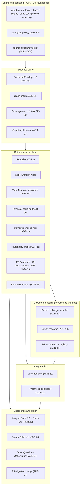

# Reference Architecture and ADRs — Developer Lens Intelligence Platform

Status: **Accepted (planning artifact)** · 2026-08-04 · Non-authoritative proposal space; canonical
contracts live in `../DEVELOPER_LENS_V2_ARCHITECTURE.md`, `../data-charter.md`,
`../source-capability-matrix.md`. Accepted deltas from this file are routed to the canonical
architecture at session close; the rest remains proposal.

Every ADR records: Context · Options · Decision · Why · Privacy effect · Compatibility/migration ·
Failure/rollback · Evidence to revisit · Cards constrained (IDs refer to
`07_DELIVERY_ROADMAP.md` and the Taskdeck starter pack).

## 0. Component map



Trust boundaries, sink contracts, and data classes are unchanged from the canonical architecture
(§5, §6, §11) and charter. Nothing below adds a new sink class, external transmission surface, or
provider; where a capability would need one, it is recorded as an **owner gate** in
`08_OPEN_QUESTIONS.md`, not assumed.

---

## ADR-01 — Evidence Spine 2.0: typed claim/limitation graph

**Context.** The canonical envelope (`CanonicalEnvelope`, coverage ledger, provenance) captures
observations and features, but insights currently reference evidence loosely; there is no typed
graph linking claims to supporting/contradicting evidence, limitations, corrections, and exports,
and no uniform "why am I seeing this?" resolution path.

**Options.** (a) Free-form `evidence_ids` arrays per insight (status quo of the V1 insight shape);
(b) a full triple/RDF store; (c) typed relational claim graph inside the existing SQLite canonical
store.

**Decision.** (c). Add four table families to the canonical store, all STRICT and FK-bound:

- `claim` — one row per rendered analytical statement at any layer above observed:
  `claim_id`, `layer` (deterministic|modelled|hypothesis|abstention), `statement_code` (closed
  enum), `method_id`+`method_version`, `window`, `scope_alias`, `schema_version`, `created_at`,
  `superseded_by`.
- `claim_evidence_edge` — `claim_id`, `evidence_id | claim_id (derives_from)`, `role` ∈
  {supports, contradicts, contextualizes, derives_from, coverage_basis, limitation_basis}.
- `limitation_instance` — `claim_id`, `limitation_code` (existing dictionary), `dimension`
  (coverage-vector dimension that triggered it), `copy_key`.
- `lineage_event` — corrections, revocation cascades, export inclusion: `subject_id`,
  `event_kind` ∈ {correction, tombstone_cascade, export_included, reconsent, index_built,
  index_deleted}, `caused_by`, `occurred_at`.

Claim IDs are deterministic: `cl_` + SHA-256 over (`statement_code`, `method_id@version`,
canonical-ordered input evidence IDs, window, scope alias, schema version). Replay of the same
inputs reproduces identical claim IDs; a changed input set produces a new claim and a
`superseded_by` link. "Why am I seeing this?" resolves UI element → claim → edges → evidence →
coverage → capability → consent revision in one deterministic walk.

**Stability key (accepted 2026-08-04, frontier finding C-03).** Because any new evidence mints a
new claim ID, claim *history* cannot be grouped by `claim_id`. Every claim additionally carries a
**stability key** — the tuple (`statement_code`, `method_id@method_version`, `window`,
`scope_alias`, `schema_version`) — as an indexed column set, so supersession chains are groupable
into series. This key is what claim-stability, calibration-scoreboard, and drift surfaces
(DL-EVQ-03/04) aggregate over. Grain rule: any surface derived from claim-version or collection
timing renders at ISO-week grain or coarser — the product's own operational timestamps fall under
the ADR-14 floor on a single-owner installation.

**Why.** Relational + deterministic IDs gives replayable lineage, cheap joins for the Evidence
Drawer, and no new storage engine. RDF adds modelling power nobody needs yet; free-form arrays
cannot express contradiction, correction, or export lineage, which principles 3–4 require.

**Privacy effect.** Claims carry only statement codes, method IDs, aliases, and windows — C1 by
construction; edges reference IDs only. No new class or sink. Export includes claim rows only via
the pack builder's allowlist with pack-scoped re-aliasing.

**Compatibility/migration.** Additive tables in the P2 store; existing P3 pack remains valid. V1
insights are not imported as claims; the bridge (ADR-04) generates claims only from V2 analyses.

**Failure/rollback.** If deterministic IDs prove unstable across platforms (float formatting,
locale), the canonicalisation function is versioned; a failed replay is a data-quality finding,
never a silent overwrite. Rollback = drop the four table families; deterministic features are
unaffected.

**Evidence to revisit.** If claim volume makes SQLite joins slow on realistic corpora (measure in
the pack benchmark card), introduce materialised projection tables — not a new engine.

**Cards.** SPINE-01 (contracts+tables), SPINE-02 (claim canonicalisation + replay proof),
SPINE-03 (why-am-I-seeing-this resolver), UX-ED (Evidence Drawer).

---

## ADR-02 — Coverage vector 2.0 and monotone abstention

**Context.** The canonical design already replaces the V1 scalar with a six-component
`EvidenceConfidence` vector and ten coverage statuses. The programme needs more dimensions
(parser coverage, snapshot comparability, drift, calibration) and a rule that prevents confidence
from ever being *upgraded* by missing evidence, plus claim-specific limitation copy.

**Options.** (a) Keep six components and overload them; (b) extend to a registered
dimension set with claim-tier gating; (c) collapse to a single score with explanations (REJ —
violates principle 7).

**Decision.** (b). The coverage vector becomes a **registered, versioned dimension set**:
`permission, completeness, freshness, censoring, conflict, sample, source_diversity,
parser_coverage, comparability, drift, calibration` — each `number | null` with a
`limiting_reason` code. Claim families declare **minimum vector requirements per claim tier**
(e.g. a modelled change-point claim requires `completeness ≥ 0.8`, `comparability = 1`,
`calibration ≠ null`). Degrading any dimension can only hold or lower the claim tier
(**monotone abstention**); no combination of other dimensions can compensate below a floor.
Limitation copy is resolved from a dictionary keyed by (claim family × limiting dimension),
so the same truncation produces claim-appropriate language everywhere.

**Why.** Registered dimensions keep the vector closed and testable; monotonicity is the formal
version of "absence is never zero" for claims; per-family gates make abstention preregistrable and
testable on degraded fixtures.

**Privacy effect.** None; all C1. **Compatibility.** `EvidenceConfidence` fields map 1:1 into the
extended set; existing UI copy keys continue to resolve. **Failure/rollback.** A missing dimension
value is `null` + limiting reason, never a default 1.0; rollback = ignore new dimensions.
**Revisit.** If per-family gates prove too coarse, add per-claim overrides through the same
registry, never ad-hoc code. **Cards.** SPINE-04 (dimension registry), SPINE-05 (monotone gate +
degraded-fixture proof), UX-CC (Coverage Cockpit).

---

## ADR-03 — Capability activation, consent, revocation, and deletion lifecycle

**Context.** The charter defines classes, retention, and revocation semantics; the matrix defines
per-capability behaviour; P4/P12 built confined activation-card parsers. There is no single
specified lifecycle joining task-card → preview → authority → activation → collection → retention →
reconsent/revocation → descendant deletion, and no cockpit UX.

**Options.** (a) Per-capability bespoke flows (status quo trajectory); (b) one typed lifecycle
state machine every capability instantiates; (c) global consent toggle (REJ — violates
least-privilege and per-capability deletion).

**Decision.** (b). One lifecycle, enforced by a typed state machine over `capability_consent`:

```
never_authorized → card_bound → previewed → active ⇄ suspended → revoked(tombstoned)
```

- Transitions require: `card_bound` = a reviewed, hash-bound activation card names exact scope,
  purpose, retained fields, deletion, and proving checks; `previewed` = the user saw the exact
  read boundary and retention; `active` = proving checks green at the exact head. Approval of a
  gate (G2/G3/G4) **never** performs a transition — proven by a registry-snapshot test that walks
  every capability after simulated approvals and asserts state is unchanged.
- Revocation runs the charter cascade: stop collection → enumerate descendants (facts, features,
  claims, graph projections, caches, retrieval indexes, model outputs, packs/backups under app
  control) → delete → write content-free tombstone → record `lineage_event`. Deletion enumeration
  is generated from the schema registry, not hand-maintained lists.
- Reconsent after a card change re-enters at `card_bound`; task-owned keys/databases/reports
  (issue #6 lineage) bind continuity; a failed key write follows the issue #59 recovery decision.
- Backup/restore is application-controlled and enumerated in the same registry so restore cannot
  resurrect revoked data (restore replays tombstones last).
- Cockpit UX (ADR-23) renders: per-capability state, retained classes, ages vs retention clocks,
  last collection, deletion preview ("what would be deleted"), and provider-held-copy disclosures.

**Why.** One state machine makes "approval never activates" a single testable invariant instead of
a per-connector convention, and makes deletion completeness derivable rather than curated.

**Privacy effect.** Strictly tightening. **Compatibility.** P4's existing card parser/loader and
P12's activation slices become instantiations, not rewrites. **Failure/rollback.** Fail-closed: an
unknown state or missing card blocks collection; a failed cascade leaves the capability
`suspended` with a data-quality finding, never half-deleted-but-active. **Revisit.** If descendant
enumeration from the registry misses a table (found by canary), that is a CI-blocking schema-registry
defect. **Cards.** LIFE-01 (state machine + invariant tests), LIFE-02 (deletion enumeration from
registry + cascade proof), LIFE-03 (backup/restore + tombstone replay), UX-PC (privacy cockpit).

---

## ADR-04 — P5 product/API/UI migration bridge (V1 → V2)

**Context.** The working product is V1: whole-file JSON store, one `/api/dashboard`-style payload,
scalar coverage, person-shaped DNA/archetype types, ShareStudio exporters fed from full
`DashboardData`. V2 foundations (P1 contracts, P2 SQLite, P3 pack, P4 connector, V2 demo seam)
exist but are inert. Without a designed bridge the programme stays disconnected architecture.

**Options.** (a) Big-bang replacement of the dashboard; (b) strangler bridge: V2 resources mount
beside the frozen legacy surface, views migrate one at a time with parity fixtures and a legacy
fallback; (c) evolve V1 types in place (REJ — person-shaped types and scalar coverage are exactly
what must retire).

**Decision.** (b), with this order and these mechanics:

1. **Freeze V1.** The legacy API payload and dashboard become read-only compatibility surfaces:
   no new fields, no new consumers. A `legacy-read-only` UI flag can pin the entire app to V1
   rendering as rollback at any point during the bridge.
2. **Mount `/api/v2/*`** resource endpoints (canonical §11 list) served from the P2 store; the
   first data is the synthetic importer's output, so the bridge is provable end-to-end with C0
   fixtures before any real collection.
3. **Parity fixtures.** One invented V1 dataset with a golden mapping: import → V2 store →
   safe-aggregate comparison (counts, windows, coverage mapping). Person-shaped V1 outputs
   (DNA, archetypes, streaks) are **deliberately absent** from parity: their retirement is the
   specified behaviour, asserted by a test that the V2 API exposes no such fields.
4. **View-by-view adoption.** Each System Atlas view (ADR-23) lands as a V2-only route; the legacy
   dashboard remains reachable until its replacement view passes its UX acceptance card; then the
   legacy route gains a deprecation banner; removal is a separate card per view.
5. **Coverage migration.** Scalar confidence renders only in legacy views; V2 views render the
   vector (ADR-02). The V1 scalar is never computed from V2 data.
6. **Deprecation order.** DNA/archetype/persona views → scalar confidence → legacy insight stack →
   legacy exporters (ShareStudio moves to `ExportView`-fed builders) → legacy collector last, and
   only after the real-migration protocol (G2) has run for the owner's data.
7. **Smallest user-visible vertical slice** (the programme's first implementation card):
   Coverage Cockpit + PR-integration-shape panel rendered from `/api/v2/coverage` +
   `/api/v2/features` over synthetic-importer data, with Evidence Drawer resolving one claim
   end-to-end. This exercises spine, storage, API, and UX in one bounded slice.

**Why.** The strangler order retires the highest-risk surfaces (person-shaped analytics) first,
keeps a working product at every commit, and makes the V2 spine load-bearing immediately.

**Privacy effect.** Net tightening: each migrated view stops touching identity-bearing V1 fields.
**Compatibility.** V1 private JSON stays untouched until the separately-gated real migration; the
bridge runs entirely on fixtures until then. **Failure/rollback.** `legacy-read-only` flag; every
view card carries its own revert. **Revisit.** If parity reveals V1 aggregates that cannot be
reproduced from V2 facts (e.g. search-enriched counts), the delta is recorded as a coverage
limitation, not patched with V1 data. **Cards.** BRIDGE-01…05, UX-CC, UX-ED.

**Grounded constraints (verified against code, 2026-08-04).** (V) The V1↔V2 production contact is
exactly one seam (`shared/v2Demo.ts` → `V2Demo.tsx` behind `?demo=v2`); the P1/P2/P3/P4/P12
subsystems have **zero production callers** — their current safety proof *is* having no caller, so
every bridge card is a "first production caller" event and carries a fresh adversarial review.
(V) `scripts/exportDemo.ts` mutates `DashboardData` in place and `scripts/verifyShowcase.ts` reads
it as `DashboardData`; the Pages workflow is the repository's only CI — therefore the V1 freeze in
step 1 is also CI protection, and any intentional `DashboardData` change is its own card with a
showcase-gate proof. (V) `better-sqlite3`/DuckDB are ABI-specific and the repo has no dynamic
`import()`; **decision:** V2 API/storage mount behind lazy dynamic import so demo and showcase
paths never load native modules. (V) The V1 path has no runtime schema validation (unchecked `as
DashboardData` casts); **decision:** every `/api/v2/*` response is schema-validated at the
boundary from day one, and the new endpoints ship with the per-launch bearer + exact Host/Origin
allowlist from birth (legacy endpoints unchanged until their retirement cards). **Decision —
provenance of served data:** the bridge slice serves only stores populated by the synthetic
importer under an explicit synthetic-mode marker; the V2 read path refuses stores whose provenance
is neither synthetic-marked nor bound to a reviewed activation card, so the bridge cannot silently
become a real-data path.

---

## ADR-05 — Repository X-Ray (committed-tree composition)

**Context.** SRC-COMP-01 exists in the matrix (G3-approved, `cap.source.structure`). The programme
needs the concrete role taxonomy, monorepo boundaries, and comparability rules.

**Decision.** Immutable-ref, ephemeral `git ls-tree` enumeration inside the isolated worker
(ADR-06 controls); retained output is C1: language/byte-share by controlled vocabulary, role
presence/counts for a closed role taxonomy {build, test, docs, config, migration, api_surface,
ci_definition, dependency_manifest, generated, vendored, binary_asset, **schema_definition,
fixture_golden, snapshot_artifact**} (14 roles; the last three accepted 2026-08-04 from frontier
finding A4 — they make golden/fixture-anchored contract surfaces and migration-ledger archaeology
observable), package/monorepo boundary count via manifest-presence classes, and
parser/enumeration coverage. Paths, names, file lists are
C4 and destroyed. Boundaries: no working tree, no submodule recursion without its own consent, no
content reads beyond role sniffing rules that are themselves closed (extension/manifest tables,
never file bodies except bounded manifest parses already covered by GH-SBOM-01 rules).

**Why/Privacy/Rollback.** Deterministic, cheap, C1-only; failure of any parse degrades
`parser_coverage`, never fabricates composition. Rollback = delete summaries (90d C3 graph rows
don't exist here; composition is pure C1). **Revisit.** Role taxonomy extensions go through the
registry, not ad-hoc sniffing. **Cards.** XRAY-01 (role taxonomy + fixtures), XRAY-02 (worker
enumeration + coverage), XRAY-03 (monorepo boundaries).

---

## ADR-06 — Code Anatomy parser strategy and isolation

**Context.** SRC-MODULE-01/SRC-API-01 need a concrete parser architecture: which parsers, how
isolated, how versioned, what happens on hostile input.

**Options.** (a) Language-native compilers only (deep but narrow); (b) tree-sitter grammar set
only (broad but shallow); (c) tiered: tree-sitter breadth + TypeScript compiler API depth for the
first-class language, both pinned and bundled; (d) LSP servers (REJ — arbitrary executables,
network risk, unpinnable).

**Decision.** (c). Tier-1: TypeScript/JavaScript via the pinned TS compiler API (typed import
graph, public-declaration counts). Tier-2: a pinned, bundled tree-sitter grammar set (initial:
Python, C#, Java, Go, Rust) for import/reference edges and declaration counts where grammar
quality is documented; everything else abstains with `parser_coverage` recorded per language.
Execution model: one isolated worker process per analysis run — no network, no shell, no
repository executables/hooks/config, blobs streamed in, bounded input size/time/memory/output,
stdout/stderr disabled, crash of one file recorded and skipped. Output: HMAC module nodes, typed
edge counts, declaration counts — C3 graph (90d) + C1 summaries; AST and diagnostics are C4.
`parser_bundle_version` stamps every output; comparability requires equal major (ADR-07).

**Why.** Tiering matches evidence value to parser quality; bundling+pinning is the only way to
keep "no repository code executes" true and outputs reproducible. **Failure/rollback.** Grammar
crash ⇒ per-file skip + coverage; bundle upgrade ⇒ new major ⇒ old snapshots stay valid but
incomparable across the boundary; rollback = delete graph/summaries. **Revisit.** Add a language
only with a documented grammar-quality note and fixture corpus; never at runtime.
**Cards.** ATLAS-01 (worker sandbox + resource caps + hostile fixtures), ATLAS-02 (TS tier-1
extractor), ATLAS-03 (tree-sitter tier-2 set), ATLAS-04 (module graph + SCC/fan-in/out features),
ATLAS-05 (API-surface counts), ATLAS-06 (test-to-code topology).

---

## ADR-07 — Architecture Time Machine (comparable snapshots and eras)

**Context.** Evolution claims need comparability rules, split/merge semantics, and era boundaries;
naive cross-version comparison would manufacture "architecture drift" from parser drift.

**Decision.** A **snapshot** is keyed by (repository alias, ref OID, `parser_bundle_version`,
config revision) and stores graph + composition + API-surface + policy/CI/dependency aggregates
from the same immutable ref. **Comparability** requires equal parser major and equal config
revision; incomparable pairs render as separate eras with an explicit `comparability` dimension
limitation, never as deltas. **Module continuity** across snapshots uses content-overlap
matching (HMAC'd normalized identifier sets); continuity, split, and merge assignments are
**modelled** layer with reported match confidence, never observed facts. **Matched-window middle
case (accepted 2026-08-04, frontier finding C-08):** between "comparable" and "incomparable" sits
the matched-sub-window comparison — eras compare only on sub-windows where the instrument matched
(equal parser major, equal config revision, coverage within preregistered tolerances), the
**matched fraction** of each era is a first-class number, and the unmatched residual names its
disqualifying dimension; the naive whole-era diff is never rendered when the matched diff disagrees
with it. **Eras** are labeled
intervals derived from accepted change-points (ADR-17), policy/CI transitions, or user annotation;
"what materially changed between eras" is a deterministic diff of snapshot aggregates plus
modelled continuity, each element carrying its layer badge.

**Why.** Keying comparability to parser major is the only honest way to separate system change
from instrument change. **Failure/rollback.** A missing snapshot member degrades `comparability`;
era labels are presentation, deletable without touching facts. **Revisit.** If continuity matching
proves unstable on fixtures (<preregistered stability), ship era diffs without continuity claims.
**Cards.** TIME-01 (snapshot contract), TIME-02 (comparability+continuity with planted
split/merge fixtures), TIME-03 (era diff view model).

---

## ADR-08 — Explicit-ref Git topology and history (hardened P6)

**Context.** GIT-GRAPH-01/GIT-REF-01/GIT-SIGN-01 and P6 define the boundary; the programme
formalises the extraction contract as a dependency for cadence, traceability, coupling, releases,
and snapshots.

**Decision.** Confirm and freeze: explicitly selected immutable refs only; `git rev-list`/
`git log`/`for-each-ref` with `--no-replace-objects`, `--no-lazy-fetch`, disabled aliases/hooks/
filters/textconv/external-diff; never `--all`, never implicit fetch, never repository executables;
raw stderr is swallowed into stable codes. Extracted: parent graph, merge structure, reachability,
first-parent release ancestry, ref-movement enums (fast-forward, non-fast-forward, deleted,
stale-upstream), revert/backport **candidates only via topology patterns (modelled)**,
shallow/partial/replace/graft boundaries and missing objects as coverage (`GIT_SHALLOW_BOUNDARY`,
`GIT_PARTIAL_OBJECT_MISSING`), optional signature coverage per GIT-SIGN-01. Retained: HMAC object
keys, parent edges, timestamps, enums (C2, 13m). Explicit rule: current reachability is never
evidence of historical publication; force-push is never asserted without authoritative movement
observation.

**Why.** Everything downstream (coupling, cadence, releases, snapshots) keys on this contract;
freezing it now prevents per-consumer divergence. **Failure/rollback.** Missing object ⇒ coverage;
hostile config fixtures must produce zero execution; rollback = capability revocation cascade.
**Revisit.** Only a documented Git behaviour change (new version semantics) reopens the flag set.
**Cards.** GIT-01 (hardened extraction + hostile-config corpus), GIT-02 (ref movement + release
ancestry), GIT-03 (coverage semantics for shallow/partial/missing).

---

## ADR-09 — Temporal coupling and change amplification

**Context.** `DL.ARCH.TEMPORAL_COUPLING.v1` and SRC-COUPLING-01 exist; the programme adds change
radius, migration waves, and cross-repository contract waves.

**Decision.** Inputs: selected commit diffsets mapped ephemerally (path→HMAC module) inside the
worker; caps: modules/commit ≤ 50 (excess ⇒ excluded + disclosed), oversize/generated-only commits
excluded + disclosed. Outputs (C3 sparse graph, C1 summaries): pair co-change ratio with support,
**change-radius distribution** (modules touched per eligible commit over time),
**coupling stability** (pair persistence across windows), **migration waves** (connected
subgraphs of elevated co-change bounded in time), and **cross-repository contract waves** via
weekly-lift over pack-scoped dependency/contract aliases (reusing `DL.CROSS.REPO_COOCCURRENCE_LIFT`
mechanics). Hard wording rule enforced in copy dictionary: co-change is association; dependency,
fault, ownership, or design-quality claims require independent structural evidence (ADR-06 edges)
and then still render as separate claims with their own evidence.

**Why.** These are the highest-value structure-change signals available without retaining paths.
**Failure/rollback.** Rename heuristics are versioned; a heuristic change invalidates dependent
features only. **Revisit.** If support gates leave everything suppressed on real corpora, lower
gates only through the preregistered display-gate process. **Cards.** COUP-01 (ephemeral diffset
mapping + caps), COUP-02 (radius/stability/wave features), COUP-03 (cross-repo wave lift).

---

## ADR-10 — Semantic change analyser (charter-safe tier)

**Context.** `cap.commit.intent` (G2-approved, ephemeral C4 subjects → C1 controlled mix) is the
only text-bearing input currently inside the charter. Richer semantics (PR/issue prose, durable
text embeddings) are outside.

**Decision.** Tier-1 ships inside the existing charter: ephemeral conventional-commit and rule
parsing over selected self-attributed subjects; controlled categories {maintenance, feature, test,
docs, refactor, fix, migration, config, dependency, revert, unknown}; multilingual handling =
language-agnostic rule families first, `unknown` otherwise; per-window mix with parser version and
≥80% completion gate; abstention below gates. Classifier ML stays a workbench candidate (ADR-19)
against the rule baseline with owner-labelled invented corpora. **Tier-2 (PR/issue prose, durable
text embeddings, richer semantic retention) is an explicit owner-gated policy proposal** recorded
in `08_OPEN_QUESTIONS.md` — not designed into any dependency here; no card assumes it.

**Why.** Keeps the analyser useful now, keeps the charter honest, and gives ML a fair baseline to
beat. **Privacy.** C4 destroyed in-process; only category counts persist. **Rollback.** Capability
revocation deletes summaries. **Cards.** SEM-01 (rule families + multilingual fixtures), SEM-02
(mix features + abstention), WB-C2 (classifier candidate, research).

---

## ADR-11 — Issue → PR → commit → release → deployment traceability graph

**Context.** `X-FLOW-01` and P7 give explicit linkage; the programme needs the typed graph, the
observed/suggested split, and revert/backport handling.

**Decision.** One typed `graph_projection` family `traceability.v2` with node kinds {issue, pr,
commit_alias, release, deployment} and edge kinds {closes(provider-observed), blocks, parent,
subissue, merge, release_ancestor(first-parent proof), deployment_of, revert_candidate(modelled),
backport_candidate(modelled), suggested_assoc(modelled)}. Provider-observed edges persist as
observed layer with source snapshots. Suggested associations (temporal adjacency, branch-topology
patterns) are **claims** (ADR-01) with calibrated uncertainty, alternatives, and falsifiers —
rendered only in hypothesis styling, excluded from deterministic flow ratios
(`DL.FLOW.ISSUE_PR_RELEASE_RATIO.v1` stays observed-edges-only). History is never rewritten: a
new provider edge supersedes a suggested claim via lineage, and the Delivery Map shows the
correction.

**Why.** The observed/suggested split preserves both usefulness (suggestions exist) and integrity
(ratios never launder guesses). **Rollback.** Suggested-edge generator is removable without
touching observed flow. **Cards.** TRACE-01 (typed graph + observed edges), TRACE-02 (release/
deployment ancestry), TRACE-03 (suggested-assoc claims + calibration fixtures).

---

## ADR-12 — Pull-request integration and rework observatory

**Context.** P7 features exist in the dictionary (integration duration, first signal, rework
episodes, change surface, review coverage). The programme adds head-movement episodes, stack/
retarget topology, batch shape, and long-tail/censoring treatment as a coherent observatory.

**Decision.** Extend the P7 fact family with: draft/ready transition sequences, head-movement
counts between review states, stack topology observations (base-retarget events, GH-STACK-01
boundary), queue/auto-merge state transitions where observable, batch shape (PRs per release
interval reusing `DL.REL.CHANGE_BATCH`), and explicit censoring records for open/abandoned tails.
All distributions render as ECDF/quantiles with eligible/censored counts (no means without
distribution). Wording rule: every latency is a **system/queue property**; the copy dictionary has
no per-person formulation, and the schema has no reviewer/author dimension.

**Cards.** OBSV-PR-01 (transition/rework facts), OBSV-PR-02 (stack/retarget), OBSV-PR-03
(batch + censored tails). Survival-analysis research stays WB-C6 (ADR-19).

---

## ADR-13 — Projects and aggregate ownership coverage (approved G3 boundary)

**Context.** `GH-PROJV2-01`, `GH-CODEOWNERS-01`, `GH-TEAM-01` are matrix-approved with C3/C4
limits; q-2 binds the boundary.

**Decision.** Implement exactly the matrix boundary: ProjectV2 status-snapshot aliases and
aggregate transition counts (no custom prose/values, C4-parse → approved local taxonomy aliases
only); repository-level CODEOWNERS match/unmatched/error counts (patterns/owners C4-destroyed);
team-coverage aggregates with size-band suppression (size-one suppressed). Copy dictionary bans:
"actively owned", "responsible team", "stewardship" — permitted claim is *declared-rule coverage*.
No people graph, member lists, or named bus factor — `GH-PEOPLE-X` stays rejected.

**Cards.** GOV-01 (ProjectV2 transitions), GOV-02 (CODEOWNERS coverage), GOV-03 (team-coverage
aggregates + suppression proofs).

---

## ADR-14 — System cadence and work-shape observatory + programme-wide proxy review

**Context.** Cadence is the highest re-identification-risk domain: fine-grained timing
reconstructs schedules. The V1 product's streak/weekend/hour features are already retired by the
canonical architecture.

**Decision.** Cadence analyses only **coarse, repository-level system distributions**: release
intervals, integration-shape trends, queue distributions, machine-feedback shape over time, and
sufficiently-supported topology/coordination transitions. Time grain floors: nothing finer than
ISO week for any cadence surface; day-grain only inside CI queue/exec distributions where the
subject is provider infrastructure and support gates hold. Prohibited outputs (schema-rejected):
event calendars, work-session boundaries, pause/return detection, hour-of-day/day-of-week
personal profiles, cross-repository personal timelines, low-support windows. The
**proxy/composition review** becomes programme-wide (per ADR/card checklists): for each feature
and each plausible feature combination, ask "could this reasonably reconstruct attendance,
schedule, effort, diligence, or individual behaviour?" — if yes, coarsen (grain/aggregation),
suppress (sample gates), or reject; record the decision in the card. Copy rule: "fast" and "busy"
are never framed as goods; trend copy is descriptive.

**Cards.** CAD-01 (coarse cadence features + grain floors), CAD-02 (proxy/composition review
checklist as a tracked template applied to every card), CAD-03 (schema rejection tests for
prohibited outputs).

---

## ADR-15 — CI, release, deployment, and dependency feedback studio

**Context.** P8/P9 boundaries and the CI/release/dependency features exist; the studio unifies
them with attempt-aware semantics and adds provenance coverage.

**Decision.** Attempt-aware run/job shape (queue, exec, outcome mix, rerun, recovery) per the
dictionary; cancellation/matrix-fanout classes from GH-ACT-DEF-01's ephemeral YAML parse (trigger/
concurrency/matrix presence classes only); release batches and deployment outcomes with 90-day
status censoring surfaced (`GH_DEPLOY_STATUS_90D_CENSOR`); dependency-update waves per ADR-09
mechanics; Dependabot/code-scanning aggregate lifecycles in the isolated C3 store (P9 card fixes
its isolated schema first, per matrix); attestation/provenance **coverage** (subject-digest
verification results as coverage ratios, never trust claims). Wording rules: rerun ≠ flaky,
failure ≠ poor quality, alert count ≠ security posture — enforced in the copy dictionary and
claim statement enums.

**Cards.** CI-01 (attempt-aware facts — extends P7/P8 lane), CI-02 (workflow-definition classes),
CI-03 (deployment linkage + censoring), DEP-01 (waves), SEC-01 (isolated alert lifecycle store),
PROV-01 (attestation coverage).

---

## ADR-16 — Repository and portfolio evolution

**Context.** `X-PORT-01`, portfolio features, and lifecycle facts exist; the programme adds era
comparison across repositories and policy/config evolution without leaderboards.

**Decision.** Deterministic portfolio surfaces: lifecycle transitions (emergence, archive, fork,
transfer, visibility boundary), language/composition transitions (JS distance over composition
vectors), effective-repository distribution, cross-repo waves (ADR-09), policy/CI-config
transition counts (GH-RULE-01 aggregates), and portfolio-level era comparison built from ADR-07
era diffs. Comparison surfaces are always **descriptive distributions across the portfolio**,
never ranked lists with normative framing; the copy dictionary bans "top", "best", "healthiest",
"most mature". **Cards.** PORT-01 (lifecycle/composition transitions), PORT-02 (policy/config
evolution), PORT-03 (portfolio era comparator view model).

---

## ADR-17 — Pattern, motif, and notable-change lab

**Context.** The canonical §9 already stages change-points (median/MAD baseline; PELT/Bayesian
research) and motif mining. The lab operationalises them with false-alert budgets and
coverage-shift separation.

**Decision.** Ladder per family: (1) deterministic transition/frequency counts; (2) robust
baseline residuals (rolling median/MAD) with preregistered alert thresholds and a **false-alert
budget expressed per year of observation**; (3) offline change-point research (PELT and Bayesian
online detection as candidates) gated by ADR-19. Every change-point evaluation runs jointly on the
**coverage series**: a candidate change coinciding with a coverage/permission/parser shift is
classified `coverage_shift_candidate`, not a system change, unless the signal survives within
fully-covered subwindows. Seasonal controls (weekly/annual) are part of the baseline, not the
model's job to discover. Outputs are claims with intervals, alternatives (including the coverage
alternative), and falsifiers. Motifs: n-gram/transition counts first; suffix-tree mining research
with time-held-out stability. **Cards.** LAB-01 (deterministic counts + residual alerts +
false-alert budget), LAB-02 (coverage-shift separation fixtures), WB-C1 (change-point candidates),
WB-C4 (motif candidates).

---

## ADR-18 — Graph and dynamic-community research

**Context.** Typed graphs exist per domain; §9 stages community detection as research.

**Decision.** Separate typed graph projections per domain (module, repository, dependency,
traceability, workflow, temporal co-change) — never merged into one universal graph, and never
containing people nodes (schema-enforced). Baseline shipped surface: SCC/components, degree/
fan-in/out distributions, density, simple centralities **of modules/repositories only** with
system framing. Community detection (e.g. Leiden) and graph embeddings remain seeded, repeatable
research: planted-partition recovery, seed stability, snapshot sensitivity, sparse suppression
gates before any UI exposure, and semantic labels never asserted from structure alone.
**Cards.** GRAPH-01 (typed projections + baseline stats), WB-C5 (community/embedding candidates).

---

## ADR-19 — ML research workbench, model registry, and promotion gates

**Context.** §9 lists candidates and gates; the programme needs the governance mechanics:
benchmarks, cards, preregistration, and the rule that nothing becomes implementation-ready in this
planning session.

**Decision.** A research workbench (future `server/research/*` or offline notebooks per P11) with:

- **Frozen invented benchmark suites** per candidate family (fixture generators with planted
  effects, versioned and checksummed; generation parameters are the dataset card).
- **Dataset cards** (source, invention parameters, classes, known limitations) and **model cards**
  (task, baseline, metrics, calibration, drift, abstention, removal path) for every candidate.
- **Preregistration**: before tuning, freeze primary metric, minimum practically-meaningful
  improvement, feature-availability time, split policy (rolling-origin/nested time-aware), and the
  final holdout; a failed gate consumes the holdout (no reuse); false discovery across the
  candidate family controlled (Benjamini–Hochberg across the family's primary tests).
- **Promotion ladder**: `seeded → benchmarked(invented) → validated(consented,real) → shipped`,
  where `validated` requires a separately authorised, representative, consented dataset with its
  own card and an untouched final holdout — invented fixtures can never carry a candidate past
  `benchmarked`. Every shipped model keeps the §9 eight conditions (baseline beat, holdouts,
  calibration, drift, explainability, abstention, fallback, no person targets).
- **Registry**: `model_registry` rows with method ID/version, card links, gate evidence,
  promotion state; UI claims resolve the registry so a demoted model disappears from claims
  automatically.

Candidate register (all `seeded`, none implementation-ready): C1 change-points, C2 change-intent
classifier, C3 CI-family classifier (metadata-only; reject if baseline unbeaten), C4 motifs,
C5 communities/embeddings, C6 time-to-event (KM baseline, censoring-aware), C7 probabilistic
observability, C8 architecture-change classifier, C9 aggregate retrieval ranking (ADR-20).

**Cards.** WB-01 (workbench harness + benchmark format), WB-02 (registry + promotion mechanics),
WB-C1…C9 (candidate cards, research). **Privacy.** All benchmark data invented C0; consented
real validation is its own owner-gated future decision per candidate.

---

## ADR-20 — Local evidence retrieval and RAG

**Context.** G4 approves only the OpenAI/Luna C1 boundary; the charter's Model sink and local
retrieval rules bind. The programme must decide how evidence is selected for hypothesis
composition, and whether vectors earn a place.

**Decision.** Retrieval is **evidence-ID-based over explicitly selected C1 analysis-pack facts**,
in three ladder steps that must each beat the previous on the retrieval benchmark before adoption:

1. **Deterministic structured retrieval (default, shipped):** SQL filtering over typed facts +
   feature registry (claim family → relevant feature IDs/coverage/limitations mapping), with
   standardized-distance ranking (z-scored numeric features) for "similar windows/systems".
   **Mandate:** every retrieval result set deliberately includes supporting, contradicting,
   coverage, and limitation evidence (quota per class), so downstream composition cannot cherry-pick.
2. **Controlled-template lexical index (research):** BM25 over *rendered controlled templates*
   (statement codes + registered enums only, no prose) — evaluated only if (1) measurably fails
   recall on the benchmark.
3. **Vector index (research, likely-reject):** local, pinned, offline embedding over the same
   controlled templates only; inherits the highest input class (C1); task-scoped, process-local,
   non-exportable, non-cross-pack-linkable, deleted on revocation; any durable index is a
   separately reviewed sink (owner gate). Adopted only if it beats (1) and (2) on Recall@k/nDCG
   **and** counter-evidence recall with acceptable reconstruction/membership-inference canary
   results.

Strict field registry applies before templating or embedding; an embedding is never anonymous.
Evaluation battery: Recall@k, nDCG/MRR, citation validity (every returned ID resolves),
counter-evidence recall, unsupported-claim rate downstream, deletion proof (index rebuilt-empty
after revocation), stale-index behaviour, prohibited-field canaries, membership-inference and
uniqueness-leakage probes. No hosted files, vector stores, external embeddings, web search, or
tools — ever, under current authority.

**Why.** Over C1 codes/numbers, structured retrieval is probably sufficient; the ladder makes
"vectors are not justified" a measurable success rather than an ideology. **Cards.** RAG-01
(structured retrieval + counter-evidence quotas), RAG-02 (retrieval benchmark + canaries), WB-C9
(lexical/vector candidates, research).

---

## ADR-21 — Hypothesis and counter-hypothesis composer

**Context.** The G4 boundary, evidence-bundle schema, and `ModelClaim` output contract exist; the
composer is the deterministic machinery around them.

**Decision.** The composer is **deterministic-first**: template-driven claim assembly (statement
code + evidence slots filled by ADR-20 retrieval with its counter-evidence quotas), producing
structured claims with supporting/contradicting IDs, alternatives from a closed per-family
alternative enum, confidence bands derived from the coverage vector (ADR-02 gates), abstentions
when gates fail, and a mandatory "what evidence would change this?" question generated from the
family's falsifier registry. The optional external step remains exactly the approved OpenAI/Luna
C1 request (uncalled in this session; `cap.external.model` `never_authorized`); a future local
model must be pinned, licensed, offline, non-executing-remote-code. Model output only ever
re-ranks/re-words within the closed enums — it cannot add evidence IDs (schema-rejected) or new
statement codes.

**Cards.** HYP-01 (template composer + falsifier registry), HYP-02 (coverage-derived confidence
bands), P12 lane continues separately for the external activation (existing cards/issues).

---

## ADR-22 — Analysis Pack 2.0 and Query Lab

**Context.** P3 shipped a one-table C1 coverage pack with checksums/COMPLETE/immutability. The
canonical Appendix D layout is the target. The charter forbids a generic SQL/table endpoint on the
private API.

**Decision.** Pack 2.0 implements the Appendix D layout incrementally (facts, features, graphs,
insights/claims, coverage, data-quality, dictionary, example SQL, notebook plan), each table
family landing with its producing capability; pack-scoped aliases and sparse suppression at build;
preview/acknowledgement before build; immutable COMPLETE; `pack_schema_version` gates readers.
**Query Lab runs over the pack, not the canonical store:** the local UI opens a user-selected
completed pack directory via DuckDB-WASM entirely in-browser (no new API endpoint, no server SQL
surface), offering example queries from the pack's own `queries/` and a read-only schema browser.
This honours the sink contract (the pack is already redacted/aliased) while making evidence
explorable in-product. Notebook plans reference the same pack (external DuckDB/Python).

**Failure/rollback.** A pack that fails checksum/COMPLETE refuses to open; Query Lab has no write
path. **Revisit.** If DuckDB-WASM bundle cost is unacceptable, Query Lab degrades to copyable SQL
+ external-tool instructions (still no server SQL endpoint). **Cards.** PACK-00 (manifest
reconciliation), PACK-01…04 (tables per producing domain), PACK-05
(preview/acknowledgement/suppression), QL-01 (DuckDB-WASM lab), QL-02 (example-query + dictionary
generation).

**Banded structural exports (accepted 2026-08-04, frontier cross-cutting risk from Scout A).**
Structural *shape vectors* — role byte shares, package/module-graph topology, declaration-count
series — are strong fingerprints of a public repository and can defeat pack aliasing by matching
against public data. Cross-cutting pack rule: structural shape values export only in **coarse
bands**; exact topology/edge lists never leave C3 (PACK-05 enforces; applies to the whole
X-Ray/Atlas family, and release instants export ISO-week-floored).

**Grounded constraint — three disagreeing manifest shapes (V, 2026-08-04).** The repo currently
holds (a) the implemented Zod pack manifest in `server/analysisPack/analysisPack.ts`
(`manifestVersion 1.0.0`, one coverage table, strict — canary-rejects unknown fields), (b) a
materially wider `docs/analysis-pack/manifest.schema.json` (18-path artifact list, 13-capability
enum, an `externalModelEvidence` field the implementation rejects), and (c) the canonical §11
snake_case example with a third field set. **Decision:** the implemented Zod schema is the sole
authority for pack `1.0.0`; Pack 2.0 defines `pack_schema_version 2.0.0` reconciling all three
shapes, and PACK-00 updates the JSON schema + canonical example to match before any new table
lands. Until PACK-00, no consumer may be written against shapes (b) or (c).

---

## ADR-23 — System Atlas UX and storytelling

**Context.** The V1 UI is dashboard+Wrapped; V2 needs the atlas views with the seven-way visual
grammar (fact/derivation/model/hypothesis/contradiction/limitation/question).

**Decision.** Information architecture (detailed in `05_UX_STORYBOARD.md`): **Evidence Atlas**
(home: system overview + coverage), **Architecture Time Machine**, **Change River** (flow of
change families over time), **Delivery/Traceability Map**, **Pattern Lens**, **Era Comparator**,
**Evidence Drawer** (universal claim inspector), **Coverage/Privacy Cockpit**, **Query Lab**, and
a guided **System Story** (Wrapped-successor narrating one era of one system). One visual grammar:
layer badges + consistent styling tokens for the seven statuses; every number is clickable to its
claim; every hypothesis card ends with its falsifying question; suppressed/missing data renders as
explicit coverage furniture, never blank. Adoption follows the ADR-04 bridge order; each view has
a UX acceptance card with annotated wireframes in `05` (desktop + mobile) and no React/CSS
implementation in this session.

**Cards.** UX-CC, UX-ED, UX-TM, UX-CR, UX-DM, UX-PL, UX-EC, UX-QL, UX-SS (one per view) + UX-VG
(visual grammar tokens).

---

## ADR-24 — Open Questions and Opportunity Observatory

**Context.** Principle 8 makes open questions first-class; coverage gaps, contradictions, and
falsifiers already exist as data.

**Decision.** A `question` claim family: each question carries kind (evidence_gap, contradiction,
untested_alternative, future_source, calibration_check), the claims/coverage rows that spawned it,
the **cheapest resolving evidence** (a registered enum of collection/consent/analysis actions with
cost class), and status (open, answered(link), obsolete). The Observatory view lists/filters
questions, shows what each would unlock, and offers a **"surprise me"** exploration that samples
under-visited evidence regions (coverage-weighted random walk over the claim graph — deterministic
seed, so reproducible). Questions are data, so packs export them and the story can end on one.

**Cards.** OPEN-01 (question family + generators), OPEN-02 (observatory view model + surprise-me
walk).

---

## Cross-cutting dependency spine (summary)

The full DAG with phases lives in `07_DELIVERY_ROADMAP.md`. The load-bearing order:

```
SPINE (ADR-01/02/03)  →  BRIDGE first slice (ADR-04)  →  everything user-visible
GIT (ADR-08)          →  COUP, TIME, TRACE ancestry, CAD
XRAY/ATLAS (05/06)    →  TIME (07), test-topology, API-surface
TRACE (11) + OBSV (12)→  Delivery Map, flow ratios
LAB/WB (17/19)        →  any modelled claim in UI
RAG (20)              →  HYP (21)  →  P12 external lane (existing)
PACK (22)             →  Query Lab, notebooks, RAG source
```

No high-sensitivity connector, parser, ML feature, RAG index, or model narrative schedules before
its contracts, deletion path, coverage semantics, benchmark, and UI claim grammar exist — this is
encoded as explicit `BLOCKED_BY_DEPENDENCY` states on the cards.
