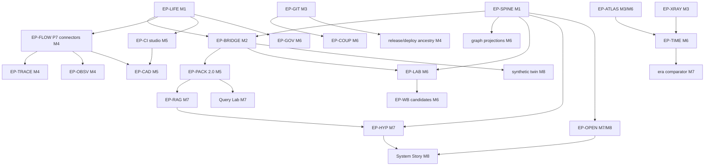

# Delivery Roadmap — Dependency DAG, Critical Path, Milestones, Card Index

Status: **Accepted (planning artifact)** · 2026-08-04 · reconciled after PR #62 (owner directive)
· Non-authoritative; stable dependency order is routed to the canonical architecture. Full card
contracts live exactly once, in the **generated** starter pack
[`taskdeck/developer-lens-intelligence-platform.taskdeck.json`](./taskdeck/developer-lens-intelligence-platform.taskdeck.json),
built by `taskdeck/tools/generate.mjs` from the single structured source
`taskdeck/tools/cards.mjs` — card text is never hand-duplicated between this file and the pack,
and §6's index is regenerated by the same tool (drift is structurally impossible).

Statuses: READY (no open dependency, no owner gate) · BLOCKED_BY_DEPENDENCY (one exact unlocking
event named) · RESEARCH (workbench-governed, can never ship ungated) · OWNER_GATED · PARKED ·
QUESTION (Open Questions column) · DONE. Effort bands S/M/L and risk bands are planning aids only —
no calendar promises and no human-productivity estimates.

## 0. Reconciled execution waves (2026-08-04 — these override milestone order for scheduling)

The next phase is **convergence, not horizontal expansion**: the platform must prove one strong,
deterministic, decision-relevant system finding in the running product before packs, retrieval,
hypothesis composition, or research earn schedule time. Milestones M1–M8 (§1) remain the long-term
phase *grouping*; execution order follows these waves:

| Wave | Content | Cards |
|---|---|---|
| R0 | Planning reconciliation (docs only) — **done** | DL-RECON-01, DL-CONTEXT-01 |
| R1 | V2 bootstrap: authenticated lazy coverage/capability API + Cockpit over a synthetic store | DL-BRIDGE-01 |
| R2 | Analytical kernel: claim spine, coverage vector, metric registry, finding + comparison contracts, resolver | DL-SPINE-01/02/03/04, DL-METRIC-01, DL-FINDING-01, DL-COMPARE-01, DL-OPS-CI-01 |
| R3 | First deterministic analytical value slice (integration shape, matched windows) | DL-VALUE-01, DL-VALIDATE-01, DL-UX-ED |
| R4 | Flow and feedback facts that deepen the finding | DL-LIFE-01/02, DL-SPINE-05, DL-BRIDGE-02, DL-FLOW-01/02/04, DL-OBSV-01/03, DL-CI-01 (after deletion planner) |
| R5 | Deterministic System Story + V1 retirement matrix | DL-BRIDGE-03/04, DL-LAB-01, DL-OPEN-01, then DL-UX-SS (deterministic beats), DL-UX-VG/CC — the Story's declared producer chain lands inside R4/R5 so the wave plan is dependency-true (corrected 2026-08-04) |
| R6 | Packs + Query Lab (PresentationView) | DL-PACK-00/01/02/04/05/06, DL-QL-01 |
| R7 | Optional interpretation (off the critical path) | DL-RAG-*, DL-HYP-*, WB candidates as unfrozen |
| R8 | Specialised lenses and remaining programme | structure/time/graph/portfolio depth, demos, frontier |

**Revised critical path:**

```
DL-RECON-01 [done in this PR]
    → DL-BRIDGE-01 [bootstrap]
    → parallel: DL-SPINE-01/04 · DL-METRIC-01 · DL-OPS-CI-01
    → DL-SPINE-02 + DL-FINDING-01 + DL-COMPARE-01
    → DL-VALUE-01 + DL-SPINE-03 + DL-UX-ED   [first analytical value]
    → DL-BRIDGE-03 [parity + V1 retirement matrix]
    → DL-FLOW-01/02/04 → DL-OBSV-01/03
    → DL-SPINE-05 + DL-BRIDGE-02 → DL-LAB-01 + DL-OPEN-01
    → DL-UX-SS [deterministic System Story]
    → DL-PACK-* + DL-QL-01
    → optional DL-RAG-* / DL-HYP-* / WB
```

`DL-LIFE-01/02` remain mandatory before any high-sensitivity or real/private connector becomes
schedulable: the synthetic bridge does not wait for real-data activation machinery, but **no
connector may create retained sensitive descendants before the deletion planner exists** (every
such connector now lists DL-LIFE-02 explicitly).

## 0a. Active execution horizon (bounded queue — directive §8 rules)

The 127-card programme is the long-term universe, **not** the standing execution queue. The active
horizon is the `horizon:active` label (≤ 12 cards, dependency-closed, every card states the user
question it enables; enforced by `tools/generate.mjs`):

> DL-BRIDGE-01 · DL-SPINE-01 · DL-SPINE-02 · DL-SPINE-03 · DL-SPINE-04 · DL-METRIC-01 ·
> DL-FINDING-01 · DL-COMPARE-01 · DL-VALIDATE-01 · DL-VALUE-01 · DL-OPS-CI-01 · DL-UX-ED

One primary user-value critical path; at most one horizontal foundation slice in flight without a
user-visible or analytical-validation slice beside it. "Ready" means contracts and dependencies
are genuinely closed, not merely that code could be started.

**Frozen until the first value slice is accepted** (`horizon:frozen`; statuses stay honest —
frozen cards keep their long-term place): external model execution (P12 lane), generic ML
promotion work (DL-WB-C1…C9), vector retrieval (DL-WB-C9), Projects ingestion (DL-GOV-01/03),
security-source expansion (DL-SEC-01), rulesets/attestations without owner decision
(DL-PORT-02/DL-PROV-01), broad multi-language parser rollout (DL-ATLAS-03), PORT-02-dependent and
suggester research (DL-EVQ-09/10, DL-TRACE-03). Exact graph export is not frozen but **removed**
(DL-PACK-03 now exports banded summaries only). Backlog expansion is closed for this planning
cycle: new analytical ideas enter through evidence-backed questions (DL-OPEN-01) after the first
value slice is evaluated — no speculative scouting before then.

## 1. Phase re-map

The canonical P0–P12 backlog remains valid. This programme re-groups the un-started phases into
dependency-true milestones (a phase boundary was revised only where live code evidence justified
it — see ADR-04 grounded constraints):

| Milestone | Contains | Canonical phases touched |
|---|---|---|
| M1 spine | SPINE-01..05, LIFE-01/02, CAD-02 | extends P1/P2 contracts |
| M2 first visible slice | BRIDGE-01..03, SPINE-03, PACK-00, UX-VG/CC/ED | P5 (bridge) + P3 reconciliation |
| M3 structure foundations | GIT-01/02, XRAY-01/02, ATLAS-01/02/04, LIFE-03 | P6 + P10 (source structure start) |
| M4 flow observatories | FLOW-01..04, TRACE-01/02, OBSV-01..03, SEM-01/02 | P7 |
| M5 feedback + pack | CI-01..03, DEP-01, SEC-01, PORT-01/02, PACK-01/02/04/05, BRIDGE-04/05, CAD-01 | P8/P9 + P3 growth |
| M6 time, graph, workbench | TIME-01/02, ATLAS-03/05/06, COUP-01/02, GOV-01..03, LAB-01/02, GRAPH-01, WB-01/02 + candidates | P10/P11 |
| M7 interpretation | RAG-01/02, HYP-01/02, OPEN-01, COUP-03, TRACE-03, PORT-03, QL-01, WB-C9 | P11/P12-adjacent |
| M8 story + frontier | UX views, OPEN-02, DEMO-A1/B1/B2, PROV-01 revisit | UX + demo programme |

The existing **P4 github.core activation lane** and **P12 OpenAI/Luna lane** continue under their
own ledger cards and are deliberately **not duplicated** on this board; PORT-01 names the P4 lane
as its fact supplier, and HYP/P12 interaction stays inside the approved G4 boundary.

## 2. Dependency DAG (epic grain)



Rule encoded on every card: no high-sensitivity connector, parser, ML feature, RAG index, or model
narrative is schedulable before its contracts, deletion path, coverage semantics, benchmark, and
UI claim grammar exist.

## 3. Critical path and parallel-safe lanes

**Critical path:** superseded 2026-08-04 — the reconciled critical path lives in §0 above
(deterministic analytical value before packs, retrieval, and composition; RAG/HYP/WB are optional
and off the path). Everything on the path remains fixture-driven; no real-data or owner gate sits
on it, by design.

**Parallel-safe lanes** (disjoint owned paths, one writer per checkout or coordinator-owned
worktrees per continuation discipline):

1. Spine/lifecycle lane (`shared/`, `server/storage` additive) — M1.
2. Bridge/UX lane (`server/api/v2`, `src/components/*V2*`) — M2, after lane 1's contracts.
3. Local-Git lane (`server/connectors/localGit`) — independent from lane 2.
4. Source-structure lane (`server/connectors/sourceStructure`) — independent; worker sandbox first.
5. GitHub-connector lane (`server/connectors/github/*`) — after LIFE-01; one capability per card.
6. Research lane (`server/research`) — independent of product lanes by construction.
7. Docs/demo lane (`docs/`, twin generator spec) — always safe.

**Merge discipline:** each lane lands through the repo's normal review gate; cards name their
focused proving checks; `npm run check` at every code milestone; `npm run build:showcase` whenever
a card's seam can reach public/demo/export surfaces (BRIDGE-01 explicitly includes it).

## 4. Effort/risk distribution

READY now: SPINE-01, SPINE-04, LIFE-01, BRIDGE-01, METRIC-01, OPS-CI-01, XRAY-01, ATLAS-01,
SEM-01, CAD-02, WB-01, PACK-00, UX-VG (GIT-01 moved to BLOCKED_BY_DEPENDENCY on the deletion
planner, 2026-08-04). READY is a dependency statement, not the queue — scheduling follows the §0a
active horizon. The launcher (`09_IMPLEMENTATION_LAUNCHER.md`) selects **DL-BRIDGE-01** as the
bootstrap slice, with **DL-VALUE-01** named as its immediate analytical-value successor.

High-risk cards (extra fresh-context review per T2 discipline + first-production-caller rule):
LIFE-01/02/03, BRIDGE-05, GIT-01, ATLAS-01, DEP-01, SEC-01, GOV-03, CAD-01, LAB-02, PACK-05.

## 5. Optional futures (deliberately plural)

The roadmap ends in alternatives, not one inevitable architecture:

- **F1 — Deterministic-complete stop.** Ship M1–M5 + M8 story over deterministic claims only;
  the workbench candidates all record honest rejections. A fully legitimate end-state.
- **F2 — Research-validated modelling.** Some WB candidates pass invented gates and the owner
  authorises consented validation (DL-Q-CONSENT); Pattern Lens gains modelled claims.
- **F3 — External-hypothesis composition.** The P12 lane activates within G4; the composer's
  optional external step re-words/re-ranks within closed enums. Requires its own activation card.
- **F4 — Dogfood-first.** DL-DEMO-A1's owner gate opens early and the structure lanes are proven
  on the real local Taskdeck checkout before the flow lanes exist.
- **F5 — Pack-centric.** Query Lab + packs become the primary product surface; UI views stay
  minimal. Viable because packs are complete evidence artifacts.

## 6. Card index (generated from the single card source)

127 cards. Generated by `taskdeck/tools/generate.mjs` from `taskdeck/tools/cards.mjs` — edit the
source, never this table. Horizon: A = active queue, F = frozen until DL-VALUE-01 is accepted, blank = long-term programme.

| ID | Title | Epic | Type | Status | Hz | Blocked by | Milestone | Risk/Effort |
|---|---|---|---|---|---|---|---|---|
| DL-SPINE-01 | Evidence claim graph table contracts | spine | contract | DONE | A | none | M1 | medium/M |
| DL-SPINE-02 | Deterministic claim canonicalisation and replay proof | spine | implementation | READY | A | DL-SPINE-01 | M1 | medium/M |
| DL-SPINE-03 | Why-am-I-seeing-this resolver | spine | implementation | READY | A | DL-SPINE-01 | M2 | low/S |
| DL-SPINE-04 | Coverage-vector dimension registry v2 | spine | contract | DONE | A | none | M1 | medium/M |
| DL-SPINE-05 | Monotone abstention gates with degraded-fixture proof | spine | implementation | READY |  | DL-SPINE-04 | M1 | medium/M |
| DL-LIFE-01 | Capability lifecycle state machine + approval-never-activates invariant | lifecycle | contract | READY |  | none | M1 | high/M |
| DL-LIFE-02 | Deletion enumeration from schema registry + cascade proof | lifecycle | implementation | BLOCKED_BY_DEPENDENCY |  | DL-LIFE-01 | M1 | high/M |
| DL-LIFE-03 | Backup/restore with tombstone replay | lifecycle | implementation | BLOCKED_BY_DEPENDENCY |  | DL-LIFE-02 | M3 | high/M |
| DL-BRIDGE-01 | V2 bootstrap slice: /api/v2 coverage+capabilities over synthetic store + Coverage Cockpit panel | bridge | implementation | DONE | A | none | M2 | medium/M |
| DL-BRIDGE-02 | V2 features + evidence endpoints with claim links | bridge | implementation | BLOCKED_BY_DEPENDENCY |  | DL-BRIDGE-01, DL-SPINE-01, DL-SPINE-02 | M2 | medium/M |
| DL-BRIDGE-03 | V1->V2 parity fixtures + person-shape-absence proof | bridge | evaluation | READY |  | DL-BRIDGE-01 | M2 | medium/M |
| DL-BRIDGE-04 | Legacy view retirement ladder (DNA/archetype first) | bridge | implementation | BLOCKED_BY_DEPENDENCY |  | DL-BRIDGE-03, DL-UX-CC, DL-UX-ED | M5 | medium/M |
| DL-BRIDGE-05 | Exporter migration to ExportView-fed builders | bridge | implementation | BLOCKED_BY_DEPENDENCY |  | DL-PACK-05 | M5 | high/M |
| DL-RECON-01 | PR #62 planning reconciliation and implementation handoff | analytics-core | process | DONE |  | none | M1 | low/M |
| DL-METRIC-01 | Versioned metric-definition registry | analytics-core | contract | READY | A | none | M2 | medium/M |
| DL-FINDING-01 | Finding contract: alternatives, contradiction, robustness, AnalyticReference | analytics-core | contract | BLOCKED_BY_DEPENDENCY | A | DL-METRIC-01, DL-SPINE-01 | M2 | medium/M |
| DL-COMPARE-01 | Matched-period comparison and censoring semantics | analytics-core | contract | BLOCKED_BY_DEPENDENCY | A | DL-METRIC-01 | M2 | medium/M |
| DL-VALIDATE-01 | Analytical conformance and counterexample suite | analytics-core | evaluation | BLOCKED_BY_DEPENDENCY | A | DL-METRIC-01, DL-FINDING-01, DL-COMPARE-01 | M2 | medium/M |
| DL-VALUE-01 | First deterministic comparative finding (integration shape, matched windows) | analytics-core | implementation | BLOCKED_BY_DEPENDENCY | A | DL-BRIDGE-01, DL-METRIC-01, DL-FINDING-01, DL-COMPARE-01, DL-VALIDATE-01, DL-SPINE-02, DL-SPINE-03, DL-UX-ED | M2 | medium/L |
| DL-OPS-CI-01 | Hosted pull-request CI gate before broad autonomous merging | analytics-core | implementation | DONE | A | none | M1 | low/M |
| DL-CONTEXT-01 | Compact machine-readable current state and active horizon | analytics-core | process | DONE |  | none | M1 | low/S |
| DL-GIT-01 | Hardened explicit-ref extraction + coverage semantics | git-topology | implementation | BLOCKED_BY_DEPENDENCY |  | DL-LIFE-02 | M3 | high/M |
| DL-GIT-02 | Ref movement + first-parent release ancestry | git-topology | implementation | BLOCKED_BY_DEPENDENCY |  | DL-GIT-01 | M3 | medium/M |
| DL-XRAY-01 | Committed-tree role taxonomy + fixtures | xray | contract | READY |  | none | M3 | low/S |
| DL-XRAY-02 | Worker tree enumeration + monorepo boundaries + parser coverage | xray | implementation | BLOCKED_BY_DEPENDENCY |  | DL-XRAY-01, DL-ATLAS-01 | M3 | medium/M |
| DL-ATLAS-01 | Isolated parser worker sandbox + resource caps + hostile corpus | atlas | implementation | READY |  | none | M3 | high/L |
| DL-ATLAS-02 | TypeScript tier-1 extractor (typed imports + public declarations) | atlas | implementation | BLOCKED_BY_DEPENDENCY |  | DL-ATLAS-01, DL-LIFE-02 | M3 | medium/L |
| DL-ATLAS-03 | tree-sitter tier-2 grammar set (Py/C#/Java/Go/Rust) | atlas | implementation | BLOCKED_BY_DEPENDENCY | F | DL-ATLAS-02 | M6 | medium/L |
| DL-ATLAS-04 | Opaque module graph features: SCC, cycles, fan-in/out, layering | atlas | implementation | BLOCKED_BY_DEPENDENCY |  | DL-ATLAS-02 | M3 | medium/M |
| DL-ATLAS-05 | Public API-surface counts between snapshots | atlas | implementation | BLOCKED_BY_DEPENDENCY |  | DL-ATLAS-02 | M6 | medium/M |
| DL-ATLAS-06 | Test-to-code topology | atlas | implementation | BLOCKED_BY_DEPENDENCY |  | DL-ATLAS-04 | M6 | low/M |
| DL-TIME-01 | Snapshot contract + comparability rules | time-machine | contract | BLOCKED_BY_DEPENDENCY |  | DL-ATLAS-04, DL-XRAY-02 | M6 | medium/M |
| DL-TIME-02 | Module continuity / split-merge matching (modelled) | time-machine | research | RESEARCH |  | DL-TIME-01 | M6 | medium/M |
| DL-COUP-01 | Ephemeral diffset->module mapping with caps | coupling | implementation | BLOCKED_BY_DEPENDENCY |  | DL-GIT-01, DL-LIFE-02 | M6 | medium/M |
| DL-COUP-02 | Change radius, coupling stability, migration waves | coupling | implementation | BLOCKED_BY_DEPENDENCY |  | DL-COUP-01 | M6 | medium/M |
| DL-COUP-03 | Cross-repository contract-wave lift | coupling | implementation | BLOCKED_BY_DEPENDENCY |  | DL-COUP-02, DL-DEP-01 | M7 | medium/M |
| DL-SEM-01 | Change-intent rule families + multilingual fixtures | semantic | implementation | READY |  | none | M4 | medium/M |
| DL-SEM-02 | Intent mix features + abstention | semantic | implementation | BLOCKED_BY_DEPENDENCY |  | DL-SEM-01 | M4 | low/S |
| DL-FLOW-01 | PR timeline connector (ready/review/rework transitions) | flow-connectors | implementation | BLOCKED_BY_DEPENDENCY |  | DL-LIFE-01, DL-LIFE-02 | M4 | medium/L |
| DL-FLOW-02 | Checks/statuses connector (attempt-aware) | flow-connectors | implementation | BLOCKED_BY_DEPENDENCY |  | DL-LIFE-01, DL-LIFE-02 | M4 | medium/M |
| DL-FLOW-03 | Issues + linkage connector (state/edges, no prose) | flow-connectors | implementation | BLOCKED_BY_DEPENDENCY |  | DL-LIFE-01, DL-LIFE-02 | M4 | medium/M |
| DL-FLOW-04 | Releases connector + release intervals | flow-connectors | implementation | BLOCKED_BY_DEPENDENCY |  | DL-LIFE-01, DL-LIFE-02 | M4 | low/M |
| DL-TRACE-01 | Typed traceability graph (observed edges only) | traceability | implementation | BLOCKED_BY_DEPENDENCY |  | DL-FLOW-01, DL-FLOW-03 | M4 | medium/M |
| DL-TRACE-02 | Release ancestry edges (deployment edges arrive with DL-CI-03) | traceability | implementation | BLOCKED_BY_DEPENDENCY |  | DL-FLOW-04, DL-GIT-02 | M4 | medium/M |
| DL-TRACE-03 | Suggested associations as calibrated hypothesis claims | traceability | research | RESEARCH | F | DL-TRACE-01, DL-WB-01 | M7 | medium/M |
| DL-OBSV-01 | PR transition/rework episode facts | pr-observatory | implementation | BLOCKED_BY_DEPENDENCY |  | DL-FLOW-01 | M4 | medium/M |
| DL-OBSV-02 | PR stack/retarget topology observations | pr-observatory | implementation | BLOCKED_BY_DEPENDENCY |  | DL-FLOW-01 | M4 | medium/M |
| DL-OBSV-03 | Batch shape + censored-tail treatment | pr-observatory | implementation | BLOCKED_BY_DEPENDENCY |  | DL-FLOW-04 | M4 | low/S |
| DL-CAD-01 | Coarse cadence features + grain floors + prohibited-output rejection | cadence | implementation | BLOCKED_BY_DEPENDENCY |  | DL-FLOW-01, DL-CI-01 | M5 | high/M |
| DL-CAD-02 | Proxy/composition review checklist (programme-wide process) | cadence | process | READY |  | none | M1 | low/S |
| DL-CI-01 | Attempt-aware workflow run/job facts (P8) | ci-studio | implementation | BLOCKED_BY_DEPENDENCY |  | DL-LIFE-01, DL-LIFE-02 | M5 | medium/L |
| DL-CI-02 | Workflow-definition classes (ephemeral YAML parse) | ci-studio | implementation | BLOCKED_BY_DEPENDENCY |  | DL-CI-01 | M5 | medium/M |
| DL-CI-03 | Deployment outcomes + release linkage (censoring-aware) | ci-studio | implementation | BLOCKED_BY_DEPENDENCY |  | DL-CI-01 | M5 | medium/M |
| DL-DEP-01 | Dependency ecosystem aggregates + update waves (P9) | ci-studio | implementation | BLOCKED_BY_DEPENDENCY |  | DL-LIFE-01, DL-LIFE-02 | M5 | high/L |
| DL-SEC-01 | Isolated security-alert lifecycle store design + aggregates | ci-studio | implementation | BLOCKED_BY_DEPENDENCY | F | DL-LIFE-02 | M5 | high/M |
| DL-PROV-01 | Attestation/provenance coverage | ci-studio | implementation | PARKED | F | DL-CI-01 | M8 | medium/M |
| DL-PORT-01 | Repository lifecycle + composition transitions | portfolio | implementation | BLOCKED_BY_DEPENDENCY |  | DL-BRIDGE-02 | M5 | medium/M |
| DL-PORT-02 | Policy/config evolution aggregates | portfolio | implementation | OWNER_GATED | F | DL-LIFE-01, DL-LIFE-02 | M5 | medium/M |
| DL-PORT-03 | Portfolio era comparator view model | portfolio | implementation | BLOCKED_BY_DEPENDENCY |  | DL-TIME-01, DL-PORT-01 | M7 | low/M |
| DL-GOV-01 | ProjectV2 status snapshots + aggregate transitions | governance | implementation | BLOCKED_BY_DEPENDENCY | F | DL-LIFE-01, DL-LIFE-02 | M6 | medium/M |
| DL-GOV-02 | CODEOWNERS repository-level coverage | governance | implementation | BLOCKED_BY_DEPENDENCY |  | DL-LIFE-01, DL-LIFE-02, DL-ATLAS-01 | M6 | medium/M |
| DL-GOV-03 | Team-coverage aggregates with sparse suppression | governance | implementation | BLOCKED_BY_DEPENDENCY | F | DL-GOV-01 | M6 | high/M |
| DL-LAB-01 | Residual alerts + false-alert budget (deterministic ladder) | pattern-lab | implementation | BLOCKED_BY_DEPENDENCY |  | DL-SPINE-04, DL-BRIDGE-02 | M6 | medium/M |
| DL-LAB-02 | Coverage-shift separation for notable changes | pattern-lab | implementation | BLOCKED_BY_DEPENDENCY |  | DL-LAB-01 | M6 | high/M |
| DL-GRAPH-01 | Typed graph projections + baseline statistics | pattern-lab | implementation | BLOCKED_BY_DEPENDENCY |  | DL-SPINE-01, DL-LIFE-02 | M6 | medium/M |
| DL-WB-01 | Research workbench harness + frozen benchmark format | workbench | implementation | READY |  | none | M6 | medium/M |
| DL-WB-02 | Model registry + promotion mechanics | workbench | implementation | BLOCKED_BY_DEPENDENCY |  | DL-WB-01, DL-SPINE-01 | M6 | medium/M |
| DL-WB-C1 | Candidate: robust weekly change-points (PELT/BOCPD) | workbench | research | RESEARCH | F | DL-WB-01, DL-LAB-01 | M6 | medium/M |
| DL-WB-C2 | Candidate: change-intent classifier vs rule baseline | workbench | research | RESEARCH | F | DL-WB-01, DL-SEM-02 | M6 | medium/M |
| DL-WB-C3 | Candidate: metadata-only CI failure-family classifier (likely reject) | workbench | research | RESEARCH | F | DL-WB-01, DL-CI-01 | M6 | medium/M |
| DL-WB-C4 | Candidate: sequence/motif discovery | workbench | research | RESEARCH | F | DL-WB-01, DL-LAB-01 | M6 | medium/M |
| DL-WB-C5 | Candidate: dynamic communities / graph embeddings | workbench | research | RESEARCH | F | DL-WB-01, DL-GRAPH-01 | M6 | medium/M |
| DL-WB-C6 | Candidate: time-to-event queue analysis (censoring-aware) | workbench | research | RESEARCH | F | DL-WB-01, DL-OBSV-01 | M6 | medium/M |
| DL-WB-C7 | Candidate: probabilistic observability model | workbench | research | RESEARCH | F | DL-WB-01, DL-LIFE-01 | M6 | medium/M |
| DL-WB-C8 | Candidate: architecture-change classifier | workbench | research | RESEARCH | F | DL-WB-01, DL-TIME-01 | M6 | medium/M |
| DL-WB-C9 | Candidate: retrieval-ranking ladder (lexical/vector vs structured) | workbench | research | RESEARCH | F | DL-WB-01, DL-RAG-02 | M7 | medium/M |
| DL-RAG-01 | Structured evidence retrieval + counter-evidence quotas | retrieval | implementation | BLOCKED_BY_DEPENDENCY |  | DL-PACK-02 | M7 | medium/M |
| DL-RAG-02 | Retrieval benchmark + privacy canary battery | retrieval | evaluation | BLOCKED_BY_DEPENDENCY |  | DL-RAG-01 | M7 | medium/M |
| DL-HYP-01 | Deterministic hypothesis composer + falsifier registry | hypothesis | implementation | BLOCKED_BY_DEPENDENCY |  | DL-RAG-01, DL-SPINE-05 | M7 | medium/M |
| DL-HYP-02 | Claim eligibility states from coverage floors (no confidence bands) | hypothesis | implementation | BLOCKED_BY_DEPENDENCY |  | DL-HYP-01 | M7 | low/S |
| DL-PACK-00 | Pack manifest-shape reconciliation (three shapes -> one authority) | analysis-pack | contract | READY |  | none | M2 | medium/S |
| DL-PACK-01 | Pack 2.0 facts tables (pr_lifecycle, check_attempts, edges, intervals, events) | analysis-pack | implementation | BLOCKED_BY_DEPENDENCY |  | DL-PACK-00, DL-BRIDGE-02 | M5 | medium/L |
| DL-PACK-02 | Pack 2.0 features + claims tables | analysis-pack | implementation | BLOCKED_BY_DEPENDENCY |  | DL-PACK-01, DL-SPINE-02 | M5 | medium/M |
| DL-PACK-03 | Pack banded structural summaries (exact graphs stay C3-local) | analysis-pack | implementation | BLOCKED_BY_DEPENDENCY |  | DL-GRAPH-01, DL-PACK-01 | M6 | medium/M |
| DL-PACK-04 | Pack dictionary + example SQL + notebook plan generation | analysis-pack | implementation | BLOCKED_BY_DEPENDENCY |  | DL-PACK-02 | M5 | low/M |
| DL-PACK-05 | Pack preview, acknowledgement, sparse suppression | analysis-pack | implementation | BLOCKED_BY_DEPENDENCY |  | DL-PACK-02 | M5 | high/M |
| DL-QL-01 | Query Lab over PackPresentationView relations (DuckDB-WASM, no server SQL) | analysis-pack | ux | BLOCKED_BY_DEPENDENCY |  | DL-PACK-04, DL-PACK-05 | M7 | medium/L |
| DL-UX-VG | Visual grammar tokens for the seven evidence statuses | ux-atlas | ux | READY |  | none | M2 | low/M |
| DL-UX-CC | Coverage/Privacy Cockpit (full) | ux-atlas | ux | BLOCKED_BY_DEPENDENCY |  | DL-BRIDGE-01, DL-LIFE-01 | M2 | medium/M |
| DL-UX-ED | Evidence Drawer (universal claim inspector) | ux-atlas | ux | BLOCKED_BY_DEPENDENCY | A | DL-SPINE-03 | M2 | medium/M |
| DL-UX-TM | Architecture Time Machine view | ux-atlas | ux | BLOCKED_BY_DEPENDENCY |  | DL-TIME-01 | M8 | medium/L |
| DL-UX-CR | Change River view | ux-atlas | ux | BLOCKED_BY_DEPENDENCY |  | DL-SEM-02, DL-COUP-02 | M8 | medium/M |
| DL-UX-DM | Delivery/Traceability Map view | ux-atlas | ux | BLOCKED_BY_DEPENDENCY |  | DL-TRACE-01, DL-OBSV-01 | M8 | medium/L |
| DL-UX-PL | Pattern Lens view | ux-atlas | ux | BLOCKED_BY_DEPENDENCY |  | DL-LAB-02 | M8 | medium/M |
| DL-UX-EC | Era Comparator view (includes era-diff model) | ux-atlas | ux | BLOCKED_BY_DEPENDENCY |  | DL-PORT-03 | M8 | medium/M |
| DL-UX-SS | Guided System Story (Wrapped successor) | ux-atlas | ux | BLOCKED_BY_DEPENDENCY |  | DL-UX-ED, DL-LAB-01, DL-OPEN-01 | M8 | medium/L |
| DL-OPEN-01 | Question claim family + generators | open-questions | implementation | BLOCKED_BY_DEPENDENCY |  | DL-SPINE-01, DL-SPINE-05 | M7 | low/M |
| DL-OPEN-02 | Open Questions Observatory + surprise-me exploration | open-questions | ux | BLOCKED_BY_DEPENDENCY |  | DL-OPEN-01 | M8 | low/M |
| DL-DEMO-A1 | Future real local Taskdeck dogfood: activation specification | demo | spec | OWNER_GATED |  | DL-GIT-01, DL-XRAY-02, DL-ATLAS-04, DL-LIFE-01 | M8 | high/M |
| DL-DEMO-B1 | Public Taskdeck-shaped synthetic twin: invented dataset generator spec | demo | spec | BLOCKED_BY_DEPENDENCY |  | DL-BRIDGE-01 | M8 | medium/M |
| DL-DEMO-B2 | Showcase script: 5-8 minute intelligence-platform walkthrough | demo | spec | BLOCKED_BY_DEPENDENCY |  | DL-DEMO-B1 | M8 | low/S |
| DL-Q-CONSTRAINTS | Upstream constraints: Developer Lens issues #5 #6 #41 #55 #57 #59 | open-questions | process | QUESTION |  | none | M1 | medium/S |
| DL-Q-PROSE | Owner gate: PR/issue prose semantic tier (tier-2 semantics) | open-questions | process | QUESTION |  | none | M7 | high/S |
| DL-Q-INDEX | Owner gate: durable retrieval index as a reviewed sink | open-questions | process | QUESTION |  | none | M7 | medium/S |
| DL-Q-LOCALMODEL | Owner gate: pinned offline local model option | open-questions | process | QUESTION |  | none | M8 | medium/S |
| DL-Q-CONSENT | Owner gate: consented real dataset for ML validation (per candidate) | open-questions | process | QUESTION |  | none | M6 | high/S |
| DL-DRIFT-01 | CI declaration-vs-execution drift map (frontier A1) | ci-studio | implementation | BLOCKED_BY_DEPENDENCY |  | DL-CI-01, DL-CI-02 | M6 | medium/M |
| DL-MIG-01 | Migration-ledger archaeology: append vs rewrite regimes (frontier A3) | xray | implementation | BLOCKED_BY_DEPENDENCY |  | DL-XRAY-02 | M6 | low/S |
| DL-FIX-01 | Golden-mass ratio + golden-rewrite waves (frontier A4) | xray | implementation | BLOCKED_BY_DEPENDENCY |  | DL-XRAY-02, DL-COUP-01 | M6 | medium/M |
| DL-BUILD-01 | Declared build/workspace graph + declared-vs-import disagreement (frontier A5) | atlas | implementation | BLOCKED_BY_DEPENDENCY |  | DL-ATLAS-04, DL-XRAY-02, DL-DEP-01 | M6 | medium/M |
| DL-REL-01 | Release-train signature vocabulary (frontier A7) | portfolio | implementation | BLOCKED_BY_DEPENDENCY |  | DL-FLOW-04, DL-GIT-02 | M5 | medium/S |
| DL-EVQ-01 | Adverse-tail counterfactual bounds + tipping fraction (frontier C-01) | evidence-quality | implementation | BLOCKED_BY_DEPENDENCY |  | DL-BRIDGE-02, DL-SPINE-04 | M5 | low/S |
| DL-EVQ-02 | Evidence-degradation fragility profile (frontier C-02) | evidence-quality | implementation | BLOCKED_BY_DEPENDENCY |  | DL-SPINE-05 | M5 | low/S |
| DL-EVQ-03 | Claim stability across re-collections (frontier C-03; stability key) | evidence-quality | implementation | BLOCKED_BY_DEPENDENCY |  | DL-SPINE-01, DL-SPINE-02 | M6 | medium/M |
| DL-EVQ-04 | Calibration scoreboard for past hypotheses (frontier C-04) | evidence-quality | implementation | BLOCKED_BY_DEPENDENCY |  | DL-OPEN-01, DL-HYP-02 | M7 | medium/M |
| DL-EVQ-05 | Replication SQL per claim family in packs (frontier C-05) | evidence-quality | implementation | BLOCKED_BY_DEPENDENCY |  | DL-PACK-04 | M5 | low/M |
| DL-EVQ-06 | Coverage-horizon calendar (frontier C-06) | evidence-quality | implementation | BLOCKED_BY_DEPENDENCY |  | DL-LIFE-02 | M5 | low/S |
| DL-EVQ-07 | Negative space: what the system notably never does (frontier C-07) | evidence-quality | implementation | BLOCKED_BY_DEPENDENCY |  | DL-BRIDGE-02 | M6 | medium/S |
| DL-EVQ-08 | Matched-window era comparison (frontier C-08) | time-machine | implementation | BLOCKED_BY_DEPENDENCY |  | DL-TIME-01 | M6 | medium/M |
| DL-EVQ-09 | Policy-transition study: placebo + confounder ledger (frontier C-09) | pattern-lab | research | RESEARCH | F | DL-PORT-02, DL-CI-01, DL-LAB-02 | M7 | high/M |
| DL-EVQ-10 | Wave lead/lag ordering with permutation null (frontier C-10) | pattern-lab | research | RESEARCH | F | DL-COUP-03, DL-DEP-01, DL-WB-01 | M7 | medium/M |
| DL-Q-GRAIN | Owner gate: freshness-age display grain (hour precision vs ISO-week floor) | open-questions | process | QUESTION |  | none | M2 | medium/S |
| DL-Q-XCONTRACT | Owner gate: cross-repository artifact identity key (frontier A11) | open-questions | process | QUESTION |  | none | M7 | high/S |
| DL-Q-AGENTCFG | Owner gate: agent_config role class + adoption-timing suppression (frontier A14) | open-questions | process | QUESTION |  | none | M6 | medium/S |
| DL-CAD-03 | Machine-checkable composition ledger (convergence D-01) | cadence | implementation | BLOCKED_BY_DEPENDENCY |  | DL-CAD-02, DL-SPINE-04 | M5 | high/M |
| DL-PACK-06 | Export distinctiveness measurement at pack build (convergence D-02) | analysis-pack | implementation | BLOCKED_BY_DEPENDENCY |  | DL-PACK-05 | M5 | medium/M |
| DL-LIFE-04 | Capability grant preview: cost dossier + producer set (convergence D-03) | lifecycle | implementation | BLOCKED_BY_DEPENDENCY |  | DL-LIFE-01, DL-SPINE-04 | M5 | medium/M |
