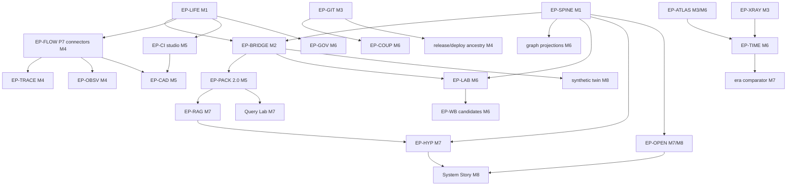

# Delivery Roadmap — Dependency DAG, Critical Path, Milestones, Card Index

Status: **Accepted (planning artifact)** · 2026-08-04 · Non-authoritative; stable dependency order
is routed to the canonical architecture. Full card contracts live exactly once, in
[`taskdeck/developer-lens-intelligence-platform.taskdeck.json`](./taskdeck/developer-lens-intelligence-platform.taskdeck.json)
(compact keyed format, one card per programme slice); this file is the index and the graph.

Statuses: READY (no open dependency, no owner gate) · BLOCKED_BY_DEPENDENCY (one exact unlocking
event named) · RESEARCH (workbench-governed, can never ship ungated) · OWNER_GATED · PARKED ·
QUESTION (Open Questions column). Effort bands S/M/L and risk bands are planning aids only — no
calendar promises and no human-productivity estimates.

## 1. Phase re-map

The canonical P0–P12 backlog remains valid. This programme re-groups the un-started phases into
dependency-true milestones (a phase boundary was revised only where live code evidence justified
it — see ADR-04 grounded constraints):

| Milestone | Contains | Canonical phases touched |
|---|---|---|
| M1 spine | SPINE-01..05, LIFE-01/02, CAD-02 | extends P1/P2 contracts |
| M2 first visible slice | BRIDGE-01..03, SPINE-03, PACK-00, UX-VG/CC/ED | P5 (bridge) + P3 reconciliation |
| M3 structure foundations | GIT-01/02, XRAY-01/02, ATLAS-01/02/04, LIFE-03 | P6 + P10 (source structure start) |
| M4 flow observatories | FLOW-01..04, TRACE-01/02, OBSV-01..03, SEM-01/02 | P7 |
| M5 feedback + pack | CI-01..03, DEP-01, SEC-01, PORT-01/02, PACK-01/02/04/05, BRIDGE-04/05, CAD-01 | P8/P9 + P3 growth |
| M6 time, graph, workbench | TIME-01/02, ATLAS-03/05/06, COUP-01/02, GOV-01..03, LAB-01/02, GRAPH-01, WB-01/02 + candidates | P10/P11 |
| M7 interpretation | RAG-01/02, HYP-01/02, OPEN-01, COUP-03, TRACE-03, PORT-03, QL-01, WB-C9 | P11/P12-adjacent |
| M8 story + frontier | UX views, OPEN-02, DEMO-A1/B1/B2, PROV-01 revisit | UX + demo programme |

The existing **P4 github.core activation lane** and **P12 OpenAI/Luna lane** continue under their
own ledger cards and are deliberately **not duplicated** on this board; PORT-01 names the P4 lane
as its fact supplier, and HYP/P12 interaction stays inside the approved G4 boundary.

## 2. Dependency DAG (epic grain)

Rule encoded on every card: no high-sensitivity connector, parser, ML feature, RAG index, or model
narrative is schedulable before its contracts, deletion path, coverage semantics, benchmark, and
UI claim grammar exist.

## 3. Critical path and parallel-safe lanes

**Critical path (user-visible value):**
`DL-SPINE-01 → DL-SPINE-02 → DL-BRIDGE-01 → DL-BRIDGE-02 → DL-UX-ED → DL-PACK-01/02 → DL-RAG-01 →
DL-HYP-01 → DL-UX-SS`. Everything on it is fixture-driven; no real-data or owner gate sits on the
critical path, by design.

**Parallel-safe lanes** (disjoint owned paths, one writer per checkout or coordinator-owned
worktrees per continuation discipline):

1. Spine/lifecycle lane (`shared/`, `server/storage` additive) — M1.
2. Bridge/UX lane (`server/api/v2`, `src/components/*V2*`) — M2, after lane 1's contracts.
3. Local-Git lane (`server/connectors/localGit`) — independent from lane 2.
4. Source-structure lane (`server/connectors/sourceStructure`) — independent; worker sandbox first.
5. GitHub-connector lane (`server/connectors/github/*`) — after LIFE-01; one capability per card.
6. Research lane (`server/research`) — independent of product lanes by construction.
7. Docs/demo lane (`docs/`, twin generator spec) — always safe.

**Merge discipline:** each lane lands through the repo's normal review gate; cards name their
focused proving checks; `npm run check` at every code milestone; `npm run build:showcase` whenever
a card's seam can reach public/demo/export surfaces (BRIDGE-01 explicitly includes it).

## 4. Effort/risk distribution

READY now: SPINE-01, SPINE-04, LIFE-01, BRIDGE-01, GIT-01, XRAY-01, ATLAS-01, SEM-01, CAD-02,
WB-01, PACK-00, UX-VG — twelve independent entry points; the launcher
(`09_IMPLEMENTATION_LAUNCHER.md`) selects **DL-BRIDGE-01** because it is the only one that makes
the platform user-visible and forces the disconnected-architecture problem shut first.

High-risk cards (extra fresh-context review per T2 discipline + first-production-caller rule):
LIFE-01/02/03, BRIDGE-05, GIT-01, ATLAS-01, DEP-01, SEC-01, GOV-03, CAD-01, LAB-02, PACK-05.

## 5. Optional futures (deliberately plural)

The roadmap ends in alternatives, not one inevitable architecture:

- **F1 — Deterministic-complete stop.** Ship M1–M5 + M8 story over deterministic claims only;
  the workbench candidates all record honest rejections. A fully legitimate end-state.
- **F2 — Research-validated modelling.** Some WB candidates pass invented gates and the owner
  authorises consented validation (DL-Q-CONSENT); Pattern Lens gains modelled claims.
- **F3 — External-hypothesis composition.** The P12 lane activates within G4; the composer's
  optional external step re-words/re-ranks within closed enums. Requires its own activation card.
- **F4 — Dogfood-first.** DL-DEMO-A1's owner gate opens early and the structure lanes are proven
  on the real local Taskdeck checkout before the flow lanes exist.
- **F5 — Pack-centric.** Query Lab + packs become the primary product surface; UI views stay
  minimal. Viable because packs are complete evidence artifacts.

## 6. Card index (generated from the single card source)

| ID | Title | Epic | Type | Status | Blocked by | Milestone | Risk/Effort |
|---|---|---|---|---|---|---|---|
| DL-SPINE-01 | Evidence claim graph table contracts | spine | contract | READY | none | M1 | medium/M |
| DL-SPINE-02 | Deterministic claim canonicalisation and replay proof | spine | implementation | BLOCKED_BY_DEPENDENCY | DL-SPINE-01 | M1 | medium/M |
| DL-SPINE-03 | Why-am-I-seeing-this resolver | spine | implementation | BLOCKED_BY_DEPENDENCY | DL-SPINE-01 | M2 | low/S |
| DL-SPINE-04 | Coverage-vector dimension registry v2 | spine | contract | READY | none | M1 | medium/M |
| DL-SPINE-05 | Monotone abstention gates with degraded-fixture proof | spine | implementation | BLOCKED_BY_DEPENDENCY | DL-SPINE-04 | M1 | medium/M |
| DL-LIFE-01 | Capability lifecycle state machine + approval-never-activates invariant | lifecycle | contract | READY | none | M1 | high/M |
| DL-LIFE-02 | Deletion enumeration from schema registry + cascade proof | lifecycle | implementation | BLOCKED_BY_DEPENDENCY | DL-LIFE-01 | M1 | high/M |
| DL-LIFE-03 | Backup/restore with tombstone replay | lifecycle | implementation | BLOCKED_BY_DEPENDENCY | DL-LIFE-02 | M3 | high/M |
| DL-BRIDGE-01 | First V2 vertical slice: /api/v2 coverage+capabilities over synthetic store + Coverage Cockpit panel | bridge | implementation | READY | none | M2 | medium/M |
| DL-BRIDGE-02 | V2 features + evidence endpoints with claim links | bridge | implementation | BLOCKED_BY_DEPENDENCY | DL-BRIDGE-01, DL-SPINE-01, DL-SPINE-02 | M2 | medium/M |
| DL-BRIDGE-03 | V1->V2 parity fixtures + person-shape-absence proof | bridge | evaluation | BLOCKED_BY_DEPENDENCY | DL-BRIDGE-01 | M2 | medium/M |
| DL-BRIDGE-04 | Legacy view retirement ladder (DNA/archetype first) | bridge | implementation | BLOCKED_BY_DEPENDENCY | DL-BRIDGE-03, DL-UX-CC, DL-UX-ED | M5 | medium/M |
| DL-BRIDGE-05 | Exporter migration to ExportView-fed builders | bridge | implementation | BLOCKED_BY_DEPENDENCY | DL-PACK-05 | M5 | high/M |
| DL-GIT-01 | Hardened explicit-ref extraction + coverage semantics | git-topology | implementation | READY | none | M3 | high/M |
| DL-GIT-02 | Ref movement + first-parent release ancestry | git-topology | implementation | BLOCKED_BY_DEPENDENCY | DL-GIT-01 | M3 | medium/M |
| DL-XRAY-01 | Committed-tree role taxonomy + fixtures | xray | contract | READY | none | M3 | low/S |
| DL-XRAY-02 | Worker tree enumeration + monorepo boundaries + parser coverage | xray | implementation | BLOCKED_BY_DEPENDENCY | DL-XRAY-01, DL-ATLAS-01 | M3 | medium/M |
| DL-ATLAS-01 | Isolated parser worker sandbox + resource caps + hostile corpus | atlas | implementation | READY | none | M3 | high/L |
| DL-ATLAS-02 | TypeScript tier-1 extractor (typed imports + public declarations) | atlas | implementation | BLOCKED_BY_DEPENDENCY | DL-ATLAS-01 | M3 | medium/L |
| DL-ATLAS-03 | tree-sitter tier-2 grammar set (Py/C#/Java/Go/Rust) | atlas | implementation | BLOCKED_BY_DEPENDENCY | DL-ATLAS-02 | M6 | medium/L |
| DL-ATLAS-04 | Opaque module graph features: SCC, cycles, fan-in/out, layering | atlas | implementation | BLOCKED_BY_DEPENDENCY | DL-ATLAS-02 | M3 | medium/M |
| DL-ATLAS-05 | Public API-surface counts between snapshots | atlas | implementation | BLOCKED_BY_DEPENDENCY | DL-ATLAS-02 | M6 | medium/M |
| DL-ATLAS-06 | Test-to-code topology | atlas | implementation | BLOCKED_BY_DEPENDENCY | DL-ATLAS-04 | M6 | low/M |
| DL-TIME-01 | Snapshot contract + comparability rules | time-machine | contract | BLOCKED_BY_DEPENDENCY | DL-ATLAS-04, DL-XRAY-02 | M6 | medium/M |
| DL-TIME-02 | Module continuity / split-merge matching (modelled) | time-machine | research | RESEARCH | DL-TIME-01 | M6 | medium/M |
| DL-COUP-01 | Ephemeral diffset->module mapping with caps | coupling | implementation | BLOCKED_BY_DEPENDENCY | DL-GIT-01 | M6 | medium/M |
| DL-COUP-02 | Change radius, coupling stability, migration waves | coupling | implementation | BLOCKED_BY_DEPENDENCY | DL-COUP-01 | M6 | medium/M |
| DL-COUP-03 | Cross-repository contract-wave lift | coupling | implementation | BLOCKED_BY_DEPENDENCY | DL-COUP-02, DL-DEP-01 | M7 | medium/M |
| DL-SEM-01 | Change-intent rule families + multilingual fixtures | semantic | implementation | READY | none | M4 | medium/M |
| DL-SEM-02 | Intent mix features + abstention | semantic | implementation | BLOCKED_BY_DEPENDENCY | DL-SEM-01 | M4 | low/S |
| DL-FLOW-01 | PR timeline connector (ready/review/rework transitions) | flow-connectors | implementation | BLOCKED_BY_DEPENDENCY | DL-LIFE-01 | M4 | medium/L |
| DL-FLOW-02 | Checks/statuses connector (attempt-aware) | flow-connectors | implementation | BLOCKED_BY_DEPENDENCY | DL-LIFE-01 | M4 | medium/M |
| DL-FLOW-03 | Issues + linkage connector (state/edges, no prose) | flow-connectors | implementation | BLOCKED_BY_DEPENDENCY | DL-LIFE-01 | M4 | medium/M |
| DL-FLOW-04 | Releases connector + release intervals | flow-connectors | implementation | BLOCKED_BY_DEPENDENCY | DL-LIFE-01 | M4 | low/M |
| DL-TRACE-01 | Typed traceability graph (observed edges only) | traceability | implementation | BLOCKED_BY_DEPENDENCY | DL-FLOW-01, DL-FLOW-03 | M4 | medium/M |
| DL-TRACE-02 | Release/deployment ancestry edges | traceability | implementation | BLOCKED_BY_DEPENDENCY | DL-FLOW-04, DL-GIT-02 | M4 | medium/M |
| DL-TRACE-03 | Suggested associations as calibrated hypothesis claims | traceability | research | RESEARCH | DL-TRACE-01, DL-WB-01 | M7 | medium/M |
| DL-OBSV-01 | PR transition/rework episode facts | pr-observatory | implementation | BLOCKED_BY_DEPENDENCY | DL-FLOW-01 | M4 | medium/M |
| DL-OBSV-02 | PR stack/retarget topology observations | pr-observatory | implementation | BLOCKED_BY_DEPENDENCY | DL-FLOW-01 | M4 | medium/M |
| DL-OBSV-03 | Batch shape + censored-tail treatment | pr-observatory | implementation | BLOCKED_BY_DEPENDENCY | DL-FLOW-04 | M4 | low/S |
| DL-CAD-01 | Coarse cadence features + grain floors + prohibited-output rejection | cadence | implementation | BLOCKED_BY_DEPENDENCY | DL-FLOW-01, DL-CI-01 | M5 | high/M |
| DL-CAD-02 | Proxy/composition review checklist (programme-wide process) | cadence | process | READY | none | M1 | low/S |
| DL-CI-01 | Attempt-aware workflow run/job facts (P8) | ci-studio | implementation | BLOCKED_BY_DEPENDENCY | DL-LIFE-01 | M5 | medium/L |
| DL-CI-02 | Workflow-definition classes (ephemeral YAML parse) | ci-studio | implementation | BLOCKED_BY_DEPENDENCY | DL-CI-01 | M5 | medium/M |
| DL-CI-03 | Deployment outcomes + release linkage (censoring-aware) | ci-studio | implementation | BLOCKED_BY_DEPENDENCY | DL-CI-01 | M5 | medium/M |
| DL-DEP-01 | Dependency ecosystem aggregates + update waves (P9) | ci-studio | implementation | BLOCKED_BY_DEPENDENCY | DL-LIFE-01 | M5 | high/L |
| DL-SEC-01 | Isolated security-alert lifecycle store design + aggregates | ci-studio | implementation | BLOCKED_BY_DEPENDENCY | DL-LIFE-02 | M5 | high/M |
| DL-PROV-01 | Attestation/provenance coverage | ci-studio | implementation | PARKED | DL-CI-01 | M8 | medium/M |
| DL-PORT-01 | Repository lifecycle + composition transitions | portfolio | implementation | BLOCKED_BY_DEPENDENCY | DL-BRIDGE-02 | M5 | medium/M |
| DL-PORT-02 | Policy/config evolution aggregates | portfolio | implementation | BLOCKED_BY_DEPENDENCY | DL-LIFE-01 | M5 | medium/M |
| DL-PORT-03 | Portfolio era comparator view model | portfolio | implementation | BLOCKED_BY_DEPENDENCY | DL-TIME-01, DL-PORT-01 | M7 | low/M |
| DL-GOV-01 | ProjectV2 status snapshots + aggregate transitions | governance | implementation | BLOCKED_BY_DEPENDENCY | DL-LIFE-01 | M6 | medium/M |
| DL-GOV-02 | CODEOWNERS repository-level coverage | governance | implementation | BLOCKED_BY_DEPENDENCY | DL-LIFE-01, DL-ATLAS-01 | M6 | medium/M |
| DL-GOV-03 | Team-coverage aggregates with sparse suppression | governance | implementation | BLOCKED_BY_DEPENDENCY | DL-GOV-01 | M6 | high/M |
| DL-LAB-01 | Residual alerts + false-alert budget (deterministic ladder) | pattern-lab | implementation | BLOCKED_BY_DEPENDENCY | DL-SPINE-04, DL-BRIDGE-02 | M6 | medium/M |
| DL-LAB-02 | Coverage-shift separation for notable changes | pattern-lab | implementation | BLOCKED_BY_DEPENDENCY | DL-LAB-01 | M6 | high/M |
| DL-GRAPH-01 | Typed graph projections + baseline statistics | pattern-lab | implementation | BLOCKED_BY_DEPENDENCY | DL-SPINE-01 | M6 | medium/M |
| DL-WB-01 | Research workbench harness + frozen benchmark format | workbench | implementation | READY | none | M6 | medium/M |
| DL-WB-02 | Model registry + promotion mechanics | workbench | implementation | BLOCKED_BY_DEPENDENCY | DL-WB-01, DL-SPINE-01 | M6 | medium/M |
| DL-WB-C1 | Candidate: robust weekly change-points (PELT/BOCPD) | workbench | research | RESEARCH | DL-WB-01, DL-LAB-01 | M6 | medium/M |
| DL-WB-C2 | Candidate: change-intent classifier vs rule baseline | workbench | research | RESEARCH | DL-WB-01, DL-SEM-02 | M6 | medium/M |
| DL-WB-C3 | Candidate: metadata-only CI failure-family classifier (likely reject) | workbench | research | RESEARCH | DL-WB-01, DL-CI-01 | M6 | medium/M |
| DL-WB-C4 | Candidate: sequence/motif discovery | workbench | research | RESEARCH | DL-WB-01, DL-LAB-01 | M6 | medium/M |
| DL-WB-C5 | Candidate: dynamic communities / graph embeddings | workbench | research | RESEARCH | DL-WB-01, DL-GRAPH-01 | M6 | medium/M |
| DL-WB-C6 | Candidate: time-to-event queue analysis (censoring-aware) | workbench | research | RESEARCH | DL-WB-01, DL-OBSV-01 | M6 | medium/M |
| DL-WB-C7 | Candidate: probabilistic observability model | workbench | research | RESEARCH | DL-WB-01, DL-LIFE-01 | M6 | medium/M |
| DL-WB-C8 | Candidate: architecture-change classifier | workbench | research | RESEARCH | DL-WB-01, DL-TIME-01 | M6 | medium/M |
| DL-WB-C9 | Candidate: retrieval-ranking ladder (lexical/vector vs structured) | workbench | research | RESEARCH | DL-WB-01, DL-RAG-02 | M7 | medium/M |
| DL-RAG-01 | Structured evidence retrieval + counter-evidence quotas | retrieval | implementation | BLOCKED_BY_DEPENDENCY | DL-PACK-02 | M7 | medium/M |
| DL-RAG-02 | Retrieval benchmark + privacy canary battery | retrieval | evaluation | BLOCKED_BY_DEPENDENCY | DL-RAG-01 | M7 | medium/M |
| DL-HYP-01 | Deterministic hypothesis composer + falsifier registry | hypothesis | implementation | BLOCKED_BY_DEPENDENCY | DL-RAG-01, DL-SPINE-05 | M7 | medium/M |
| DL-HYP-02 | Coverage-derived confidence bands | hypothesis | implementation | BLOCKED_BY_DEPENDENCY | DL-HYP-01 | M7 | low/S |
| DL-PACK-00 | Pack manifest-shape reconciliation (three shapes -> one authority) | analysis-pack | contract | READY | none | M2 | medium/S |
| DL-PACK-01 | Pack 2.0 facts tables (pr_lifecycle, check_attempts, edges, intervals, events) | analysis-pack | implementation | BLOCKED_BY_DEPENDENCY | DL-PACK-00, DL-BRIDGE-02 | M5 | medium/L |
| DL-PACK-02 | Pack 2.0 features + claims tables | analysis-pack | implementation | BLOCKED_BY_DEPENDENCY | DL-PACK-01, DL-SPINE-02 | M5 | medium/M |
| DL-PACK-03 | Pack graph tables + GraphML export | analysis-pack | implementation | BLOCKED_BY_DEPENDENCY | DL-GRAPH-01, DL-PACK-01 | M6 | medium/M |
| DL-PACK-04 | Pack dictionary + example SQL + notebook plan generation | analysis-pack | implementation | BLOCKED_BY_DEPENDENCY | DL-PACK-02 | M5 | low/M |
| DL-PACK-05 | Pack preview, acknowledgement, sparse suppression | analysis-pack | implementation | BLOCKED_BY_DEPENDENCY | DL-PACK-02 | M5 | high/M |
| DL-QL-01 | Query Lab over completed packs (DuckDB-WASM, no server SQL) | analysis-pack | ux | BLOCKED_BY_DEPENDENCY | DL-PACK-04 | M7 | medium/L |
| DL-UX-VG | Visual grammar tokens for the seven evidence statuses | ux-atlas | ux | READY | none | M2 | low/M |
| DL-UX-CC | Coverage/Privacy Cockpit (full) | ux-atlas | ux | BLOCKED_BY_DEPENDENCY | DL-BRIDGE-01, DL-LIFE-01 | M2 | medium/M |
| DL-UX-ED | Evidence Drawer (universal claim inspector) | ux-atlas | ux | BLOCKED_BY_DEPENDENCY | DL-SPINE-03, DL-BRIDGE-02 | M2 | medium/M |
| DL-UX-TM | Architecture Time Machine view | ux-atlas | ux | BLOCKED_BY_DEPENDENCY | DL-TIME-01 | M8 | medium/L |
| DL-UX-CR | Change River view | ux-atlas | ux | BLOCKED_BY_DEPENDENCY | DL-SEM-02, DL-COUP-02 | M8 | medium/M |
| DL-UX-DM | Delivery/Traceability Map view | ux-atlas | ux | BLOCKED_BY_DEPENDENCY | DL-TRACE-01, DL-OBSV-01 | M8 | medium/L |
| DL-UX-PL | Pattern Lens view | ux-atlas | ux | BLOCKED_BY_DEPENDENCY | DL-LAB-02 | M8 | medium/M |
| DL-UX-EC | Era Comparator view (includes era-diff model) | ux-atlas | ux | BLOCKED_BY_DEPENDENCY | DL-PORT-03 | M8 | medium/M |
| DL-UX-SS | Guided System Story (Wrapped successor) | ux-atlas | ux | BLOCKED_BY_DEPENDENCY | DL-UX-ED, DL-LAB-01, DL-OPEN-01 | M8 | medium/L |
| DL-OPEN-01 | Question claim family + generators | open-questions | implementation | BLOCKED_BY_DEPENDENCY | DL-SPINE-01, DL-SPINE-05 | M7 | low/M |
| DL-OPEN-02 | Open Questions Observatory + surprise-me exploration | open-questions | ux | BLOCKED_BY_DEPENDENCY | DL-OPEN-01 | M8 | low/M |
| DL-DEMO-A1 | Future real local Taskdeck dogfood: activation specification | demo | spec | OWNER_GATED | DL-GIT-01, DL-XRAY-02, DL-ATLAS-04, DL-LIFE-01 | M8 | high/M |
| DL-DEMO-B1 | Public Taskdeck-shaped synthetic twin: invented dataset generator spec | demo | spec | BLOCKED_BY_DEPENDENCY | DL-BRIDGE-01 | M8 | medium/M |
| DL-DEMO-B2 | Showcase script: 5-8 minute intelligence-platform walkthrough | demo | spec | BLOCKED_BY_DEPENDENCY | DL-DEMO-B1 | M8 | low/S |
| DL-Q-CONSTRAINTS | Upstream constraints: Developer Lens issues #5 #6 #41 #55 #57 #59 | open-questions | process | QUESTION | none | M1 | medium/S |
| DL-Q-PROSE | Owner gate: PR/issue prose semantic tier (tier-2 semantics) | open-questions | process | QUESTION | none | M7 | high/S |
| DL-Q-INDEX | Owner gate: durable retrieval index as a reviewed sink | open-questions | process | QUESTION | none | M7 | medium/S |
| DL-Q-LOCALMODEL | Owner gate: pinned offline local model option | open-questions | process | QUESTION | none | M8 | medium/S |
| DL-Q-CONSENT | Owner gate: consented real dataset for ML validation (per candidate) | open-questions | process | QUESTION | none | M6 | high/S |
